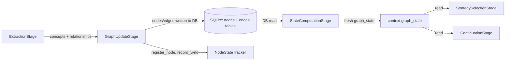

# Graph Mutation & Deduplication
## Current Version: 1.0

How the knowledge graph evolves through sequential stages each turn, including node/edge deduplication, cross-turn resolution, and permitted connections validation.

## Core Mechanics



### Stage 3: ExtractionStage

LLM extracts `concepts` (nodes) and `relationships` (edges) from the user utterance. Each extracted item carries `source_utterance_id` linking it back to the utterance that produced it (traceability chain).

### Stage 4: GraphUpdateStage

Persists extraction results to the database via `GraphRepository`. Before persisting, performs **three-step surface deduplication** per concept:

1. **Exact label + node_type match** (case-insensitive, fast path) — calls `repo.find_node_by_label_and_type()`. If found, adds `utterance_id` to provenance and returns the existing node.
2. **Semantic similarity** — only runs when `embedding_service` is configured. Computes embedding for the concept text, then calls `repo.find_similar_nodes()` filtering by same `node_type` and `threshold = surface_similarity_threshold` (default **0.80**). If a match is found, the new concept merges into the best-scoring existing node.
3. **Create new** — if neither match succeeds, a new `KGNode` is created with the computed embedding (if available).

**Dedup is session-scoped.** The same concept text in different sessions creates independent nodes.

#### Cross-turn edge resolution

After processing the current turn's concepts, the full session node map is loaded (`get_nodes_by_session`) and merged into `label_to_node`. This allows edges extracted this turn to reference nodes created in prior turns. When a relationship's source or target resolves to a deduplicated existing node, the edge is created between those node IDs (not the original extracted text).

#### Edge deduplication

Duplicate edges (same source, target, and `edge_type`) are merged — the utterance is added to the existing edge's provenance rather than creating a new edge.

#### Supersession on revises edges

When `_add_edge_from_relationship()` encounters `relationship_type == "revises"`, it calls `repo.supersede_node(target_node.id, source_node.id)` to mark the target (old belief) as superseded by the source (new belief). This sets `superseded_by` on the old node, which causes it to be excluded from `get_nodes_by_session()` queries (filtered by `WHERE superseded_by IS NULL`). The revises edge itself is still created normally. Superseded nodes are filtered out of chain walking and graph state counts.

#### Permitted connections validation (post-dedup)

After both source and target nodes are resolved, `_add_edge_from_relationship()` validates the edge against the methodology's `permitted_connections` schema when `methodology` parameter is provided. This validation uses the **post-dedup node types** (actual KGNode types after semantic merge), not the LLM-assigned types from extraction. This catches cross-turn edges that bypass extraction-time validation (which only checks current-turn concepts). Invalid edges are rejected with `invalid_connection_post_dedup` log. The `revises` edge type is always permitted (wildcard `["*", "*"]` in schema). Validation is skipped when `methodology=None` for backward compatibility.

#### NodeStateTracker updates

After DB writes, updates `NodeStateTracker`:
- `register_node()` — initializes `NodeState` for newly added nodes
- `update_edge_counts()` — updates relationship metrics on affected nodes
- `record_yield()` — credits `previous_focus` node with graph changes this turn

Sets `context.nodes_added` and `context.edges_added` for downstream stages.

### Stage 5: StateComputationStage

Reads graph metrics fresh from the database via `GraphRepository.get_state()`. Computes:
- Node count, edge count, max depth, coverage
- Saturation metrics (from `all_response_depths` in NodeStateTracker)
- Canonical graph state (if `enable_canonical_slots=True`)

Stores result in `context.state_computation_output`. The `computed_at` timestamp on this output enables freshness validation downstream.

**The freshness guarantee:** StateComputation reads from DB *after* GraphUpdate writes to DB — `graph_state` always reflects the current turn's extractions, not a cached value.

### NodeStateTracker Update Timing

`NodeStateTracker` mutations in Stage 4 happen **before** signal detection in Stage 6/8. The ordering is:

```
Stage 4 (GraphUpdate): register_node, update_edge_counts, record_yield
Stage 4.5 (SlotDiscovery): canonical slot mapping
Stage 5 (StateComputation): graph_state refresh
Stage 6/8 (StrategySelection): signal detection reads NodeStateTracker
```

Any state written by Stage 4 is visible to signal detectors in Stage 6/8 within the same turn.

## Correctness Requirements

1. **StateComputationStage must run after GraphUpdateStage** — `graph_state` is stale if this ordering is violated.
2. **No in-memory shortcut between GraphUpdate and StateComputation** — GraphUpdate writes to SQLite; StateComputation reads from SQLite. Bypassing the DB write/read cycle breaks the freshness guarantee.
3. **Empty extraction must still trigger StateComputation** — even if no concepts were extracted, `graph_state` must be recomputed.
4. **NodeStateTracker updates happen in Stage 4, not Stage 6/8** — `register_node()` and `record_yield()` run in GraphUpdateStage. Signal detectors read the state mutated by Stage 4.
5. **Surface deduplication merges nodes with same `node_type` only** — merging nodes of different types (e.g., an `attribute` node into a `value` node) corrupts the ontology.
6. **Embedding required for semantic dedup** — if `embedding_service` is `None`, only exact-match dedup runs. Nodes without embeddings silently skip Step 2 and always create new nodes.
7. **`surface_similarity_threshold = 0.80` is intentionally high** — the surface graph preserves language variation. A lower threshold would collapse distinct phrasings into one node prematurely.
8. **Cross-turn edge resolution loads all session nodes** — edges referencing prior-turn concepts are correctly wired only because the full session graph is loaded. If this load fails, cross-turn edges will be silently dropped (`edge_skipped_missing_node`).
9. **Permitted connections validation uses post-dedup node types** — validation occurs after semantic dedup, so the validated types are the actual KGNode types in the database, not the LLM-assigned types from extraction.

## Symptom → Cause → Fix

| Symptom | Cause | Fix |
|---------|-------|-----|
| `graph_state.node_count` not increasing after extraction | StateComputationStage not reached (pipeline error before Stage 5) | Find upstream error; ensure Stage 5 always runs |
| New nodes appear but signals don't reflect them | StateComputationStage ran before GraphUpdateStage completed DB write | Verify pipeline stage ordering in `_build_pipeline()` |
| Duplicate nodes accumulating in graph | `surface_similarity_threshold` too high, or nodes have different `node_type` | Check threshold config; verify LLM is assigning consistent types |
| `NodeStateTracker` out of sync (shows no nodes after extraction) | `register_node()` not called for new nodes | Check `_update_node_state_tracker()` in GraphUpdateStage |
| `graph_state` shows stale metrics mid-session | `computed_at` timestamp not advancing; StateComputation skipped | Check continuation logic that might short-circuit before Stage 5 |
| Same concept creates multiple surface nodes | `embedding_service` not configured (semantic dedup skipped), or threshold too high | Verify `embedding_service` is injected; lower threshold if intentional |
| Semantically different concepts merged | `surface_similarity_threshold` too low | Raise threshold toward 0.85–0.90 and re-test |
| Cross-turn edges silently dropped | Source or target node not found in `label_to_node` | Check `edge_skipped_missing_node` log; lower threshold or verify embedding pipeline |
| Edges lost after dedup | Edge dedup merge not adding utterance to provenance | Check `edge_deduplicated` log and `repo.add_edge_source_utterance()` path |
| Nodes created without embeddings | `embedding_service` unavailable or encoding failed | Check `embedding_service` initialization; verify spaCy model is installed |
| Revises edges exist but `superseded_by` is always `NULL` | Supersession logic not triggered | Check `node_superseded_via_revises` log |
| Cross-turn edges bypass permitted_connections validation | ExtractionService only validates current-turn concepts | Validation moved to `_add_edge_from_relationship()` post-dedup; check `invalid_connection_post_dedup` log |

## Key Files

- `src/services/turn_pipeline/stages/extraction_stage.py` — LLM extraction, produces `ExtractionResult`
- `src/services/turn_pipeline/stages/graph_update_stage.py` — Stage 4 wiring; passes `methodology` to GraphService for validation
- `src/services/turn_pipeline/stages/state_computation_stage.py` — Stage 5 DB read, graph_state refresh
- `src/services/graph_service.py` — `_add_or_get_node()` (dedup logic), `_add_edge_from_relationship()` (edge resolution, permitted_connections validation)
- `src/services/node_state_tracker.py` — `register_node()`, `record_yield()`, `update_edge_counts()`
- `src/persistence/repositories/graph_repo.py` — `find_node_by_label_and_type`, `find_similar_nodes`, `create_node`
- `src/domain/models/knowledge_graph.py` — `KGNode`, `KGEdge`, `GraphState`
- `src/domain/models/methodology_schema.py` — `MethodologySchema.is_valid_connection()` for permitted_connections check
- `src/core/config.py` — `deduplication.surface_similarity_threshold` (default 0.80)
- `src/services/session_service.py:_build_pipeline()` — stage ordering
