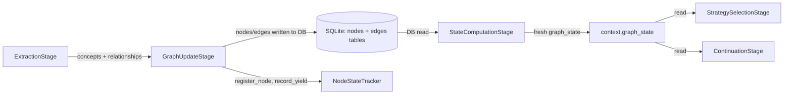

# Graph Mutation

## Core Mechanics

The knowledge graph evolves through three sequential stages each turn:



### Stage 3: ExtractionStage

LLM extracts `concepts` (nodes) and `relationships` (edges) from the user utterance. Each extracted item carries `source_utterance_id` linking it back to the utterance that produced it (traceability chain).

### Stage 4: GraphUpdateStage

Persists extraction results to the database via `GraphRepository`. Before persisting, performs **three-step surface deduplication** per concept:

1. **Exact label match** — returns existing node if label matches (case-insensitive)
2. **Semantic similarity** — computes embedding, checks against session nodes; if cosine similarity ≥ `surface_similarity_threshold` (0.80) and same `node_type`, merges into existing node
3. **Create new** — stores new node with embedding

After DB writes, updates `NodeStateTracker`:
- `register_node()` — initializes `NodeState` for newly added nodes
- `update_edge_counts()` — updates relationship metrics on affected nodes
- `record_yield()` — credits `previous_focus` node with graph changes this turn

Sets `context.nodes_added` and `context.edges_added` for downstream stages.

### Stage 5: StateComputationStage

Reads graph metrics fresh from the database via `GraphRepository.get_state()`. Computes:
- Node count, edge count, max depth, coverage
- Saturation metrics (from `all_response_depths` in NodeStateTracker)
- Canonical graph state (if `enable_canonical_slots=True`)

Stores result in `context.state_computation_output`. The `computed_at` timestamp on this output enables freshness validation downstream.

**The freshness guarantee:** StateComputation reads from DB *after* GraphUpdate writes to DB — `graph_state` always reflects the current turn's extractions, not a cached value.

### NodeStateTracker Update Timing

`NodeStateTracker` mutations in Stage 4 happen **before** signal detection in Stage 6/8. The ordering is:

```
Stage 4 (GraphUpdate): register_node, update_edge_counts, record_yield
Stage 4.5 (SlotDiscovery): canonical slot mapping
Stage 5 (StateComputation): graph_state refresh
Stage 6/8 (StrategySelection): signal detection reads NodeStateTracker
```

Any state written by Stage 4 is visible to signal detectors in Stage 6/8 within the same turn.

## Correctness Requirements

1. **StateComputationStage must run after GraphUpdateStage** — `graph_state` is stale if this ordering is violated. Signals that read `graph_state` will score against last turn's metrics.

2. **No in-memory shortcut between GraphUpdate and StateComputation** — GraphUpdate writes to SQLite; StateComputation reads from SQLite. Bypassing the DB write/read cycle (e.g., passing nodes directly in memory) breaks the freshness guarantee.

3. **Empty extraction must still trigger StateComputation** — even if no concepts were extracted, `graph_state` must be recomputed. Metrics like `interview_progress` and `saturation_score` change each turn regardless of extraction.

4. **NodeStateTracker updates happen in Stage 4, not Stage 6/8** — `register_node()` and `record_yield()` run in GraphUpdateStage. Signal detectors in StrategySelectionStage read the state mutated by Stage 4. If these calls were moved to Stage 6/8, they would affect the same turn they were meant to reflect.

5. **Surface deduplication merges nodes with same `node_type` only** — merging nodes of different types (e.g., an `attribute` node into a `value` node) corrupts the ontology. The type check in `_add_or_get_node()` must remain.

## Symptom → Cause → Fix

| Symptom | Cause | Fix |
|---------|-------|-----|
| `graph_state.node_count` not increasing after extraction | StateComputationStage not reached (pipeline error before Stage 5) | Find and fix the upstream error; ensure Stage 5 always runs |
| New nodes appear but signals don't reflect them | StateComputationStage ran before GraphUpdateStage completed DB write | Verify pipeline stage ordering in `_build_pipeline()` |
| Duplicate nodes accumulating in graph | `surface_similarity_threshold` too high, or nodes have different `node_type` | Check threshold config; verify LLM is assigning consistent types |
| `NodeStateTracker` out of sync (shows no nodes after extraction) | `register_node()` not called for new nodes | Check `_update_node_state_tracker()` in GraphUpdateStage |
| `graph_state` shows stale metrics mid-session | `computed_at` timestamp not advancing; StateComputation skipped | Check continuation logic that might short-circuit before Stage 5 |

## Key Files

- `src/services/turn_pipeline/stages/extraction_stage.py` — LLM extraction, produces `ExtractionResult`
- `src/services/turn_pipeline/stages/graph_update_stage.py` — dedup, DB write, NodeStateTracker updates
- `src/services/turn_pipeline/stages/state_computation_stage.py` — DB read, graph_state refresh
- `src/services/graph_service.py` — `_add_or_get_node()` (dedup logic), `update_graph()`
- `src/services/node_state_tracker.py` — `register_node()`, `record_yield()`, `update_edge_counts()`
- `src/persistence/repositories/graph_repo.py` — DB access layer
- `src/services/session_service.py:_build_pipeline()` — stage ordering
- `config/interview_config.yaml` — `deduplication.surface_similarity_threshold`
