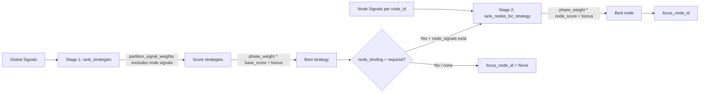

# Strategy Selection

## Core Mechanics

`StrategySelectionStage` (Stage 6/8 in pipeline) is the decision engine. It orchestrates two sub-stages to produce a selected strategy and focus node for the current turn.

**Inputs read from context:**
- `graph_state` — must be fresh (StateComputationStage must have run)
- `recent_nodes`, `recent_utterances`, `extraction`
- `strategy_history` — for temporal diversity signals
- `node_tracker` — per-node state for exhaustion signals

**Output:** `StrategySelectionOutput` with `strategy`, `focus_node_id`, `signals`, `node_signals`, `score_decomposition`.

### Two-Stage D2 Selection



**Stage 1 — Strategy Selection (`rank_strategies()`):**
- Uses global signals only: `graph.*`, `llm.*`, `temporal.*`, `meta.*`
- `partition_signal_weights()` auto-excludes node-scoped weights (`convgraph.node.*`, `convgraph.node.*, canongraph.node.*, interview.focus.*, meta.node.**`, `meta.node.*`)
- Applies phase multipliers (multiplicative) and bonuses (additive) from YAML config
- Scoring formula: `final_score = (base_score × multiplier) + bonus`

**Stage 2 — Node Selection (`rank_nodes_for_strategy()`):**
- Runs only when `node_binding = "required"` (default) and `node_signals` are available
- Uses node-scoped weights only (extracted via `partition_signal_weights()`)
- Same phase multiplier/bonus applied at node level

**Strategies with `node_binding: none`** (e.g., `revitalize`) operate at conversation level — `focus_node_id` is `None`, and `node_id = ""` appears in `score_decomposition`.

**Strategies with `valid_when` gate** (MEC chain-aware strategies: `ascend`, `ground`, `bridge`, `branch`, `anchor`) are only scored for nodes where the gate signal evaluates to `True`. A strategy with `valid_when: convgraph.node.chain.gap.above` will never appear in candidates for terminal nodes. This filtering happens in `rank_strategy_node_pairs()` before scoring. See `.claude/context/strategy-scoring.md` for full chain-aware strategy documentation.

### Signal Detection

`GlobalSignalDetectionService` → `ComposedSignalDetector` for global signals:
- `graph.*` — graph structure metrics
- `llm.*` — response quality (batch-detected in single API call)
- `temporal.*` — strategy repetition count, turns since strategy change
- `meta.*` — interview progress, phase

`NodeSignalDetectionService` → per-node detectors:
- `convgraph.node.*` — exhaustion score, focus streak, yield stagnation, recency
- `convgraph.node.*, canongraph.node.*, interview.focus.*, meta.node.**` — consecutive same strategy on node
- `meta.node.*` — opportunity (exhausted / probe_deeper / fresh)

### Phase Weights

Phase is detected explicitly via `InterviewPhaseSignal` (not via `ComposedSignalDetector`). Phase yields `interview.phase` = `early` / `mid` / `late`.

Phase weights are loaded from `config.phases[phase]`:
```yaml
phases:
  early:
    signal_weights:      # multiplicative
      branch: 1.5
      ascend: 0.8
    phase_bonuses:       # additive
      branch: 0.1
```

### Post-Selection Updates

After strategy + node selection, before exiting Stage 6/8:

1. **Per-concept quality bridge** — `MethodologyStrategyService` iterates `per_concept_ratings` from the LLM batch detector and routes `response.semantic.llm.elaboration` / `response.semantic.llm.charge` to each concept's mapped node via `NodeStateTracker.append_quality()`. This replaces the old `append_response_signal()` single-focus-node path.
2. `update_focus()` — sets new focus as `previous_focus` for next turn, increments streak counters

Critical ordering: the quality bridge must run before `update_focus()`, so per-concept ratings are attributed to the nodes that were asked about last turn.

## Correctness Requirements

1. **StateComputationStage must have run before Stage 6/8** — `graph_state` is stale if Stage 5 was skipped. Signal detectors that read `graph_state` will produce wrong scores.

2. **Phase must be detected before scoring** — `rank_strategies()` requires `phase_weights` and `phase_bonuses`. Without them, multipliers default to 1.0 and bonuses to 0.0, suppressing phase-based strategy shaping.

3. **Node signals must not leak into Stage 1** — `partition_signal_weights()` filters them out. If node-scoped weights were applied during strategy scoring, the same node weights would affect all nodes equally and distort strategy selection.

4. **Per-concept ratings must be bridged to the correct nodes** — `concept_to_node_id` (populated by GraphUpdateStage) maps extracted concepts to graph nodes. If a concept is not mapped, its quality ratings are silently skipped.

5. **`strategy_alternatives` is a list of `(strategy_name, score)` 2-tuples** — not 3-tuples. Downstream log parsers expecting 3-tuples will fail silently or raise index errors.

## Symptom → Cause → Fix

| Symptom | Cause | Fix |
|---------|-------|-----|
| Wrong strategy always selected regardless of signals | Phase weights not loading (`interview.phase` absent) | Check `InterviewPhaseSignal` detection; verify methodology YAML has `phases` section |
| Node signals not affecting node selection | Node-scoped weights present in `signal_weights` but `node_binding: none` on strategy | Change strategy to `node_binding: required` or move weights to node-level section |
| Phase multipliers applying but not bonuses | `phase_bonuses` key missing from YAML phase config | Add `phase_bonuses:` section under affected phase |
| Response depth always attributed to wrong node | `append_response_signal()` called after `update_focus()` | Restore ordering: append first, then update_focus |
| `focus_node_id` is always `None` for node-bound strategies | `node_signals` dict is empty (NodeSignalDetectionService not running) | Check Stage ordering and NodeSignalDetectionService injection |

## Key Files

- `src/services/turn_pipeline/stages/strategy_selection_stage.py` — orchestrates signal detection + D2 selection
- `src/services/methodology_strategy_service.py` — `rank_strategies()`, `rank_nodes_for_strategy()`
- `src/methodologies/scoring.py` — `partition_signal_weights()`, scoring formula
- `src/methodologies/registry.py` — YAML config loader
- `src/services/global_signal_detection_service.py` — global signal orchestration
- `src/services/node_signal_detection_service.py` — per-node signal detection
- `src/signals/meta/` — Meta signal implementations (InterviewPhaseSignal, etc.)
- `config/methodologies/*.yaml` — strategy configs, `signal_weights`, `phase_bonuses`, `node_binding`
