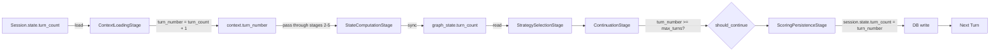

# Turn Count
## Current Version: 1.0

## Core Mechanics

Two distinct values track progress through the interview:

- **`turn_count`** — stored in the database as `session.state.turn_count`. Represents *completed* turns. Starts at 0.
- **`turn_number`** — computed in-context each turn as `turn_count + 1`. Represents the *current* turn being processed.

**Flow through the pipeline:**



**Phase configuration** (`config/interview_config.yaml`):
```yaml
phases:
  exploratory:
    n_turns: 6
  focused:
    n_turns: 7
  closing:
    n_turns: 2
# max_turns = 6 + 7 + 2 = 15
```

`max_turns` is computed as the sum of all phase `n_turns` values — never hardcoded.

Phase detection (`InterviewPhaseSignal`) maps `turn_number` against cumulative phase boundaries:
- `turn_number <= 6` → `early`
- `turn_number <= 13` → `mid`
- `turn_number > 13` → `late`

## Correctness Requirements

1. **`turn_number = turn_count + 1`** — the off-by-one is intentional. `turn_count` is completed turns; `turn_number` is the turn in progress. This invariant must hold at `ContextLoadingStage`.

2. **`max_turns` must come from phase boundaries sum** — no hardcoded fallback. If the YAML is missing a phase, the interview length changes silently.

3. **Stage 10 (`ScoringPersistenceStage`) must always run** — it is the only place `turn_count` is written back to the database. If Stage 10 is skipped (e.g., due to early return or exception), `turn_count` stays the same on the next turn, causing the pipeline to process the same turn number indefinitely.

4. **`ContinuationStage` reads `turn_number` against `max_turns`** — but `max_turns` also considers strategy termination and saturation flags. Turn-count termination is one of three exit conditions.

5. **`graph_state.turn_count` is synced by `StateComputationStage`** — downstream stages that read `graph_state` see the current turn number after Stage 5, not from the raw context.

## Symptom → Cause → Fix

| Symptom | Cause | Fix |
|---------|-------|-----|
| Interview loops at the same turn number | `ScoringPersistenceStage` not reached (pipeline raised before Stage 10) | Find and fix the exception; ensure Stage 10 always executes |
| Phase never changes (stuck on `early`) | `max_turns` computed incorrectly or phase boundary wrong | Check `InterviewPhaseSignal` and YAML `n_turns` sum |
| Interview never ends despite reaching `max_turns` | `ContinuationStage` not reading `turn_number` correctly, or `max_turns` returns 0/None | Verify `turn_number` flows through context and `max_turns` is > 0 |
| `turn_count` increments twice in one turn | `ScoringPersistenceStage` called twice in the pipeline wiring | Check `_build_pipeline()` for duplicate stage registration |

## Known Failure Modes

_No entries yet. Add failure patterns as they are discovered in this subsystem — each entry should describe the incorrect behavior, its consequence, and the correct approach._


## Key Files

- `src/services/turn_pipeline/stages/context_loading_stage.py` — sets `turn_number = (session.state.turn_count or 0) + 1`
- `src/services/turn_pipeline/stages/state_computation_stage.py` — syncs `turn_number` into `graph_state`
- `src/services/turn_pipeline/stages/continuation_stage.py` — checks `turn_number >= max_turns`
- `src/services/turn_pipeline/stages/scoring_persistence_stage.py` — writes `turn_number` back as `turn_count`
- `src/services/session_service.py:_build_pipeline()` — pipeline wiring (Stage ordering)
- `config/interview_config.yaml` — `phases[*].n_turns` (source of `max_turns`)
