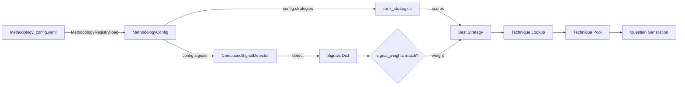

# Interview System v2 - System Design

> **Purpose**: Narrative documentation of the interview system architecture, written for technical articles and comprehensive understanding.
> **Related**: [Pipeline Contracts](./pipeline_contracts.md) | [Data Flow Paths](./data_flow_paths.md) | [ADR Index](./adr/README.md)

## Table of Contents

- [Overview](#overview)
- [Core Architecture](#core-architecture)
- [The Turn Pipeline](#the-turn-pipeline)
- [Signal Pools Architecture](#signal-pools-architecture)
- [Concept-Driven Coverage](#concept-driven-coverage)
- [Methodology-Centric Design](#methodology-centric-design)
- [Knowledge Graph State](#knowledge-graph-state)
- [LLM Integration](#llm-integration)

---

## Overview

The Interview System v2 is a knowledge-graph-based conversational research system that conducts semi-structured interviews through adaptive questioning. At its core, the system uses a **10-stage turn processing pipeline** that transforms user input into follow-up questions while building a knowledge graph of the conversation.

### Key Design Principles

1. **Pipeline Pattern**: Each turn flows through 10 sequential stages with well-defined contracts
2. **Signal Pools**: Strategy selection uses namespaced signals from multiple data sources
3. **Methodology-Centric**: Interview behavior driven by pluggable methodology configurations
4. **Knowledge Graph**: All extracted concepts and relationships stored as graph structure
5. **Traceability**: Every piece of data linked back to its source utterance

### High-Level Architecture

```
User Input → Turn Pipeline → Knowledge Graph → Strategy Selection → Question Generation → User Response
                ↓ (10 stages)
            Context Accumulation
```

---

## Core Architecture

### The Two-Layer Design

The system separates **concepts** (WHAT to explore) from **methodologies** (HOW to explore):

```
┌─────────────────────────────────────────────────────────────┐
│                     Application Layer                       │
│  - FastAPI endpoints                                        │
│  - TurnPipeline orchestrator                                │
│  - 10 sequential stages                                     │
└─────────────────────────────────────────────────────────────┘
                            ↓
┌─────────────────────────────────────────────────────────────┐
│                   Methodology Layer                         │
│  - YAML-based methodology configs                           │
│  - Signal detection (graph, llm, temporal, meta)            │
│  - Strategy ranking and selection                           │
│  - Focus selection                                          │
└─────────────────────────────────────────────────────────────┘
                            ↓
┌─────────────────────────────────────────────────────────────┐
│                    Infrastructure Layer                     │
│  - Knowledge Graph (nodes/edges)                            │
│  - Session state persistence                                │
│  - LLM client abstraction                                   │
│  - Configuration management                                 │
└─────────────────────────────────────────────────────────────┘
```

---

## The Turn Pipeline

### Pipeline Overview

The turn pipeline is the heart of the system. Each user response flows through 10 stages in sequence:

```
1. ContextLoading  → Load session metadata and graph state
2. UtteranceSaving → Save user input to database
3. Extraction      → Extract concepts and relationships
4. GraphUpdate     → Add concepts/relationships to graph
5. StateComputation → Refresh graph state metrics
6. StrategySelection → Select questioning strategy
7. Continuation    → Decide if interview should continue
8. QuestionGeneration → Generate next question
9. ResponseSaving  → Save system response
10. ScoringPersistence → Save scoring and update session
```

### Shared Context Accumulator

The pipeline uses a **shared context accumulator pattern** where `PipelineContext` flows through all stages:

```python
@dataclass
class PipelineContext:
    # Input parameters (immutable after creation)
    session_id: str
    user_input: str

    # Session metadata (loaded in Stage 1)
    methodology: str
    concept_id: str
    turn_number: int
    mode: str
    max_turns: int
    recent_utterances: List[Dict[str, str]]
    strategy_history: List[str]

    # Graph state (loaded in Stage 1, refreshed in Stage 5)
    graph_state: GraphState
    recent_nodes: List[KGNode]

    # Extraction results (computed in Stage 3)
    extraction: ExtractionResult

    # And more...
```

Each stage **reads** from the context and **writes** new information. This pattern ensures:
- Clear data flow contracts between stages
- Easy debugging (trace state evolution)
- Testability (each stage is isolated)
- Parallel development (stages have clear boundaries)

### Stage Contracts

Each stage has formal Pydantic contracts for inputs and outputs:

```python
# Example: ExtractionStage contract
class ExtractionOutput(BaseModel):
    extraction: ExtractionResult      # Concepts and relationships
    methodology: str                   # Methodology used
    timestamp: datetime                # When extraction was performed
    concept_count: int                 # Number of concepts extracted
    relationship_count: int            # Number of relationships extracted
```

**ADR-010 Phase 2** enhanced traceability by adding `source_utterance_id` throughout extraction and scoring data, linking all extracted concepts back to the specific user utterance that produced them.

---

## Signal Pools Architecture

### Overview

**Phase 6 (2026-01-28)**: The system now uses methodology-based signal detection with YAML configuration, replacing the old two-tier scoring system.

Signal pools enable flexible strategy selection by collecting signals from multiple data sources:

```
┌─────────────────────────────────────────────────────────────┐
│                    ComposedSignalDetector                   │
│  - Orchestrates signal detection from all pools             │
│  - Two-pass detection (non-meta first, then meta)           │
└─────────────────────────────────────────────────────────────┘
                            ↓
        ┌───────────────────┼───────────────────┐
        ↓                   ↓                   ↓
┌──────────────┐   ┌──────────────┐   ┌──────────────┐
│ Graph Pool   │   │  LLM Pool    │   │Temporal Pool │
│              │   │              │   │              │
│ - node_count │   │ - response_  │   │ - strategy_  │
│ - max_depth  │   │   depth      │   │   repetition │
│ - coverage   │   │ - sentiment  │   │ - turns_     │
│ - orphan_    │   │ - topics     │   │   since_     │
│   count      │   │              │   │   focus      │
└──────────────┘   └──────────────┘   └──────────────┘
        ↓                   ↓                   ↓
        └───────────────────┼───────────────────┘
                            ↓
                    ┌──────────────┐
                    │  Meta Pool   │
                    │              │
                    │ - interview_ │
                    │   progress  │
                    │ - exploratn_ │
                    │   score     │
                    └──────────────┘
```

### Signal Namespacing

All signals use dot-notation namespacing to prevent collisions:

| Pool | Namespace | Example Signals |
|------|-----------|-----------------|
| **Graph** | `graph.*` | node_count, max_depth, orphan_count, coverage_breadth |
| **Graph (Node)** | `graph.node.*` | exhausted, yield_stagnation, focus_streak, recency_score |
| **LLM** | `llm.*` | response_depth, sentiment, topics |
| **Temporal** | `temporal.*` | strategy_repetition_count, turns_since_focus_change |
| **Meta** | `meta.*` | interview_progress, exploration_score |
| **Meta (Node)** | `meta.node.*` | opportunity (exhausted/probe_deeper/fresh) |
| **Meta (Interview)** | `meta.interview.*` | phase (early/mid/late) |

### YAML Configuration Flow



### Fresh LLM Signals

**Critical Design Decision**: LLM signals are **fresh per response** - computed every turn, no cross-response caching. This ensures:
- Signals reflect the current conversation state
- No stale signals from previous responses
- Accurate strategy selection

### Node-Level Signals

**Phase 6 (2026-01-29)**: Node-level signals enable per-node state tracking and joint strategy-node scoring.

Node-level signals use the `graph.node.*` namespace and are computed by `NodeSignalDetector` subclasses:

| Signal | Description | Type | Detector |
|--------|-------------|------|----------|
| `graph.node.exhausted` | Boolean: is node exhausted | `"true"` / `"false"` | `NodeExhaustedSignal` |
| `graph.node.exhaustion_score` | Continuous: 0.0 (fresh) to 1.0 (exhausted) | float | `NodeExhaustionScoreSignal` |
| `graph.node.yield_stagnation` | Boolean: 3+ turns without yield | `"true"` / `"false"` | `NodeYieldStagnationSignal` |
| `graph.node.focus_streak` | Categorical: none/low/medium/high | str | `NodeFocusStreakSignal` |
| `graph.node.is_current_focus` | Boolean: is this the current focus | `"true"` / `"false"` | `NodeIsCurrentFocusSignal` |
| `graph.node.recency_score` | Continuous: 1.0 (current) to 0.0 (20+ turns ago) | float | `NodeRecencyScoreSignal` |
| `graph.node.is_orphan` | Boolean: node has no edges | `"true"` / `"false"` | `NodeIsOrphanSignal` |
| `graph.node.edge_count` | Integer: total edges (incoming + outgoing) | int | `NodeEdgeCountSignal` |
| `graph.node.strategy_repetition` | Categorical: none/low/medium/high | str | `NodeStrategyRepetitionSignal` |

**Node Signal Architecture:**

All node signal detectors inherit from `NodeSignalDetector` base class, which provides:
- Access to `NodeStateTracker` for per-node state
- Automatic iteration over all tracked nodes
- Consistent return type: `Dict[node_id, signal_value]`

### Meta Signals

Meta signals provide higher-level abstractions by combining multiple lower-level signals:

**Node Opportunity Signal (`meta.node.opportunity`):**

Combines node-level signals to determine what action should be taken for each node:
- **exhausted**: Node is exhausted (no yield, shallow responses, persistent focus)
- **probe_deeper**: Deep responses but no yield (extraction opportunity)
- **fresh**: Node has opportunity for exploration

Computed by `NodeOpportunitySignal` using:
- `graph.node.exhausted`
- `graph.node.focus_streak`
- `llm.response_depth`

**Interview Phase Signal (`meta.interview.phase`):**

Detects the current interview phase based on graph state:
- **early**: Initial exploration (node_count < 5)
- **mid**: Building depth and connections (node_count < 15 or orphan_count > 3)
- **late**: Validation and verification (node_count >= 15)

Computed by `InterviewPhaseSignal` using graph state metrics.

### Joint Strategy-Node Scoring (Phase 3)

**Phase 6 (2026-01-29)**: The system implements joint strategy-node scoring for focus selection.

Instead of selecting a strategy first and then a node, the system scores all (strategy, node) pairs:

```python
def rank_strategy_node_pairs(
    strategies: List[StrategyConfig],
    global_signals: Dict[str, Any],
    node_signals: Dict[str, Dict[str, Any]],
    phase_weights: Optional[Dict[str, float]] = None,
) -> List[Tuple[StrategyConfig, str, float]]:
    """
    Rank (strategy, node) pairs by joint score.

    For each (strategy, node) pair:
    1. Merge global + node signals (node signals take precedence)
    2. Score strategy using combined signals
    3. Apply phase weight multiplier if available
    4. Sort all pairs by score descending
    """
```

**Benefits:**
- Strategy selection considers node-specific context
- Natural integration with node exhaustion (exhausted nodes get low scores)
- Phase-based weight multipliers adjust strategy preferences per interview phase
- Single scoring pass for both strategy and node selection

---

## Concept-Driven Coverage

### Concepts vs Methodologies

The system uses a **two-layer architecture**:

1. **Concepts** (`config/concepts/*.yaml`): Define WHAT to explore
   - Semantic elements (attributes, values, consequences)
   - Research context (topic, insight, promise, rtb)
   - Element aliases for fuzzy matching

2. **Methodologies** (`src/methodologies/config/*.yaml`): Define HOW to explore
   - Node types (attribute, functional, psychosocial, etc.)
   - Ladder structure (chain length)
   - Signal definitions
   - Strategy definitions

### Coverage State Tracking

The system tracks coverage at the **element level** with depth validation:

```python
coverage_state = {
    "elements": {
        1: {  # "Creamy texture"
            "covered": True,
            "linked_node_ids": ["node_123", "node_456"],
            "types_found": ["attribute", "psychosocial_consequence"],
            "depth_score": 0.5,  # 2/4 levels (chain validation)
        },
        2: {  # "Plant-based"
            "covered": False,
            "linked_node_ids": [],
            "types_found": [],
            "depth_score": 0.0,
        },
    },
    "elements_covered": 1,
    "elements_total": 6,
    "overall_depth": 0.25,
}
```

### Depth Tracking (Chain Validation)

Depth is calculated via **chain validation** - finding the longest connected path of node types among linked nodes:

**Algorithm:**
1. Get all nodes linked to an element
2. Get edges connecting these nodes (treat as undirected)
3. Build adjacency graph
4. Find longest connected path
5. `depth_score = longest_chain_length / methodology_ladder_length`

**Why chain validation matters:**
- Simply counting types (2/4 = 0.5) doesn't validate connection
- attribute + psychosocial with no functional might be unrelated thoughts
- Chain validation confirms actual laddering occurred

---

## Methodology-Centric Design

### Methodology Registry

The system uses a **methodology registry** that loads YAML configurations:

```python
# src/methodologies/registry.py
class MethodologyRegistry:
    _methodologies: Dict[str, MethodologyConfig] = {}

    @classmethod
    def load_all(cls):
        """Load all methodology YAML configs from config directory"""
        for config_file in glob("src/methodologies/config/*.yaml"):
            config = MethodologyConfig.from_yaml(config_file)
            cls._methodologies[config.id] = config

    @classmethod
    def get_methodology(cls, methodology_id: str) -> MethodologyConfig:
        """Get methodology config by ID"""
        return cls._methodologies.get(methodology_id)
```

### MethodologyStrategyService

The `MethodologyStrategyService` uses methodology configs to:

1. **Detect signals** from all pools (graph, llm, temporal, meta)
2. **Score strategies** using YAML-defined signal weights
3. **Select best strategy** based on weighted scores
4. **Select focus** using strategy.focus_preference

This replaces the old two-tier scoring system with a more flexible, YAML-driven approach.

---

## Knowledge Graph State

### Graph Structure

The knowledge graph stores:

- **Nodes**: Concepts extracted from user responses
  - `id`: Unique node identifier
  - `text`: Concept text
  - `node_type`: Type classification (attribute, functional, psychosocial, etc.)
  - `utterance_id`: Source utterance for traceability

- **Edges**: Relationships between concepts
  - `id`: Unique edge identifier
  - `source_node_id`: Source node
  - `target_node_id`: Target node
  - `relationship_type`: Type of relationship
  - `utterance_id`: Source utterance for traceability

### Graph State Metrics

The `GraphState` object tracks:

```python
@dataclass
class GraphState:
    node_count: int              # Total nodes in graph
    edge_count: int              # Total edges in graph
    turn_count: int              # Number of completed turns
    coverage_state: CoverageState # Element-level coverage
    max_depth: int               # Maximum chain depth
    orphan_count: int            # Nodes with no edges
    coverage_breadth: float      # Breadth of coverage (0-1)
```

These metrics drive strategy selection via signal pools.

### Node State Tracking

**Phase 6 (2026-01-29)**: The system now includes per-node state tracking via `NodeStateTracker` to enable node exhaustion detection and backtracking.

The `NodeState` dataclass tracks for each node:

```python
@dataclass
class NodeState:
    # Basic info
    node_id: str
    label: str
    created_at_turn: int
    depth: int

    # Engagement metrics
    focus_count: int              # Times this node was selected as focus
    last_focus_turn: Optional[int]
    turns_since_last_focus: int
    current_focus_streak: int     # Consecutive turns as focus

    # Yield metrics
    last_yield_turn: Optional[int]
    turns_since_last_yield: int
    yield_count: int              # Times node produced graph changes
    yield_rate: float             # yield_count / focus_count

    # Response quality
    all_response_depths: List[str]  # All response depths for this node

    # Relationships
    connected_node_ids: Set[str]
    edge_count_outgoing: int
    edge_count_incoming: int

    # Strategy usage
    strategy_usage_count: Dict[str, int]
    last_strategy_used: Optional[str]
    consecutive_same_strategy: int

    @property
    def is_orphan(self) -> bool:
        """Check if node has no edges."""
        return (self.edge_count_incoming + self.edge_count_outgoing) == 0
```

### Node Exhaustion and Backtracking

**Phase 6 (2026-01-29)**: The node exhaustion system enables intelligent backtracking by detecting when nodes are exhausted (no longer yielding new information).

#### Exhaustion Detection Criteria

A node is considered **exhausted** when all of the following conditions are met:

1. **Minimum engagement**: The node has been focused on at least once (`focus_count >= 1`)
2. **Yield stagnation**: No yield (graph changes) for 3+ turns (`turns_since_last_yield >= 3`)
3. **Persistent focus**: Current focus streak is 2+ consecutive turns (`current_focus_streak >= 2`)
4. **Shallow responses**: 2/3 of recent responses are shallow (indicates topic depletion)

#### Node-Level Exhaustion Signals

The system provides multiple signals for exhaustion detection:

| Signal | Type | Purpose |
|--------|------|---------|
| `graph.node.exhausted` | boolean | Primary exhaustion flag for strategy weights |
| `graph.node.exhaustion_score` | float (0.0-1.0) | Continuous score for fine-grained scoring |
| `graph.node.yield_stagnation` | boolean | Early warning: 3+ turns without yield |
| `graph.node.focus_streak` | categorical | Track persistent focus (none/low/medium/high) |
| `graph.node.recency_score` | float (0.0-1.0) | How recently node was focused (decays over 20 turns) |

#### Exhaustion Score Calculation

The continuous exhaustion score combines multiple factors:

```python
exhaustion_score = (
    min(turns_since_last_yield, 10) / 10.0 * 0.4 +  # 0.0-0.4: Yield stagnation
    min(current_focus_streak, 5) / 5.0 * 0.3 +      # 0.0-0.3: Persistent focus
    shallow_response_ratio * 0.3                      # 0.0-0.3: Response quality
)
```

**Score interpretation:**
- `0.0 - 0.3`: Fresh node, high opportunity
- `0.3 - 0.6`: Moderate engagement, some yield
- `0.6 - 1.0`: Exhausted, backtracking recommended

#### Backtracking Behavior

When a node becomes exhausted, the system automatically backtracks:

1. **Exhaustion signal applies negative weight**: Strategies targeting exhausted nodes receive `graph.node.exhausted.true` signal with negative weight in methodology configs

2. **Strategy selection deprioritizes exhausted nodes**: During joint strategy-node scoring, exhausted nodes receive lower scores:
   ```yaml
   # Example methodology config
   probe_attribute:
     signal_weights:
       graph.node.exhausted.true: -5.0  # Strong penalty for exhausted nodes
       graph.node.is_orphan.true: 3.0   # Boost for orphan nodes
   ```

3. **System backtracks to high-yield nodes**: Focus selection service chooses nodes with better opportunity scores:
   - Nodes with `meta.node.opportunity: "fresh"` get priority
   - Orphan nodes receive priority boost for connection
   - Nodes with recent yield history are preferred

4. **Natural breadth-first exploration**: The system oscillates between:
   - **Deep dive**: Focusing on a productive node until exhaustion
   - **Backtracking**: Switching to fresh nodes when current node is exhausted
   - **Revisiting**: Returning to nodes after other exploration (recency score decay)

#### Phase-Based Weight Multipliers

Strategy preferences can be adjusted per interview phase using weight multipliers:

```python
# Phase-based scoring in rank_strategy_node_pairs()
phase_weights = {
    "probe_attribute": 1.5,  # Boost probing in early phase
    "connect_concepts": 2.0, # Prioritize connections in mid phase
    "validate_findings": 1.8, # Focus on validation in late phase
}

score *= phase_weights.get(strategy.name, 1.0)
```

**Phase-based behavior:**
- **Early phase**: Boost strategies that explore new concepts
- **Mid phase**: Boost strategies that build connections and depth
- **Late phase**: Boost strategies that validate and verify findings

This ensures the interview adapts its strategy preferences as the knowledge graph matures.

---

## Policy-Driven Follow-Up Question Generation

### Opening vs Follow-Up Questions

The system uses fundamentally different prompt structures for opening versus follow-up questions:

**Opening Questions** (conversational, low-constraint):
- Goal: Warmly invite the respondent to share initial thoughts
- Style: Friendly, open-ended, narrative-focused
- Context: Methodology + interview objective
- Example: "What are your thoughts on oat milk alternatives?"

**Follow-Up Questions** (policy-driven, high-constraint):
- Goal: Execute a specific strategy based on signals
- Style: Focused, strategic, signal-aware
- Context: Strategy description + signal rationale + methodology + graph state
- Example: "Why does that matter?" (because `graph.chain_completion.has_complete_chain=false`)

### Signal Rationale in Prompts

**Phase 6 (2026-01-29)**: Follow-up prompts now include active signals with descriptions to explain WHY each strategy was selected.

#### Signal Descriptions

Each signal class now includes a `description` attribute that explains:

- **What the signal measures**: "Depth of the longest causal chain in the graph"
- **How to interpret values**: "Low values (<2) indicate surface-level exploration"
- **What it means for questioning**: "Low depth suggests we're still at surface level"

Example signals with descriptions:
```python
class GraphMaxDepthSignal(SignalDetector):
    signal_name = "graph.max_depth"
    description = "Depth of the longest causal chain. Low values (<2) indicate surface-level exploration,
                   moderate (2-3) indicate reaching consequences or values, high (4+) indicate deep value exploration."
```

#### Prompt Structure

The follow-up user prompt includes:

```
## Active Signals:
- graph.max_depth: 1
  → "Depth of the longest chain. Low values (<2) indicate surface-level exploration"
- llm.response_depth: moderate
  → "LLM assessment of response depth. 'moderate' means some elaboration"
- graph.chain_completion.has_complete_chain: false
  → "Whether any complete chains exist from level 1 to terminal nodes"

## Why This Strategy Was Selected:
- Low depth suggests we're still at surface level
- No complete chains exist - need to reach terminal values
- Strategy: deepen to probe motivations and values

Focus concept: indulgence
Strategy: Deepen Understanding - "Explore why something matters to understand deeper motivations and values"
```

### Strategy Descriptions from YAML

Strategies are now loaded from `config/scoring.yaml` with `description` fields that explain WHAT each strategy does:

```yaml
- id: deepen
  name: "Deepen Understanding"
  description: "Explore why something matters to understand deeper motivations and values"
```

This replaces hardcoded strategy dictionaries and makes strategies:
- **Configurable**: Edit YAML without code changes
- **Self-documenting**: Description field explains strategy purpose
- **LLM-ready**: Descriptions formulated for prompt inclusion

### Methodology Context

When methodology schema is available, follow-up prompts also include:

```
Method: means_end_chain
Laddering: attributes → consequences → values
Goal: Explore causal chains from concrete attributes to abstract values
```

This provides the LLM with methodology-specific context for generating appropriate questions.

---

## LLM Integration

### Three-Client Architecture (ADR-010)

The system uses three specialized LLM clients:

| Client | Purpose | Model |
|--------|---------|-------|
| `ExtractionClient` | Concept/relationship extraction | Claude (high quality) |
| `SignalClient` | Qualitative signal extraction | Claude (high quality) |
| `QuestionClient` | Question generation | Claude/Moonshot (cost-optimized) |

### LLM Fallback

The system implements LLM fallback for reliability:
- Primary LLM fails → fallback to secondary model
- Fallback status tracked in `QuestionGenerationOutput.has_llm_fallback`

---

## References

- [Pipeline Contracts](./pipeline_contracts.md) - Stage read/write specifications
- [Data Flow Paths](./data_flow_paths.md) - Critical data flow visualizations
- [ADR Index](./adr/README.md) - Architecture decision records
- [API Documentation](./API.md) - Complete API reference
- [DEVELOPMENT](./DEVELOPMENT.md) - Development guide
