# Interview System v2 - System Design

> **Purpose**: Narrative documentation of the interview system architecture, written for technical articles and comprehensive understanding.
> **Related**: [Pipeline Contracts](./pipeline_contracts.md) | [Data Flow Paths](./data_flow_paths.md) | [ADR Index](./adr/README.md)

## Table of Contents

- [Overview](#overview)
- [Core Architecture](#core-architecture)
- [The Turn Pipeline](#the-turn-pipeline)
- [Signal Pools Architecture](#signal-pools-architecture)
- [Concept-Driven Coverage](#concept-driven-coverage)
- [Methodology-Centric Design](#methodology-centric-design)
- [Knowledge Graph State](#knowledge-graph-state)
- [Policy-Driven Follow-Up Question Generation](#policy-driven-follow-up-question-generation)
- [LLM Integration](#llm-integration)

---

## Overview

The Interview System v2 is a knowledge-graph-based conversational research system that conducts semi-structured interviews through adaptive questioning. At its core, the system uses a **12-stage turn processing pipeline** that transforms user input into follow-up questions while building a knowledge graph of the conversation.

### Key Design Principles

1. **Pipeline Pattern**: Each turn flows through 12 stages with well-defined contracts
2. **Signal Pools**: Strategy selection uses namespaced signals from multiple data sources
3. **Methodology-Centric**: Interview behavior driven by pluggable methodology configurations
4. **Knowledge Graph**: All extracted concepts and relationships stored as graph structure
5. **Traceability**: Every piece of data linked back to its source utterance

### High-Level Architecture

```
User Input → Turn Pipeline → Knowledge Graph → Strategy Selection → Question Generation → User Response
                ↓ (12 stages)
            Context Accumulation
```

---

## Core Architecture

### The Two-Layer Design

The system separates **concepts** (WHAT to explore) from **methodologies** (HOW to explore):

```
┌─────────────────────────────────────────────────────────────┐
│                     Application Layer                       │
│  - FastAPI endpoints                                        │
│  - TurnPipeline orchestrator                                │
│  - 12 stages (including SRLPreprocessing, SlotDiscovery) │
└─────────────────────────────────────────────────────────────┘
                            ↓
### Dual-Graph Architecture (Phase 2-3, 2026-02-08)

The system implements a dual-graph architecture to handle respondent paraphrase fragmentation:

**Surface Graph**:
- Original extraction (respondent's exact language)
- High fidelity for traceability
- Stored in `kg_nodes` and `kg_edges` tables

**Canonical Graph**:
- Deduplicated abstract concepts (canonical slots)
- Stable signals for exhaustion tracking
- Stored in `canonical_slots`, `canonical_edges` tables

**Mapping**:
- Unidirectional: Surface → Canonical only
- Via `surface_to_slot_mapping` table
- Uses embedding similarity (all-MiniLM-L6-v2, 384-dim)

**Benefits**:
1. Cleaner signals: "1 concept discussed 3 times" vs "3 fresh concepts"
2. Accurate exhaustion tracking across paraphrases
3. Stable metrics regardless of language variation

**REFERENCE**: ADR-018 for full architecture details

┌─────────────────────────────────────────────────────────────┐
│                   Methodology Layer                         │
│  - YAML-based methodology configs                           │
│  - Signal detection (graph, llm, temporal, meta)            │
│  - Strategy ranking and selection                           │
│  - Focus selection                                          │
└─────────────────────────────────────────────────────────────┘
                            ↓
┌─────────────────────────────────────────────────────────────┐
│                    Infrastructure Layer                     │
│  - Knowledge Graph (nodes/edges)                            │
│  - Session state persistence                                │
│  - LLM client abstraction                                   │
│  - Configuration management                                 │
└─────────────────────────────────────────────────────────────┘
```

---

## The Turn Pipeline

### Pipeline Overview

The turn pipeline is the heart of the system. Each user response flows through 10 base stages (plus 2 optional stages):

**Base Stages (always run)**:
```
1. ContextLoading  → Load session metadata and graph state
2. UtteranceSaving → Save user input to database
3. Extraction      → Extract concepts and relationships
4. GraphUpdate     → Add concepts/relationships to graph
5. StateComputation → Refresh graph state metrics
6. StrategySelection → Select questioning strategy
7. Continuation    → Decide if interview should continue
8. QuestionGeneration → Generate next question
9. ResponseSaving  → Save system response
10. ScoringPersistence → Save scoring and update session
```

**Additional Stages**:
```
2.5. SRLPreprocessing → Linguistic structure extraction
4.5. SlotDiscovery    → Canonical slot discovery for dual-graph
```

**Total**: 12 stages

### Shared Context Accumulator

The pipeline uses a **shared context accumulator pattern** where `PipelineContext` flows through all stages:

```python
@dataclass
class PipelineContext:
    # Input parameters (immutable after creation)
    session_id: str
    user_input: str

    # Session metadata (loaded in Stage 1)
    methodology: str
    concept_id: str
    turn_number: int
    mode: str
    max_turns: int
    recent_utterances: List[Dict[str, str]]
    strategy_history: List[str]

    # Graph state (loaded in Stage 1, refreshed in Stage 5)
    graph_state: GraphState
    recent_nodes: List[KGNode]

    # Extraction results (computed in Stage 3)
    extraction: ExtractionResult

    # And more...
```

Each stage **reads** from the context and **writes** new information. This pattern ensures:
- Clear data flow contracts between stages
- Easy debugging (trace state evolution)
- Testability (each stage is isolated)
- Parallel development (stages have clear boundaries)

### Stage Contracts

Each stage has formal Pydantic contracts for inputs and outputs:

```python
# Example: ExtractionStage contract
class ExtractionOutput(BaseModel):
    extraction: ExtractionResult      # Concepts and relationships
    methodology: str                   # Methodology used
    timestamp: datetime                # When extraction was performed
    concept_count: int                 # Number of concepts extracted
    relationship_count: int            # Number of relationships extracted
```

**ADR-010 Phase 2** enhanced traceability by adding `source_utterance_id` throughout extraction and scoring data, linking all extracted concepts back to the specific user utterance that produced them.

### Pipeline Output: TurnResult

**Phase 6 (2026-02-03)**: The `TurnResult` dataclass is the final output returned by the pipeline after all stages complete.

```python
@dataclass
class TurnResult:
    # Core results
    turn_number: int
    extracted: dict                    # concepts, relationships
    graph_state: dict                  # node_count, edge_count, depth_achieved
    scoring: dict                      # strategy_id, score, reasoning
    strategy_selected: Optional[str]   # Selected strategy name
    next_question: str                  # Generated question
    should_continue: bool              # Whether interview continues

    # Observability (Phase 6)
    signals: Optional[Dict[str, Any]] = None           # Raw methodology signals
    strategy_alternatives: Optional[List[Dict[str, Any]]] = None  # All scored alternatives
    termination_reason: Optional[str] = None  # Reason for termination

    # Dual-Graph Observability (Phase 3)
    canonical_graph: Optional[Dict[str, Any]] = None    # Canonical graph metrics
    graph_comparison: Optional[Dict[str, Any]] = None   # Surface vs canonical comparison

    # Performance
    latency_ms: int = 0                # Pipeline execution time
```

#### Field Details

| Field | Source | Description |
|-------|--------|-------------|
| `turn_number` | PipelineContext | Current turn number (1-indexed) |
| `extracted` | ExtractionOutput | Extracted concepts and relationships |
| `graph_state` | StateComputationOutput | Current graph state metrics |
| `scoring` | ScoringPersistenceOutput | Strategy scoring data |
| `strategy_selected` | StrategySelectionOutput | Selected strategy name |
| `next_question` | QuestionGenerationOutput | Generated follow-up question |
| `should_continue` | ContinuationOutput | Whether to continue interview |
| `signals` | StrategySelectionOutput | Raw signals from signal pools (Phase 6) |
| `strategy_alternatives` | StrategySelectionOutput | All scored alternatives with node_id |
| `termination_reason` | ContinuationOutput.reason | Reason for termination |
| `canonical_graph` | StateComputationOutput | Canonical graph metrics (Phase 3) |
| `graph_comparison` | StateComputationOutput | Surface vs canonical comparison (Phase 3) |
| `latency_ms` | Pipeline | Total execution time in milliseconds |

#### Signals and Strategy Alternatives

**Observability fields**: Observability fields expose raw signal data for debugging:

- **`signals`**: Raw methodology signals from all signal pools
  - `graph.*`: Global and node-level graph signals
  - `llm.*`: Response depth, sentiment, uncertainty
  - `temporal.*`: Strategy repetition, turns since change
  - `meta.*`: Interview progress, phase, node opportunity

- **`strategy_alternatives`**: All (strategy, node) pairs with scores
  ```python
  [
      {"strategy": "deepen", "node_id": "node_123", "score": 2.5},
      {"strategy": "clarify", "node_id": "node_456", "score": 2.1},
      ...
  ]
  ```

These fields enable:
- Debugging why a strategy was selected
- Understanding signal influence on scoring
- Analyzing joint strategy-node selection behavior

#### Canonical Graph Output (Phase 3)

**Phase 3 (2026-02-08)**: Dual-graph architecture adds canonical graph observability fields:

```python
canonical_graph = {
    "slots": {
        "concept_count": int,      # Active canonical slots
        "orphan_count": int,        # Slots with no edges
        "avg_support": float,       # Avg support per slot
    },
    "edges": {
        "edge_count": int,          # Canonical edges
    },
    "metrics": {
        "max_depth": int,           # Longest canonical path
    }
}

graph_comparison = {
    "node_reduction_pct": float,     # % reduction from surface → canonical
    "edge_aggregation_ratio": float, # canonical_edges / surface_edges
    "orphan_improvement_pct": float, # Orphan reduction from aggregation
}
```

### Continuation and Termination

**Phase 9 (2026-02-03)**: The `ContinuationStage` (Stage 7) decides whether to continue the interview based on multiple termination conditions.

#### Termination Reasons

The `termination_reason` field is populated when `should_continue=False`:

| Reason | Description | Detection |
|--------|-------------|-----------|
| `"max_turns_reached"` | Interview reached configured `max_turns` limit | `turn_number >= max_turns` |
| `"depth_plateau"` | Graph max_depth hasn't increased in 6 consecutive turns | Tracked in `StateComputationStage` |
| `"quality_degraded"` | Consecutive shallow responses detected (saturation) | `consecutive_shallow` threshold in node_tracker |
| `"close_strategy"` | Closing strategy was selected | Strategy-based termination |

#### Continuation Logic

```python
# ContinuationStage evaluates:
should_continue = (
    turn_number < max_turns and
    not depth_plateau and
    not quality_degraded and
    strategy != "close"
)
```

If `should_continue=False`, the `termination_reason` field is set to explain why, enabling:
- User understanding of why interview ended
- Analytics on termination patterns
- Debugging premature termination

---

## Signal Pools Architecture

### Overview

**Phase 6 (2026-01-28)**: The system now uses methodology-based signal detection with YAML configuration, replacing the old two-tier scoring system.

**Phase 6 (2026-01-29)**: Node-level signals enable per-node state tracking and intelligent backtracking.

**D1 Architecture (2026-01-30)**: Joint strategy-node scoring enables the system to select optimal (strategy, node) combinations, with node exhaustion awareness driving automatic backtracking.

Signal pools enable flexible strategy selection by collecting signals from multiple data sources:

```
┌─────────────────────────────────────────────────────────────┐
│                    ComposedSignalDetector                   │
│  - Orchestrates signal detection from all pools             │
│  - Two-pass detection (non-meta first, then meta)           │
└─────────────────────────────────────────────────────────────┘
                            ↓
        ┌───────────────────┼───────────────────┬───────────────┐
        ↓                   ↓                   ↓               ↓
┌──────────────┐   ┌──────────────┐   ┌──────────────┐ ┌──────────────┐
│ Graph Pool   │   │  LLM Pool    │   │Temporal Pool │ │Technique Pool│
│              │   │              │   │              │ │              │
│Global:       │   │ - response_  │   │ - strategy_  │ │Node-level:   │
│ - node_count │   │   depth      │   │   repetition │ │ - strategy_  │
│ - max_depth  │   │ - sentiment  │   │ - turns_     │ │   repetition │
│ - chain_comp │   │ - uncertainty │   │   since_     │ │              │
│              │   │ - hedging    │   │   strategy   │ └──────────────┘
│Node-level:   │   │ - global_    │   │   change     │
│ - exhausted  │   │   trend      │   │              │
│ - yield_stag │   │              │   │              │
│ - focus_     │   │              │   │              │
│   streak     │   │              │   │              │
│ - recency_   │   │              │   │              │
│   score      │   │              │   │              │
└──────────────┘   └──────────────┘   └──────────────┘
        ↓                   ↓                   ↓
        └───────────────────┼───────────────────┘
                            ↓
                    ┌──────────────┐
                    │  Meta Pool   │
                    │              │
                    │Global:       │
                    │ - interview_ │
                    │   progress   │
                    │ - interview_ │
                    │   phase      │
                    │              │
                    │Node-level:   │
                    │ - node.opport │
                    │   unity       │
                    └──────────────┘
```

### Signal Namespacing

All signals use dot-notation namespacing to prevent collisions:

| Pool | Namespace | Example Signals |
|------|-----------|-----------------|
| **Graph (Global)** | `graph.*` | node_count, max_depth, orphan_count, chain_completion |
| **Graph (Node)** | `graph.node.*` | exhausted, exhaustion_score, yield_stagnation, focus_streak, recency_score, is_orphan, edge_count |
| **LLM** | `llm.*` | response_depth, sentiment, uncertainty, ambiguity, hedging_language, global_response_trend |
| **Temporal** | `temporal.*` | strategy_repetition_count, turns_since_strategy_change |
| **Meta (Global)** | `meta.*` | interview_progress, interview.phase |
| **Meta (Node)** | `meta.node.*` | opportunity (exhausted/probe_deeper/fresh) |
| **Technique (Node)** | `technique.node.*` | strategy_repetition (consecutive same strategy on node) |

### YAML Configuration Flow

```mermaid
graph LR
    A[methodology_config.yaml] -->|MethodologyRegistry.load| B[MethodologyConfig]
    B -->|config.signals| C[ComposedSignalDetector]
    B -->|config.strategies| D[rank_strategy_node_pairs]
    B -->|config.phases| E[Phase Weights + Bonuses]

    C -->|detect global| F[Global Signals Dict]
    C -->|detect per-node| G[Node Signals Dict]

    F --> H{phase in config?}
    G --> H
    E --> H

    H -->|Yes| I[Load phase weights + bonuses]
    H -->|No| J[No phase modifiers]

    I --> K[rank_strategy_node_pairs]
    J --> K

    K --> L[For Each Strategy × Node Pair]
    L --> M[Merge global + node signals]
    M --> N[Score with combined signals]
    N --> O[Apply phase weights and bonuses]
    O --> P[Sort all pairs by score]

    P --> Q[Select Best (Strategy, Node)]
    Q --> R[Return with alternatives]

    R --> S[Technique Lookup]
    S --> T[Technique Pool]
    T --> U[Question Generation]
```

### Fresh LLM Signals

**Critical Design Decision**: LLM signals are **fresh per response** - computed every turn, no cross-response caching. This ensures:
- Signals reflect the current conversation state
- No stale signals from previous responses
- Accurate strategy selection

### Node-Level Signals

**Phase 6 (2026-01-29)**: Node-level signals enable per-node state tracking and joint strategy-node scoring.

Node-level signals use the `graph.node.*` namespace and are computed by `NodeSignalDetector` subclasses:

| Signal | Description | Type | Detector |
|--------|-------------|------|----------|
| `graph.node.exhausted` | Boolean: is node exhausted | `"true"` / `"false"` | `NodeExhaustedSignal` |
| `graph.node.exhaustion_score` | Continuous: 0.0 (fresh) to 1.0 (exhausted) | float | `NodeExhaustionScoreSignal` |
| `graph.node.yield_stagnation` | Boolean: 3+ turns without yield | `"true"` / `"false"` | `NodeYieldStagnationSignal` |
| `graph.node.focus_streak` | Categorical: none/low/medium/high | str | `NodeFocusStreakSignal` |
| `graph.node.is_current_focus` | Boolean: is this the current focus | `"true"` / `"false"` | `NodeIsCurrentFocusSignal` |
| `graph.node.recency_score` | Continuous: 1.0 (current) to 0.0 (20+ turns ago) | float | `NodeRecencyScoreSignal` |
| `graph.node.is_orphan` | Boolean: node has no edges | `"true"` / `"false"` | `NodeIsOrphanSignal` |
| `graph.node.edge_count` | Integer: total edges (incoming + outgoing) | int | `NodeEdgeCountSignal` |
| `graph.node.strategy_repetition` | Categorical: none/low/medium/high | str | `NodeStrategyRepetitionSignal` |

**Node Signal Architecture:**

All node signal detectors inherit from `NodeSignalDetector` base class, which provides:
- Access to `NodeStateTracker` for per-node state
- Automatic iteration over all tracked nodes
- Consistent return type: `Dict[node_id, signal_value]`

### Meta Signals

Meta signals provide higher-level abstractions by combining multiple lower-level signals:

**Node Opportunity Signal (`meta.node.opportunity`):**

Combines node-level signals to determine what action should be taken for each node:
- **exhausted**: Node is exhausted (no yield, shallow responses, persistent focus)
- **probe_deeper**: Deep responses but no yield (extraction opportunity)
- **fresh**: Node has opportunity for exploration

Computed by `NodeOpportunitySignal` using:
- `graph.node.exhausted`
- `graph.node.focus_streak`
- `llm.response_depth`

**Interview Phase Signal (`meta.interview.phase`):**

Detects the current interview phase based on graph state and methodology-specific thresholds:
- **early**: Initial exploration (node_count < early_max_nodes)
- **mid**: Building depth and connections (early_max_nodes ≤ node_count < mid_max_nodes)
- **late**: Validation and verification (node_count ≥ mid_max_nodes)

**Phase transition logic**: The system uses a pure node_count-based threshold system. Transitions occur at predefined node count boundaries defined in the methodology YAML config. This ensures predictable phase progression regardless of graph structure (orphan count, chain completion, etc.).

**Configurable Phase Boundaries (54d)**: Each methodology defines its own phase transition thresholds in YAML config under `phases.<phase>.phase_boundaries`:
```yaml
phases:
  early:
    phase_boundaries:
      early_max_nodes: 5   # Transition to mid at this count
      mid_max_nodes: 15    # Transition to late at this count
```

Computed by `InterviewPhaseSignal` using methodology-specific thresholds from config with fallback to defaults (5/15).

### Joint Strategy-Node Scoring (D1 Architecture)

**Phase 6 (2026-01-29)**: The system implements joint strategy-node scoring for focus selection.

Instead of selecting a strategy first and then a node, the system scores all (strategy, node) pairs:

```python
def rank_strategy_node_pairs(
    strategies: List[StrategyConfig],
    global_signals: Dict[str, Any],
    node_signals: Dict[str, Dict[str, Any]],
    node_tracker: NodeStateTracker,
    phase_weights: Optional[Dict[str, float]] = None,
    phase_bonuses: Optional[Dict[str, float]] = None,
    signal_norms: Optional[Dict[str, float]] = None,
) -> List[Tuple[StrategyConfig, str, float]]:
    """
    Rank (strategy, node) pairs by joint score.

    For each (strategy, node) pair:
    1. Merge global + node signals (node signals take precedence)
    2. Score strategy using combined signals
    3. Apply phase weight multiplier if available
    4. Apply phase bonus additively if available
    5. Sort all pairs by score descending

    Returns: List of (StrategyConfig, node_id, score) tuples
    """
```

**Scoring Formula**:
```python
# Base score from signal weights
base_score = score_strategy(strategy, combined_signals, signal_norms)

# Apply phase weight multiplier if available
multiplier = phase_weights.get(strategy.name, 1.0)

# Apply phase bonus additively if available
bonus = phase_bonuses.get(strategy.name, 0.0)

# Final score: (base_score × multiplier) + bonus
final_score = (base_score * multiplier) + bonus
```

**Benefits:**
- Strategy selection considers node-specific context
- Natural integration with node exhaustion (exhausted nodes get low scores)
- Phase-based weights (multiplicative) and bonuses (additive) adjust strategy preferences per interview phase
- Single scoring pass for both strategy and node selection
- Returns alternatives list for debugging: `[(strategy, node_id, score), ...]`

---

## Methodology-Centric Design

### Methodology Registry

The system uses a **methodology registry** that loads YAML configurations:

```python
# src/methodologies/registry.py
class MethodologyRegistry:
    _methodologies: Dict[str, MethodologyConfig] = {}

    @classmethod
    def load_all(cls):
        """Load all methodology YAML configs from config directory"""
        for config_file in glob("config/methodologies/*.yaml"):
            config = MethodologyConfig.from_yaml(config_file)
            cls._methodologies[config.id] = config

    @classmethod
    def get_methodology(cls, methodology_id: str) -> MethodologyConfig:
        """Get methodology config by ID"""
        return cls._methodologies.get(methodology_id)
```

### MethodologyStrategyService

The `MethodologyStrategyService` uses methodology configs to:

1. **Detect signals** from all pools (graph, llm, temporal, meta)
2. **Score strategies** using YAML-defined signal weights
3. **Select best (strategy, node) pair** using joint strategy-node scoring

This replaces the old two-tier scoring system with a more flexible, YAML-driven approach.

---

## Knowledge Graph State

### Graph Structure

The knowledge graph stores:

- **Nodes**: Concepts extracted from user responses
  - `id`: Unique node identifier
  - `text`: Concept text
  - `node_type`: Type classification (attribute, functional, psychosocial, etc.)
  - `utterance_id`: Source utterance for traceability

- **Edges**: Relationships between concepts
  - `id`: Unique edge identifier
  - `source_node_id`: Source node
  - `target_node_id`: Target node
  - `relationship_type`: Type of relationship
  - `utterance_id`: Source utterance for traceability

### Graph State Metrics

The `GraphState` object tracks:

```python
@dataclass
class GraphState:
    node_count: int              # Total nodes in graph
    edge_count: int              # Total edges in graph
    turn_count: int              # Number of completed turns
    max_depth: int               # Maximum chain depth
    orphan_count: int            # Nodes with no edges
    current_phase: str           # Interview phase (exploratory/focused/closing)
    strategy_history: deque      # Recent strategies for diversity tracking
```

These metrics drive strategy selection via signal pools.

### Canonical Graph State

**Phase 3 (2026-02-08)**: The system maintains a parallel canonical graph for deduplicated concepts.

```python
@dataclass
class CanonicalGraphState:
    concept_count: int           # Number of active canonical slots
    edge_count: int              # Number of canonical edges
    orphan_count: int            # Slots with no canonical edges
    max_depth: int               # Longest path in canonical graph
    avg_support: float           # Average support_count per slot
```

**State Computation**:
- Computed by `CanonicalGraphService` in Stage 5
- Aggregates surface edges to canonical edges
- Tracks candidate → active slot lifecycle

### Node State Tracking

**Phase 6 (2026-01-29)**: The system now includes per-node state tracking via `NodeStateTracker` to enable node exhaustion detection and backtracking.

The `NodeState` dataclass tracks for each node:

```python
@dataclass
class NodeState:
    # Basic info
    node_id: str
    label: str
    created_at_turn: int
    depth: int

    # Engagement metrics
    focus_count: int              # Times this node was selected as focus
    last_focus_turn: Optional[int]
    turns_since_last_focus: int
    current_focus_streak: int     # Consecutive turns as focus

    # Yield metrics
    last_yield_turn: Optional[int]
    turns_since_last_yield: int
    yield_count: int              # Times node produced graph changes
    yield_rate: float             # yield_count / focus_count

    # Response quality
    all_response_depths: List[str]  # All response depths for this node

    # Relationships
    connected_node_ids: Set[str]
    edge_count_outgoing: int
    edge_count_incoming: int

    # Strategy usage
    strategy_usage_count: Dict[str, int]
    last_strategy_used: Optional[str]
    consecutive_same_strategy: int

    @property
    def is_orphan(self) -> bool:
        """Check if node has no edges."""
        return (self.edge_count_incoming + self.edge_count_outgoing) == 0
```

### Node Tracker Persistence (Phase 9)

**Phase 9 (2026-02-03)**: NodeStateTracker now persists across turns via database storage, enabling `previous_focus` tracking and `all_response_depths` accumulation for saturation detection.

#### Persistence Flow

```mermaid
graph LR
    A[SessionService.process_turn] -->|load or create| B[SessionService._get_or_create_node_tracker]
    B -->|check database| C[SessionRepository.get_node_tracker_state]
    C -->|state found?| D{Has persisted state?}
    D -->|Yes| E[NodeStateTracker.from_dict]
    D -->|No| F[New NodeStateTracker]
    E -->|restored states| G[node_tracker]
    F --> G
    G -->|Load at turn start| H[StrategySelectionStage]
    H -->|append_response_depth| I[node_tracker]
    H -->|update_focus| J[node_tracker]
    I -->|all_response_depths.append| K[previous_focus node]
    J -->|set previous_focus| L[node_tracker]
    L -->|After turn completes| M[SessionService._save_node_tracker]
    M -->|to_dict| N[node_tracker.to_dict]
    N -->|JSON serialize| O[tracker_dict]
    O -->|save to database| P[SessionRepository.update_node_tracker_state]
    P -->|Write| Q[(sessions.node_tracker_state)]
    Q -->|Next turn| A
```



#### Key Points

**Load (turn start)**:
- `SessionService._get_or_create_node_tracker()` queries `sessions.node_tracker_state` from database
- If found: `NodeStateTracker.from_dict()` restores all node states
- If not found: Creates fresh `NodeStateTracker()`

**Use (during turn)**:
- `StrategySelectionStage.append_response_signal()`: Appends `llm.response_depth` to `previous_focus` node's `all_response_depths` list
- `StrategySelectionStage.update_focus()`: Updates `previous_focus` for next turn

**Save (turn end)**:
- `SessionService._save_node_tracker()` serializes via `NodeStateTracker.to_dict()`
- Stores JSON in `sessions.node_tracker_state` column (added in migration 004)

#### Schema and Compatibility

- `NODE_TRACKER_SCHEMA_VERSION = 1` for future compatibility
- Includes: `schema_version`, `previous_focus`, `states` dict
- Existing sessions with `node_tracker_state = NULL` create fresh tracker (graceful degradation)
- State size: ~15KB JSON for 25 nodes (varies by interview length)

#### Enables

- **Response depth tracking**: `all_response_depths` accumulates across turns per node
- **Saturation detection**: `consecutive_shallow` calculation requires historical depth data
- **Focus continuity**: `previous_focus` enables tracking which node received the last response

### Node Exhaustion and Backtracking

**Phase 6 (2026-01-29)**: The node exhaustion system enables intelligent backtracking by detecting when nodes are exhausted (no longer yielding new information).

#### Exhaustion Detection Criteria

A node is considered **exhausted** when all of the following conditions are met:

1. **Minimum engagement**: The node has been focused on at least once (`focus_count >= 1`)
2. **Yield stagnation**: No yield (graph changes) for 3+ turns (`turns_since_last_yield >= 3`)
3. **Persistent focus**: Current focus streak is 2+ consecutive turns (`current_focus_streak >= 2`)
4. **Shallow responses**: 2/3 of recent responses are shallow (indicates topic depletion)

#### Node-Level Exhaustion Signals

The system provides multiple signals for exhaustion detection:

| Signal | Type | Purpose |
|--------|------|---------|
| `graph.node.exhausted` | boolean | Primary exhaustion flag for strategy weights |
| `graph.node.exhaustion_score` | float (0.0-1.0) | Continuous score for fine-grained scoring |
| `graph.node.yield_stagnation` | boolean | Early warning: 3+ turns without yield |
| `graph.node.focus_streak` | categorical | Track persistent focus (none/low/medium/high) |
| `graph.node.recency_score` | float (0.0-1.0) | How recently node was focused (decays over 20 turns) |

#### Exhaustion Score Calculation

The continuous exhaustion score combines multiple factors:

```python
exhaustion_score = (
    min(turns_since_last_yield, 10) / 10.0 * 0.4 +  # 0.0-0.4: Yield stagnation
    min(current_focus_streak, 5) / 5.0 * 0.3 +      # 0.0-0.3: Persistent focus
    shallow_response_ratio * 0.3                      # 0.0-0.3: Response quality
)
```

**Score interpretation:**
- `0.0 - 0.3`: Fresh node, high opportunity
- `0.3 - 0.6`: Moderate engagement, some yield
- `0.6 - 1.0`: Exhausted, backtracking recommended

#### Backtracking Behavior

When a node becomes exhausted, the system automatically backtracks:

1. **Exhaustion signal applies negative weight**: Strategies targeting exhausted nodes receive `graph.node.exhausted.true` signal with negative weight in methodology configs

2. **Strategy selection deprioritizes exhausted nodes**: During joint strategy-node scoring, exhausted nodes receive lower scores:
   ```yaml
   # Example methodology config
   probe_attribute:
     signal_weights:
       graph.node.exhausted.true: -5.0  # Strong penalty for exhausted nodes
       graph.node.is_orphan.true: 3.0   # Boost for orphan nodes
   ```

3. **System backtracks to high-yield nodes**: Focus selection service chooses nodes with better opportunity scores:
   - Nodes with `meta.node.opportunity: "fresh"` get priority
   - Orphan nodes receive priority boost for connection
   - Nodes with recent yield history are preferred

4. **Natural breadth-first exploration**: The system oscillates between:
   - **Deep dive**: Focusing on a productive node until exhaustion
   - **Backtracking**: Switching to fresh nodes when current node is exhausted
   - **Revisiting**: Returning to nodes after other exploration (recency score decay)

#### Phase-Based Weights and Bonuses

Strategy preferences can be adjusted per interview phase using both multiplicative weights and additive bonuses defined in YAML methodology configs.

**Two Code Paths:**

The system has two strategy selection code paths, both supporting phase-based modifiers:

1. **`rank_strategies()`** - Used by `MethodologyStrategyService.select_strategy()` (legacy selection without node exhaustion)
2. **`rank_strategy_node_pairs()`** - Used by `MethodologyStrategyService.select_strategy_and_focus()` (D1 architecture with node exhaustion)

Both functions apply phase modifiers identically:

```python
# Phase detection from meta.interview.phase signal
current_phase = signals.get("meta.interview.phase", "mid")  # early/mid/late

# Phase weights and bonuses retrieval from YAML config
phase_weights = None
phase_bonuses = None
if config.phases and current_phase in config.phases:
    phase_config = config.phases[current_phase]
    phase_weights = phase_config.signal_weights      # Multiplicative
    phase_bonuses = phase_config.phase_bonuses        # Additive

# Base score calculation using signal weights
base_score = score_strategy(strategy, signals, signal_norms)

# Apply phase weight multiplier and bonus additively
multiplier = phase_weights.get(strategy.name, 1.0) if phase_weights else 1.0
bonus = phase_bonuses.get(strategy.name, 0.0) if phase_bonuses else 0.0

# Final score: (base_score × multiplier) + bonus
final_score = (base_score * multiplier) + bonus
```

**Signal Normalization** (t19):

The `score_strategy()` function normalizes numeric signals to [0, 1] using `signal_norms` from YAML configs:

```python
# For numeric signals with values > 1, normalize using max_expected from signal_norms
# Example: graph.node_count = 25, signal_norms["graph.node_count"] = 50
# → normalized value = 25/50 = 0.5

# Signals already in [0, 1] pass through unchanged
# Example: llm.uncertainty = 0.7 → no normalization needed

# If a numeric signal > 1 has no norm defined, raises ValueError
# This forces methodology configs to declare expected ranges explicitly
```

**Error Handling in Signal Detection:**

Each signal detector runs in isolation with try/except handling. If a detector fails (e.g., database timeout, LLM error):
- Error logged with `structlog` at error level
- Failed signal scored as 0 (missing from signals dict)
- Other detectors continue executing
- Strategy selection proceeds with partial signals (degraded but not dead)

**YAML Configuration Example:**

```yaml
# config/methodologies/means_end_chain.yaml

# Signal normalization ranges for numeric signals
signal_norms:
  graph.node_count: 50         # Expect up to 50 nodes
  graph.max_depth: 10          # Expect max depth of 10
  graph.orphan_count: 10       # Expect up to 10 orphans
  temporal.strategy_repetition_count: 5  # Expect up to 5 repetitions

# Phase-based strategy modifiers
phases:
  early:
    signal_weights:    # Multiplicative weights
      explore: 1.5     # Boost explore in early phase
      clarify: 1.2
      deepen: 0.5
      reflect: 0.2
    phase_bonuses:     # Additive bonuses
      explore: 0.2     # Bonus for explore in early phase
  mid:
    signal_weights:    # Default scoring in mid phase
      deepen: 1.3      # Prioritize deepening chains
      clarify: 0.8     # Reduced from 1.0 (was causing dominance)
      explore: 0.8
      reflect: 0.7
    phase_bonuses:
      deepen: 0.3      # Additive bonus for deepening in mid phase
  late:
    signal_weights:
      reflect: 1.2     # Reduced from 1.8 (was causing dominance)
      revitalize: 1.2  # Boost revitalize in late phase
      deepen: 0.5
      explore: 0.3
    phase_bonuses:
      reflect: 0.2     # Reduced from 0.4 (was causing over-selection)
      revitalize: 0.2  # Bonus for revitalize in late phase
```

**Phase-based behavior:**
- **Early phase**: Boost strategies that explore new concepts (`explore`, `clarify`)
- **Mid phase**: Prioritize deepening chains while maintaining variety (`deepen` boosted, others balanced)
- **Late phase**: Boost strategies that validate and verify findings (`reflect`, `revitalize`)
- **Additive bonuses** provide small strategy nudges independent of multiplicative weights
- **Weight calibration (2026-02-04)**: Reduced `clarify` mid weight (1.0→0.8) and `reflect` late weight/bonus (1.8→1.2, 0.4→0.2) to improve strategy variety and prevent dominance

This ensures the interview adapts its strategy preferences as the knowledge graph matures.

---

## Policy-Driven Follow-Up Question Generation

### Opening vs Follow-Up Questions

The system uses fundamentally different prompt structures for opening versus follow-up questions:

**Opening Questions** (conversational, low-constraint):
- Goal: Warmly invite the respondent to share initial thoughts
- Style: Friendly, open-ended, narrative-focused
- Context: Methodology + interview objective
- Example: "What are your thoughts on oat milk alternatives?"

**Follow-Up Questions** (policy-driven, high-constraint):
- Goal: Execute a specific strategy based on signals
- Style: Focused, strategic, signal-aware
- Context: Strategy description + signal rationale + methodology + graph state
- Example: "Why does that matter?" (because `graph.chain_completion.has_complete_chain=false`)

### Signal Rationale in Prompts

**Phase 6 (2026-01-29)**: Follow-up prompts now include active signals with descriptions to explain WHY each strategy was selected.

#### Signal Descriptions

Each signal class now includes a `description` attribute that explains:

- **What the signal measures**: "Depth of the longest causal chain in the graph"
- **How to interpret values**: "Low values (<2) indicate surface-level exploration"
- **What it means for questioning**: "Low depth suggests we're still at surface level"

Example signals with descriptions:
```python
class GraphMaxDepthSignal(SignalDetector):
    signal_name = "graph.max_depth"
    description = "Depth of the longest causal chain. Low values (<2) indicate surface-level exploration,
                   moderate (2-3) indicate reaching consequences or values, high (4+) indicate deep value exploration."
```

#### Prompt Structure

The follow-up user prompt includes:

```
## Active Signals:
- graph.max_depth: 1
  → "Depth of the longest chain. Low values (<2) indicate surface-level exploration"
- llm.response_depth: moderate
  → "LLM assessment of response depth. 'moderate' means some elaboration"
- graph.chain_completion.has_complete_chain: false
  → "Whether any complete chains exist from level 1 to terminal nodes"

## Why This Strategy Was Selected:
- Low depth suggests we're still at surface level
- No complete chains exist - need to reach terminal values
- Strategy: deepen to probe motivations and values

Focus concept: indulgence
Strategy: Deepen Understanding - "Explore why something matters to understand deeper motivations and values"
```

### Strategy Descriptions from YAML

Strategies are now loaded from `config/scoring.yaml` with `description` fields that explain WHAT each strategy does:

```yaml
- id: deepen
  name: "Deepen Understanding"
  description: "Explore why something matters to understand deeper motivations and values"
```

This replaces hardcoded strategy dictionaries and makes strategies:
- **Configurable**: Edit YAML without code changes
- **Self-documenting**: Description field explains strategy purpose
- **LLM-ready**: Descriptions formulated for prompt inclusion

### Methodology Context

When methodology schema is available, follow-up prompts also include:

```
Method: means_end_chain
Laddering: attributes → consequences → values
Goal: Explore causal chains from concrete attributes to abstract values
```

This provides the LLM with methodology-specific context for generating appropriate questions.

---

## LLM Integration

### Three-Client Architecture (ADR-010)

The system uses three specialized LLM clients:

| Client | Purpose | Model |
|--------|---------|-------|
| `ExtractionClient` | Concept/relationship extraction | Claude (high quality) |
| `SignalClient` | Qualitative signal extraction | Claude (high quality) |
| `QuestionClient` | Question generation | Claude/Moonshot (cost-optimized) |

### LLM Timeout and Retry (wqo)

**Phase 6 (2026-02-03)**: LLM clients implement timeout with exponential backoff retry for resilience.

**Behavior**:
- **Timeout**: Configurable per-client (default 30s for extraction/scoring, 60s for generation)
- **Retry**: Max 1 retry on timeout or transient errors (429 rate limit, 5xx server errors)
- **Backoff**: Exponential delay (1s × 2^attempt) between retries
- **Circuit breaker**: Errors propagate as `LLMTimeoutError` or `LLMError` after retries exhausted

**Error Types**:
- `httpx.TimeoutException` → Retry with backoff → `LLMTimeoutError` if exhausted
- `HTTPStatusError(429)` → Retry with backoff → `LLMError` if exhausted
- `HTTPStatusError(5xx)` → Retry with backoff → `LLMError` if exhausted

---

## References

- [Pipeline Contracts](./pipeline_contracts.md) - Stage read/write specifications
- [Data Flow Paths](./data_flow_paths.md) - Critical data flow visualizations
- [ADR Index](./adr/README.md) - Architecture decision records
- [API Documentation](./API.md) - Complete API reference
- [DEVELOPMENT](./DEVELOPMENT.md) - Development guide
