# Complete Architecture Diagram (Mermaid)

**Adaptive Interview System v2** - Full Module Dependency Graph

> This diagram shows every Python module in the codebase with arrows indicating data flow and dependencies. Render with [Mermaid Live Editor](https://mermaid.live) or any Mermaid-compatible viewer.

**Updated:** 2025-01-28 - Reflects Signal Pools Architecture (ADR-014)

---

## Mermaid Diagram

```mermaid
graph TD
    classDef api fill:#e1f5fe,stroke:#01579b,stroke-width:2px
    classDef service fill:#f3e5f5,stroke:#4a148c,stroke-width:2px
    classDef pipeline fill:#fff3e0,stroke:#e65100,stroke-width:2px
    classDef repository fill:#e8f5e9,stroke:#1b5e20,stroke-width:2px
    classDef domain fill:#fce4ec,stroke:#880e4f,stroke-width:2px
    classDef llm fill:#f1f8e9,stroke:#33691e,stroke-width:2px
    classDef methodology fill:#fffaf0,stroke:#e65100,stroke-width:2px
    classDef signal fill:#e0f7fa,stroke:#006064,stroke-width:2px
    classDef technique fill:#f3e5f5,stroke:#4a148c,stroke-width:2px

    subgraph API["API Layer (FastAPI)"]
        API_ROUTES["api/routes/sessions.py<br/>POST /sessions/{id}/turns"]:::api
        API_SCHEMAS["api/schemas.py<br/>Request/Response Models"]:::api
        API_DEPS["api/dependencies.py<br/>Dependency Injection"]:::api
    end

    subgraph SERVICES["Service Layer"]
        SESSION_SVC["services/session_service.py<br/>SessionService"]:::service
        EXTRACTION_SVC["services/extraction_service.py<br/>ExtractionService"]:::service
        GRAPH_SVC["services/graph_service.py<br/>GraphService"]:::service
        QUESTION_SVC["services/question_service.py<br/>QuestionService"]:::service
        STRATEGY_SVC["services/methodology_strategy_service.py<br/>MethodologyStrategyService"]:::service
        FOCUS_SVC["services/focus_selection_service.py<br/>FocusSelectionService"]:::service
        EXPORT_SVC["services/export_service.py<br/>ExportService"]:::service
    end

    subgraph PIPELINE["Pipeline Layer (ADR-008, ADR-010)"]
        PIPELINE_MAIN["turn_pipeline/pipeline.py<br/>TurnPipeline"]:::pipeline
        PIPELINE_CTX["turn_pipeline/context.py<br/>PipelineContext"]:::pipeline
        PIPELINE_RESULT["turn_pipeline/result.py<br/>TurnResult"]:::pipeline
        PIPELINE_BASE["turn_pipeline/base.py<br/>TurnStage"]:::pipeline
    end

    subgraph STAGES["Pipeline Stages (10)"]
        STAGE1["stages/context_loading_stage.py<br/>1. Load metadata"]:::pipeline
        STAGE2["stages/utterance_saving_stage.py<br/>2. Save user input"]:::pipeline
        STAGE3["stages/extraction_stage.py<br/>3. Extract concepts"]:::pipeline
        STAGE4["stages/graph_update_stage.py<br/>4. Update graph"]:::pipeline
        STAGE5["stages/state_computation_stage.py<br/>5. Refresh state"]:::pipeline
        STAGE6["stages/strategy_selection_stage.py<br/>6. Select strategy"]:::pipeline
        STAGE7["stages/continuation_stage.py<br/>7. Decide continuation"]:::pipeline
        STAGE8["stages/question_generation_stage.py<br/>8. Generate question"]:::pipeline
        STAGE9["stages/response_saving_stage.py<br/>9. Save response"]:::pipeline
        STAGE10["stages/scoring_persistence_stage.py<br/>10. Save scoring"]:::pipeline
    end

    subgraph METHODOLOGY["Methodology Module (ADR-014)"]
        METH_REGISTRY["methodologies/registry.py<br/>MethodologyRegistry"]:::methodology
        METH_CONFIG["methodologies/config/<br/>means_end_chain.yaml<br/>jobs_to_be_done.yaml"]:::methodology

        subgraph SIGNALS["Signal Pools"]
            SIGNAL_COMMON["signals/common.py<br/>SignalDetector, Enums"]:::signal
            SIGNAL_REGISTRY["signals/registry.py<br/>ComposedSignalDetector"]:::signal

            subgraph GRAPH_SIGNALS["Graph Signals"]
                GS_NODE["signals/graph/node_count.py"]:::signal
                GS_DEPTH["signals/graph/max_depth.py"]:::signal
                GS_ORPHAN["signals/graph/orphan_count.py"]:::signal
            end

            subgraph LLM_SIGNALS["LLM Signals (Fresh)"]
                LS_DEPTH["signals/llm/response_depth.py"]:::signal
                LS_SENTIMENT["signals/llm/sentiment.py"]:::signal
                LS_TOPICS["signals/llm/topics.py"]:::signal
            end

            subgraph TEMPORAL_SIGNALS["Temporal Signals"]
                TS_REPETITION["signals/temporal/strategy_repetition.py"]:::signal
                TS_FOCUS["signals/temporal/turns_since_focus_change.py"]:::signal
            end

            subgraph META_SIGNALS["Meta Signals"]
                MS_PROGRESS["signals/meta/interview_progress.py"]:::signal
                MS_EXPLORATION["signals/meta/exploration_score.py"]:::signal
            end
        end

        subgraph TECHNIQUES["Technique Pool"]
            TECH_LADDER["techniques/laddering.py<br/>LadderingTechnique"]:::technique
            TECH_ELABORATION["techniques/elaboration.py<br/>ElaborationTechnique"]:::technique
            TECH_PROBING["techniques/probing.py<br/>ProbingTechnique"]:::technique
            TECH_VALIDATION["techniques/validation.py<br/>ValidationTechnique"]:::technique
        end

        METH_SCORING["methodologies/scoring.py<br/>rank_strategies()"]:::methodology
    end

    subgraph REPOS["Repository Layer"]
        SESSION_REPO["persistence/repositories/session_repo.py<br/>SessionRepository"]:::repository
        GRAPH_REPO["persistence/repositories/graph_repo.py<br/>GraphRepository"]:::repository
        UTTERANCE_REPO["persistence/repositories/utterance_repo.py<br/>UtteranceRepository"]:::repository
    end

    subgraph DB["Database"]
        SQLITE["data/interview.db<br/>SQLite Database"]
    end

    subgraph DOMAIN["Domain Models"]
        DOMAIN_CONTRACTS["domain/models/pipeline_contracts.py<br/>ContextLoadingOutput<br/>StateComputationOutput"]:::domain
        DOMAIN_TURN["domain/models/turn.py<br/>TurnContext, TurnResult, Focus"]:::domain
        DOMAIN_KG["domain/models/knowledge_graph.py<br/>KGNode, KGEdge, GraphState"]:::domain
        DOMAIN_EXTRACTION["domain/models/extraction.py<br/>ExtractionResult"]:::domain
        DOMAIN_UTTERANCE["domain/models/utterance.py<br/>Utterance"]:::domain
        DOMAIN_INTERVIEW["domain/models/interview_state.py<br/>InterviewMode, Phase"]:::domain
        DOMAIN_CONCEPT["domain/models/concept.py<br/>Concept, ConceptElement, CoverageState"]:::domain
    end

    subgraph LLM["LLM Layer"]
        LLM_CLIENT["llm/client.py<br/>AnthropicClient"]:::llm
        LLM_PROMPTS["llm/prompts/<br/>extraction.py, question.py"]:::llm
    end

    subgraph CONFIG["Configuration"]
        CONFIG_MAIN["core/config.py<br/>Settings"]:::domain
        CONFIG_INTERVIEW["config/interview_config.yaml<br/>Interview Config"]:::domain
        CONFIG_CONCEPTS["config/concepts/<br/>*.yaml"]:::domain
    end

    %% API Layer
    API_ROUTES -->|POST /sessions/id/turns| SESSION_SVC
    API_SCHEMAS -.->|Validates| API_ROUTES
    API_DEPS -.->|Injects repos & services| API_ROUTES

    %% Service to Pipeline
    SESSION_SVC -->|Creates PipelineContext| PIPELINE_CTX
    SESSION_SVC -->|Delegates to| PIPELINE_MAIN
    PIPELINE_MAIN -->|Returns| PIPELINE_RESULT

    %% Pipeline Stages Flow
    PIPELINE_MAIN -->|1. Execute| STAGE1
    STAGE1 -->|2. Execute| STAGE2
    STAGE2 -->|3. Execute| STAGE3
    STAGE3 -->|4. Execute| STAGE4
    STAGE4 -->|5. Execute| STAGE5
    STAGE5 -->|6. Execute| STAGE6
    STAGE6 -->|7. Execute| STAGE7
    STAGE7 -->|8. Execute| STAGE8
    STAGE8 -->|9. Execute| STAGE9
    STAGE9 -->|10. Execute| STAGE10

    %% Context Usage
    PIPELINE_CTX -.->|Reads/Writes| STAGE1
    PIPELINE_CTX -.->|Reads/Writes| STAGE2
    PIPELINE_CTX -.->|Reads/Writes| STAGE3
    PIPELINE_CTX -.->|Reads/Writes| STAGE4
    PIPELINE_CTX -.->|Reads/Writes| STAGE5
    PIPELINE_CTX -.->|Reads/Writes| STAGE6
    PIPELINE_CTX -.->|Reads/Writes| STAGE7
    PIPELINE_CTX -.->|Reads/Writes| STAGE8
    PIPELINE_CTX -.->|Reads/Writes| STAGE9
    PIPELINE_CTX -.->|Reads/Writes| STAGE10

    %% Stage to Service Dependencies
    STAGE1 -->|Uses| SESSION_REPO
    STAGE1 -->|Uses| GRAPH_REPO
    STAGE1 -->|Uses| UTTERANCE_REPO
    STAGE2 -->|Uses| UTTERANCE_REPO
    STAGE3 -->|Uses| EXTRACTION_SVC
    STAGE4 -->|Uses| GRAPH_SVC
    STAGE5 -->|Uses| GRAPH_SVC
    STAGE6 -->|Uses| STRATEGY_SVC
    STAGE7 -->|Uses| QUESTION_SVC
    STAGE8 -->|Uses| QUESTION_SVC
    STAGE9 -->|Uses| UTTERANCE_REPO
    STAGE10 -->|Uses| SESSION_REPO

    %% LLM Dependencies
    EXTRACTION_SVC -->|Calls| LLM_CLIENT
    QUESTION_SVC -->|Calls| LLM_CLIENT
    LLM_CLIENT -->|Uses prompts from| LLM_PROMPTS

    %% Repository Dependencies
    SESSION_SVC -->|Uses| SESSION_REPO
    SESSION_SVC -->|Uses| GRAPH_REPO
    GRAPH_SVC -->|Uses| GRAPH_REPO
    EXPORT_SVC -->|Uses| SESSION_REPO
    EXPORT_SVC -->|Uses| GRAPH_REPO

    %% Database Dependencies
    SESSION_REPO -->|CRUD| SQLITE
    GRAPH_REPO -->|CRUD| SQLITE
    UTTERANCE_REPO -->|CRUD| SQLITE

    %% Methodology Module - Signal Detection
    STRATEGY_SVC -->|Loads YAML| METH_REGISTRY
    METH_REGISTRY -->|Loads| METH_CONFIG

    STRATEGY_SVC -->|Creates detector| SIGNAL_REGISTRY
    SIGNAL_REGISTRY -->|Pools| SIGNAL_COMMON
    SIGNAL_REGISTRY -->|Pools| GS_NODE
    SIGNAL_REGISTRY -->|Pools| GS_DEPTH
    SIGNAL_REGISTRY -->|Pools| GS_ORPHAN
    SIGNAL_REGISTRY -->|Pools| LS_DEPTH
    SIGNAL_REGISTRY -->|Pools| LS_SENTIMENT
    SIGNAL_REGISTRY -->|Pools| LS_TOPICS
    SIGNAL_REGISTRY -->|Pools| TS_REPETITION
    SIGNAL_REGISTRY -->|Pools| TS_FOCUS
    SIGNAL_REGISTRY -->|Pools| MS_PROGRESS
    SIGNAL_REGISTRY -->|Pools| MS_EXPLORATION

    %% Methodology Module - Techniques
    STRATEGY_SVC -->|Gets technique| TECH_LADDER
    STRATEGY_SVC -->|Gets technique| TECH_ELABORATION
    STRATEGY_SVC -->|Gets technique| TECH_PROBING
    STRATEGY_SVC -->|Gets technique| TECH_VALIDATION

    %% Methodology Module - Scoring
    STRATEGY_SVC -->|Ranks strategies| METH_SCORING

    %% Focus Selection
    STRATEGY_SVC -->|Selects focus| FOCUS_SVC
    FOCUS_SVC -->|Uses| GRAPH_SVC

    %% LLM Signal Freshness
    LS_DEPTH -->|Fresh analysis| LLM_CLIENT
    LS_SENTIMENT -->|Fresh analysis| LLM_CLIENT
    LS_TOPICS -->|Fresh analysis| LLM_CLIENT

    %% Domain Models
    DOMAIN_TURN -.->|Used by| PIPELINE_CTX
    DOMAIN_KG -.->|Used by| GRAPH_SVC
    DOMAIN_EXTRACTION -.->|Used by| EXTRACTION_SVC
    DOMAIN_UTTERANCE -.->|Used by| UTTERANCE_REPO
    DOMAIN_INTERVIEW -.->|Used by| SESSION_SVC
    DOMAIN_CONTRACTS -.->|Used by| PIPELINE_CTX

    %% Configuration
    CONFIG_MAIN -->|Loads| CONFIG_INTERVIEW
    SESSION_SVC -.->|Reads| CONFIG_INTERVIEW
    EXTRACTION_SVC -.->|Reads| DOMAIN_CONCEPT
```



---

## Legend

| Layer | Color | Description |
|-------|-------|-------------|
| **API Layer** | 🔵 Blue | HTTP endpoints and request/response handling |
| **Service Layer** | 🟣 Purple | Core business logic and orchestration |
| **Pipeline Layer** | 🟠 Orange | Turn processing pipeline (ADR-008, ADR-010) |
| **Repository Layer** | 🟢 Green | Database access abstraction |
| **Domain Models** | 🔴 Pink | Business entities and data structures |
| **LLM Layer** | 🟡 Lime | Language model integration |
| **Methodology Layer** | 🟠 Peach | YAML configs + signal pools + techniques |
| **Signal Pools** | 🔷 Cyan | Shared signal detection (graph/llm/temporal/meta) |
| **Technique Pool** | 🟣 Lavender | Reusable question generation modules |

---

## Module Count by Layer

| Layer | Modules |
|-------|---------|
| API | 3 (routes, schemas, dependencies) |
| Services | 7 (session, extraction, graph, question, methodology_strategy, focus_selection, export) |
| Pipeline | 14 (pipeline, context, result, base, 10 stages) |
| Methodology | ~30 (registry, scoring, 4 signal pools ~20 signals, 4 techniques) |
| Repositories | 3 (session, graph, utterance) |
| Domain | 6+ (contracts, turn, knowledge_graph, extraction, utterance, interview_state) |
| LLM | 2 (client, prompts) |
| **Total** | **~65 modules** |

---

## Signal Pools Architecture (ADR-014)

### Signal Groups

| Pool | Namespace | Examples | Refresh Trigger |
|------|-----------|----------|-----------------|
| **Graph** | `graph.*` | node_count, max_depth, orphan_count | PER_TURN |
| **LLM** | `llm.*` | response_depth, sentiment, topics | PER_RESPONSE (fresh) |
| **Temporal** | `temporal.*` | strategy_repetition_count, turns_since_focus_change | PER_TURN |
| **Meta** | `meta.*` | interview_progress, exploration_score | PER_TURN |

### Signal Detection Flow

```
User Response
    ↓
StrategySelectionStage
    ↓
MethodologyStrategyService.select_strategy()
    ↓
1. Load methodology YAML config
    ↓
2. Create ComposedSignalDetector from config.signals
    ↓
3. Detect all signals (namespaced)
    - First pass: graph, llm, temporal signals
    - Second pass: meta signals (depends on first pass)
    ↓
4. Score strategies using signal_weights
    ↓
5. Select best strategy + technique
    ↓
6. FocusSelectionService.select() for focus node
    ↓
Return (strategy, focus, alternatives, signals)
```

### Technique vs Strategy

**Techniques (How-To):**
- Shared modules (LadderingTechnique, ElaborationTechnique, etc.)
- Define how to generate questions
- No knowledge of when to use

**Strategies (When-To-Use):**
- Methodology-specific (defined in YAML)
- Define when to apply which technique
- Use signal weights for selection

---

## Data Flow Summary

### 1. Request Flow
```
User Input → API Routes → SessionService → TurnPipeline → 10 Stages → TurnResult → API Response
```

### 2. PipelineContext Accumulation
```
Initial: {session_id, user_input}
  ↓ ContextLoadingStage
Add: {context_loading_output (contracts)}
  - methodology, concept_id, turn_number, graph_state, recent_utterances
  ↓ ExtractionStage
Add: {extraction (concepts, relationships)}
  ↓ GraphUpdateStage
Add: {nodes_added, edges_added}
  ↓ StateComputationStage
Add: {state_computation_output (contracts)}
  - graph_state (refreshed), recent_nodes, computed_at
  ↓ StrategySelectionStage
Add: {signals (namespaced), strategy, focus, strategy_alternatives}
  - signals: {graph.*, llm.*, temporal.*, meta.*}
  - strategy_alternatives: [(name, score), ...]
  ↓ ContinuationStage
Add: {should_continue}
  ↓ QuestionGenerationStage
Add: {next_question}
  ↓ ResponseSavingStage
Add: {system_utterance}
  ↓ ScoringPersistenceStage
Add: {scoring_output}
```

### 3. Service Dependencies
```
SessionService
  ├─→ ExtractionService ──→ LLM Client
  ├─→ GraphService ──────→ GraphRepository
  ├─→ QuestionService ────→ LLM Client
  └─→ MethodologyStrategyService ──→ MethodologyRegistry
       ├─→ ComposedSignalDetector
       │    ├─→ Graph Signals
       │    ├─→ LLM Signals (fresh per response)
       │    ├─→ Temporal Signals
       │    └─→ Meta Signals
       ├─→ Technique Pool
       ├─→ rank_strategies()
       └─→ FocusSelectionService
```

---

## Configuration Flow

### YAML-Based Methodology Definition

```yaml
# methodologies/config/means_end_chain.yaml
methodology:
  name: means_end_chain
  signals:
    graph: [graph.node_count, graph.max_depth, ...]
    llm: [llm.response_depth, llm.sentiment, ...]
    temporal: [temporal.strategy_repetition_count, ...]
    meta: [meta.interview_progress]
  strategies:
    - name: deepen
      technique: laddering
      signal_weights:
        llm.response_depth.surface: 0.8
        graph.max_depth: 0.5
      focus_preference: shallow
```

### Signal Detection

```python
# ComposedSignalDetector pools signals from all pools
detector = ComposedSignalDetector([
    "graph.node_count",
    "graph.max_depth",
    "llm.response_depth",  # Fresh LLM analysis
    "llm.sentiment",       # Fresh LLM analysis
    "temporal.strategy_repetition_count",
    "meta.interview_progress"  # Depends on graph signals
])

signals = await detector.detect(context, graph_state, response_text)
# Returns: {graph.node_count: 5, llm.response_depth: "surface", ...}
```

---

## References

- **ADR-007**: YAML-based methodology schema
- **ADR-008**: Pipeline pattern + internal API boundaries
- **ADR-010**: Pipeline contracts formalization
- **ADR-013**: Methodology-centric architecture
- **ADR-014**: Signal pools architecture (current)
- **Data Flow**: `docs/data_flow_paths.md` - Detailed stage breakdown
- **Implementation Plan**: `docs/plans/refactor-signals-strategies-plan.md` - Detailed migration plan
