# Data Flow Paths - Critical Path Diagrams

> **Context**: This document visualizes critical data flow paths through the turn processing pipeline.
> **Related**: [Pipeline Contracts](./pipeline_contracts.md) | [ADR-008: Internal API Boundaries](./adr/008-internal-api-boundaries-pipeline-pattern.md) | [ADR-014: Signal Pools Architecture](./adr/ADR-014-signal-pools-architecture.md) | [ADR-015: Node Exhaustion Backtracking](./adr/ADR-015-node-exhaustion-backtracking.md)

## Overview

The turn pipeline has several critical data flow paths that are essential to understand for maintaining and extending the system. These paths represent:

1. **State mutation flows** - How interview state evolves across turns
2. **Decision-making flows** - How strategies are selected using signal pools
3. **Information processing flows** - How user input becomes graph updates
4. **History tracking flows** - How we maintain conversation context and diversity

## Path 1: Turn Count Evolution

**Why Critical**: The turn count controls the entire interview lifecycle, determining:
- Which interview phase we're in (early, middle, late)
- When to apply phase multipliers in strategy scoring
- When to terminate the interview

```mermaid
graph LR
    A[Session.state.turn_count] -->|load| B[ContextLoadingStage]
    B -->|current = turn_count + 1| C[context.turn_number]
    C -->|pass through| D[UtteranceSavingStage]
    D --> E[ExtractionStage]
    E --> F[GraphUpdateStage]
    F --> G[StateComputationStage]
    G -->|refresh| H[graph_state.turn_count]
    H -->|read| I[StrategySelectionStage]
    I --> J[MethodologyStrategyService.select_strategy]
    J --> K[focus + strategy]
    K --> L[ContinuationStage]
    L --> M{turn_number >= max_turns?}
    M -->|No| N[should_continue = True]
    M -->|Yes| O[should_continue = False]
    N --> P[ScoringPersistenceStage]
    O --> P
    P -->|increment| Q[Session.state.turn_count += 1]
    Q --> R[Next Turn]
```

### Key Points

- **`turn_count`** (stored in database) = number of *completed* turns
- **`turn_number`** (in context) = current turn being processed = `turn_count + 1`
- Turn count is **loaded** from database in ContextLoadingStage
- Turn count is **refreshed** from graph state in StateComputationStage
- Turn count is **checked** against max_turns in ContinuationStage
- Turn count is **incremented** and saved back in ScoringPersistenceStage

### Implementation Note

In `ContextLoadingStage`, the turn number is calculated as:
```python
# turn_count is completed turns, so current turn is turn_count + 1
context.turn_number = (session.state.turn_count or 0) + 1
```

This ensures that:
- Turn 1 starts with `turn_count = 0` (no completed turns yet)
- After turn 1 completes, `turn_count = 1`
- Turn 2 starts with `turn_number = 2`

## Path 2: Strategy Selection with Signal Pools

**Why Critical**: Strategy selection is the core decision-making logic that determines interview quality and coverage.

**Phase 6 (2026-01-28)**: System now uses methodology-based signal detection with YAML configuration, replacing the old two-tier scoring system.

**Phase Weights (2026-01-29)**: Phase-based weight multipliers are applied to strategy scores based on interview phase (early/mid/late).

**D1 Architecture (2026-01-30)**: Joint strategy-node scoring enables per-node exhaustion awareness and backtracking. System now uses `rank_strategy_node_pairs()` to score each (strategy, node) combination, returning the best pair rather than selecting strategy first then node separately.

```mermaid
graph LR
    A[graph_state] -->|read| B[StrategySelectionStage]
    C[recent_nodes] -->|read| B
    D[recent_utterances] -->|read| B
    E[extraction] -->|read| B
    F[strategy_history] -->|read| B
    G[node_tracker] -->|read| B

    B --> H[MethodologyStrategyService]
    H --> I[MethodologyRegistry.get_methodology]
    I --> J[YAML Config]
    J --> K[ComposedSignalDetector]

    K --> L[Signal Pool Detection]
    L --> L1[graph global signals]
    L --> L2[graph node signals]
    L --> L3[llm signals]
    L --> L4[temporal signals]
    L --> L5[meta global signals]
    L --> L6[technique node signals]

    L1 --> M[Signal Detection Complete]
    L2 --> M
    L3 --> M
    L4 --> M
    L5 --> M
    L6 --> M

    M --> N[InterviewPhaseSignal.detect]
    N --> O[meta.interview.phase]
    O --> P[Check phase in config]

    P -->|Yes| Q[config.phases.phase]
    P -->|No| R[phase_weights equals None]

    Q --> S[rank_strategy_node_pairs]
    R --> S

    S --> T[For Each Strategy times Node]
    T --> U[Merge global and node signals]
    U --> V[Score strategy combined]
    V --> W[Check phase weights]

    W -->|Yes| X[Apply phase weights and bonuses]
    W -->|No| Y[Use base score]

    X --> Z[Final Score]
    Y --> Z

    Z --> AA[Sort All Pairs by Score]
    AA --> AB[Select Best Strategy Node]
    AB --> AC[context outputs]

    AC --> AD[ContinuationStage]
```

### Key Points

- **MethodologyStrategyService** loads YAML configs from `config/methodologies/`
- **ComposedSignalDetector** pools signals from all pools (graph, llm, temporal, meta, technique)
- **Signals are namespaced**: `graph.node_count`, `llm.response_depth`, `temporal.strategy_repetition_count`, `graph.node.exhausted`, `technique.node.strategy_repetition`, etc.
- **LLM signals are fresh** - computed every response, no cross-response caching
- **InterviewPhaseSignal** detects current phase (`early`, `mid`, `late`) from `meta.interview.phase` signal
- **Phase weights and bonuses** are defined in YAML config under `config.phases[phase]`:
  - `signal_weights`: Multiplicative strategy weights (e.g., `deepen: 1.5`)
  - `phase_bonuses`: Additive strategy bonuses (e.g., `broaden: 0.2`)
- **Scoring formula**: `final_score = (base_score × multiplier) + bonus` when phase weights are available
- **D1 Architecture**: `rank_strategy_node_pairs()` scores all (strategy, node) combinations:
  - Merges global signals with node-specific signals (node signals take precedence)
  - Returns best (strategy, node_id) pair with alternatives
  - Enables node exhaustion awareness and intelligent backtracking
- **NodeStateTracker** provides per-node state for node-level signals
- **strategy_alternatives** returns list of (strategy, node_id, score) tuples for debugging

### Signal Namespacing

All signals use dot-notation namespacing to prevent collisions:

| Pool | Namespace | Examples |
|------|-----------|----------|
| **Graph (Global)** | `graph.*` | node_count, max_depth, orphan_count, chain_completion |
| **Graph (Node)** | `graph.node.*` | exhausted, exhaustion_score, yield_stagnation, focus_streak, recency_score, is_orphan, edge_count |
| **LLM** | `llm.*` | response_depth, sentiment, uncertainty, ambiguity, hedging_language |
| **Temporal** | `temporal.*` | strategy_repetition_count, turns_since_strategy_change |
| **Meta** | `meta.*` | interview_progress, interview.phase |
| **Meta (Node)** | `meta.node.*` | opportunity (exhausted/probe_deeper/fresh) |
| **Technique (Node)** | `technique.node.*` | strategy_repetition (consecutive same strategy on node) |

### YAML Configuration Flow

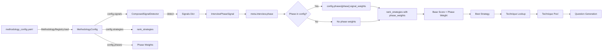

**Phase Weights and Bonuses Example**:
```yaml
phases:
  early:
    signal_weights:      # Multiplicative weights
      deepen: 1.5        # Boost deepen in early phase
      clarify: 1.2
      reflect: 0.8       # Reduce reflect in early phase
    phase_bonuses:       # Additive bonuses
      broaden: 0.2       # Small bonus for broaden strategy
  mid:
    signal_weights:      # Default scoring in mid phase
      deepen: 1.0
      clarify: 1.0
      reflect: 1.0
    phase_bonuses:
      probe: 0.1
  late:
    signal_weights:
      deepen: 0.5        # Reduce deepen in late phase
      clarify: 0.8
      reflect: 1.8       # Boost reflect in late phase
    phase_bonuses:
      synthesize: 0.3
      validate: 0.2
```

**Scoring Formula**:
```python
# Apply phase weight multiplier if available
multiplier = phase_weights.get(strategy.name, 1.0)

# Apply phase bonus additively if available
bonus = phase_bonuses.get(strategy.name, 0.0)

# Final score: (base_score × multiplier) + bonus
final_score = (base_score × multiplier) + bonus
```

## Path 3: Graph State Mutation

**Why Critical**: Understanding how the knowledge graph evolves is essential for debugging coverage and depth issues.

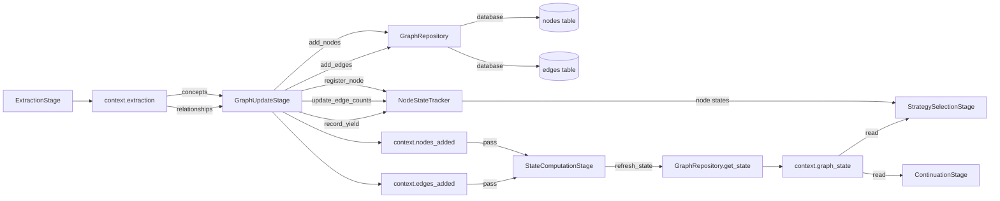

### Key Points

- Extraction produces concepts and relationships
- GraphUpdateStage persists to database AND tracks in context
- **NodeStateTracker integration**:
  - `register_node()` - Registers new nodes when added
  - `update_edge_counts()` - Updates relationship counts
  - `record_yield()` - Records yield when graph changes occur
- StateComputationStage refreshes to get accurate metrics (node_count, coverage, depth)
- NodeStateTracker provides per-node state for node-level signals in StrategySelectionStage
- Multiple downstream stages read the refreshed graph state

## Path 4: Strategy History Tracking (Diversity)

**Why Critical**: Strategy history prevents repetitive questioning and ensures interview diversity.

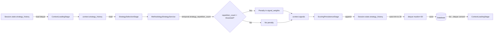

### Key Points

- History is loaded at start of each turn as `deque(maxlen=30)`
- **Automatic trimming**: Deque automatically discards items beyond 30 (O(1) append/pop)
- **Temporal signals** track strategy repetition (`temporal.strategy_repetition_count`)
- Signal weights in YAML configs automatically penalize repetition
- History is appended and saved at end of turn
- **Backward compatibility**: Lists from database are auto-converted to deque via field validator
- Creates a feedback loop for diversity with bounded memory usage

## Path 5: Traceability Chain (ADR-010 Phase 2)

**Why Critical**: Every piece of extracted data is linked back to its source utterance for debugging and analysis.

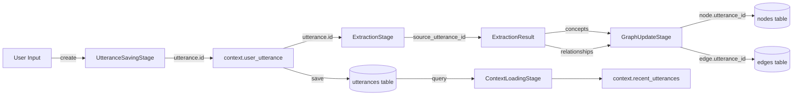

### Key Points

**ADR-010 Phase 2 Enhanced Traceability:**
- `UtteranceSavingStage` generates `utterance.id` (e.g., "utter_123")
- `ExtractionStage` passes `source_utterance_id` to all extracted data:
  - `ExtractedConcept.source_utterance_id` - Links concept to utterance
  - `ExtractedRelationship.source_utterance_id` - Links edge to utterance
- `GraphUpdateStage` stores provenance in database:
  - `node.utterance_id` - Which utterance created this node
  - `edge.utterance_id` - Which utterance created this edge

**Debugging Benefits:**
- Trace any concept/edge back to specific user response
- Debug signal extraction by reviewing LLM model and prompt version
- Analyze response quality by correlating with signal confidence scores
- Reconstruct conversation provenance for analysis

## Path 6: Joint Strategy-Node Selection (D1 Architecture)

**Why Critical**: The D1 architecture selects strategy and node jointly, enabling node exhaustion awareness and intelligent backtracking.

```mermaid
graph LR
    A[StrategySelectionStage] -->|context, graph_state| B[MethodologyStrategyService]
    B --> C[Detect global signals]
    B --> D[Detect node-level signals]
    D --> E[For each tracked node]

    C --> F[rank_strategy_node_pairs]
    E --> F

    F --> G[For each strategy node pair]
    G --> H[Merge global and node signals]
    H --> I[Score strategy combined]
    I --> J[Apply phase weights and bonuses]
    J --> K[Collect strategy node id score]

    K --> L[Sort all pairs by score]
    L --> M[Select best pair]
    M --> N[context strategy focus node id signals]

    N --> O[ContinuationStage]
    O --> P[Validate focus_node_id exists]
    P --> Q[context.focus_concept]
    Q --> R[QuestionGenerationStage]
```

### Key Points

- **D1 Architecture**: `rank_strategy_node_pairs()` replaces separate strategy-then-node selection
- **Joint scoring**: Each (strategy, node) pair gets a combined score:
  - Global signals (graph.*, llm.*, temporal.*, meta.*)
  - Node-specific signals (graph.node.*, technique.node.*, meta.node.*)
  - Node signals take precedence when merging (override global)
- **Node exhaustion awareness**:
  - `graph.node.exhausted.true` applies negative weight in YAML configs
  - `meta.node.opportunity: "exhausted"` signals exhausted nodes
  - Automatically backtracks to fresh nodes
- **Phase-aware scoring**: Applies both multiplicative weights and additive bonuses
- **Output**: Returns best (strategy, node_id, score) with alternatives list for debugging
- **FocusSelectionService** now receives focus_node_id directly from joint selection

## Path 7: Signal Detection Flow

**Why Critical**: Signal detection is the foundation of strategy selection in the new methodology-centric architecture.

```mermaid
graph LR
    A[StrategySelectionStage] -->|context, response_text, node_tracker| B[MethodologyStrategyService]
    B --> C[MethodologyRegistry]
    C -->|load YAML| D[MethodologyConfig]

    D -->|config.signals| E[ComposedSignalDetector]
    E -->|create detectors| F[Signal Pool Registry]

    F --> G[Pass 1: Global Signals]
    G --> H[graph global signals]
    G --> I[llm signals fresh]
    G --> J[temporal signals]
    G --> K[technique signals]

    F --> L[Pass 1: Node-Level Signals]
    L --> M[graph node signals]
    L --> N[technique node signals]
    L --> O[Iterate all tracked nodes]

    H --> P[Signal Detection Complete]
    I --> P
    J --> P
    K --> P
    M --> Q[Node signals dict]
    N --> Q
    O --> Q

    P --> R[Pass 2: Meta Signals]
    Q --> R
    R --> S[meta global signals]
    R --> T[meta node signals]

    S --> U[All Global Signals]
    T --> V[All Node Signals]

    U --> W[InterviewPhaseSignal]
    V --> W
    W --> X[meta.interview.phase]

    X --> Y[Check phase in config]
    Y -->|Yes| Z[config.phases.phase]
    Y -->|No| AA[phase_weights equals None]

    Z --> AB[rank_strategy_node_pairs]
    AA --> AB

    AB --> AC[Score Each Strategy Node]
    AC --> AD[Merge global and node signals]
    AD --> AE[Apply phase weights and bonuses]
    AE --> AF[Sort and Select Best]

    AF --> AG[Best Strategy Node Pair]
```

### Key Points

- **Two-pass detection**: Meta signals depend on non-meta signals
- **Two detection modes**:
  - **Global signals**: Single value per interview (graph.*, llm.*, temporal.*, meta.*)
  - **Node-level signals**: Per-node values (graph.node.*, technique.node.*, meta.node.*)
- **Fresh LLM signals**: Always computed per response (no cross-response caching)
- **Namespaced output**: All signals returned as `{pool.signal_name: value}` dict
- **Node signals format**: `{node_id: {signal_name: value}}` for per-node signals
- **Cost tiers**: Signals declare computation cost (FREE/LOW/MEDIUM/HIGH)
- **Refresh triggers**: Signals declare when to refresh (PER_RESPONSE/PER_TURN/PER_SESSION)
- **Phase detection**: `InterviewPhaseSignal` determines current phase from `meta.interview.phase`
- **Phase weights and bonuses**: Applied from `config.phases[phase]`:
  - `signal_weights`: Multiplicative weights
  - `phase_bonuses`: Additive bonuses
- **Scoring formula**: `final_score = (base_score × multiplier) + bonus`
- **Joint scoring**: `rank_strategy_node_pairs()` merges global + node signals for each (strategy, node) pair

## Path 8: Node State Tracking and Exhaustion

**Why Critical**: NodeStateTracker maintains per-node state for exhaustion detection, enabling intelligent backtracking.

**Phase 9 (2026-02-03)**: NodeStateTracker now persists across turns, enabling response depth tracking for saturation detection.

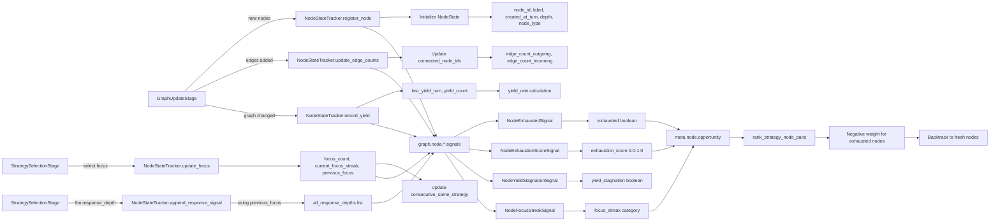

### Key Points

**NodeStateTracker** maintains persistent per-node state across turns:
- **Basic info**: node_id, label, created_at_turn, depth, node_type, is_terminal, level
- **Engagement metrics**: focus_count, last_focus_turn, turns_since_last_focus, current_focus_streak
- **Yield metrics**: last_yield_turn, turns_since_last_yield, yield_count, yield_rate
- **Response quality**: all_response_depths (list of surface/shallow/deep) - **NOW PERSISTED**
- **Relationships**: connected_node_ids, edge_count_outgoing, edge_count_incoming
- **Strategy usage**: strategy_usage_count, last_strategy_used, consecutive_same_strategy
- **previous_focus**: Tracks the focus node from the previous turn - **NOW PERSISTED**

**Response Depth Tracking** (NEW - Phase 9):
1. `llm.response_depth` signal detected in StrategySelectionStage
2. Appended to `previous_focus` node's `all_response_depths` list
3. Enables `consecutive_shallow` saturation detection in StateComputationStage

**Exhaustion Detection Criteria** (NodeExhaustedSignal):
1. Minimum engagement: `focus_count >= 1`
2. Yield stagnation: `turns_since_last_yield >= 3`
3. Persistent focus: `current_focus_streak >= 2`
4. Shallow responses: 2/3 of recent responses are "surface"

### Key Points

**NodeStateTracker** maintains persistent per-node state:
- **Basic info**: node_id, label, created_at_turn, depth, node_type, is_terminal, level
- **Engagement metrics**: focus_count, last_focus_turn, turns_since_last_focus, current_focus_streak
- **Yield metrics**: last_yield_turn, turns_since_last_yield, yield_count, yield_rate
- **Response quality**: all_response_depths (list of surface/shallow/deep)
- **Relationships**: connected_node_ids, edge_count_outgoing, edge_count_incoming
- **Strategy usage**: strategy_usage_count, last_strategy_used, consecutive_same_strategy

**Exhaustion Detection Criteria** (NodeExhaustedSignal):
1. Minimum engagement: `focus_count >= 1`
2. Yield stagnation: `turns_since_last_yield >= 3`
3. Persistent focus: `current_focus_streak >= 2`
4. Shallow responses: 2/3 of recent responses are "surface"

**Exhaustion Score** (NodeExhaustionScoreSignal):
```python
exhaustion_score = (
    min(turns_since_last_yield, 10) / 10.0 * 0.4 +  # 0.0-0.4: Yield stagnation
    min(current_focus_streak, 5) / 5.0 * 0.3 +      # 0.0-0.3: Persistent focus
    shallow_response_ratio * 0.3                      # 0.0-0.3: Response quality
)
```

**Node Opportunity** (meta.node.opportunity):
- `"exhausted"`: Node is exhausted (backtrack recommended)
- `"probe_deeper"`: Deep responses but no yield (extraction opportunity)
- `"fresh"`: Node has opportunity for exploration

## Path 9: Node Tracker Persistence

**Why Critical**: NodeStateTracker must persist across turns to maintain `previous_focus` and `all_response_depths` for response depth tracking and saturation detection.

**Phase 9 (2026-02-03)**: Database persistence added for node_tracker state.

```mermaid
graph LR
    A[SessionService.process_turn] -->|load or create| B[SessionService._get_or_create_node_tracker]

    B -->|check database| C[SessionRepository.get_node_tracker_state]
    C -->|state found?| D{Has persisted state?}

    D -->|Yes| E[NodeStateTracker.from_dict]
    D -->|No| F[New NodeStateTracker]

    E -->|restored states| G[node_tracker]
    F --> G

    G -->|Load at turn start| H[StrategySelectionStage]
    H -->|append_response_depth| I[node_tracker]
    H -->|update_focus| J[node_tracker]

    I -->|all_response_depths.append| K[previous_focus node]
    J -->|set previous_focus| L[node_tracker]

    L -->|After turn completes| M[SessionService._save_node_tracker]
    M -->|to_dict| N[node_tracker.to_dict]
    N -->|JSON serialize| O[tracker_dict]

    O -->|save to database| P[SessionRepository.update_node_tracker_state]
    P -->|Write| Q[(sessions.node_tracker_state)]

    Q -->|Next turn| A
```

### Key Points

**Persistence Flow**:
1. **Load** (turn start): `SessionService._get_or_create_node_tracker()`
   - Queries `sessions.node_tracker_state` from database
   - If found: `NodeStateTracker.from_dict()` restores all node states
   - If not found: Creates fresh `NodeStateTracker()`

2. **Use** (during turn):
   - `StrategySelectionStage.append_response_signal()`: Appends `llm.response_depth` to `previous_focus` node
   - `StrategySelectionStage.update_focus()`: Updates `previous_focus` for next turn

3. **Save** (turn end): `SessionService._save_node_tracker()`
   - `NodeStateTracker.to_dict()`: Serializes to JSON-compatible dict
   - Stores in `sessions.node_tracker_state` column

**Schema Versioning**:
- `NODE_TRACKER_SCHEMA_VERSION = 1` for future compatibility
- Includes: schema_version, previous_focus, states dict

**Backwards Compatibility**:
- Existing sessions with `node_tracker_state = NULL` create fresh tracker (no change in behavior)
- Graceful degradation: If load fails, creates fresh tracker with warning log

**State Size**: ~15KB JSON for 25 nodes (varies by interview length)

**Enables**:
- `consecutive_shallow` saturation detection (now works correctly)
- Response depth tracking across entire interview
- Future features: pause/resume interviews, interview replay

## Path 10: Canonical Slot Discovery (Dual-Graph Architecture)

**Why Critical**: Canonical slot discovery is the foundation of the dual-graph architecture, enabling deduplication of paraphrased concepts for stable exhaustion tracking.

**Phase 2 (2026-02-08)**: System now discovers canonical slots via LLM proposal + embedding similarity.


### Key Points

- **Feature flag**: Controlled by `enable_canonical_slots` in Settings
- **Stage 4.5**: Runs after GraphUpdateStage, before StateComputationStage
- **LLM proposal**: Uses scoring LLM (KIMI) for structured JSON extraction
- **Embedding similarity**: all-MiniLM-L6-v2 (384-dim) for candidate matching
- **Candidate lifecycle**:
  - New slots start as "candidate"
  - Promoted to "active" when support_count >= canonical_min_support_nodes
- **Edge aggregation**: Surface edges aggregated to canonical edges (many-to-one)
- **Output**: SlotDiscoveryOutput with slots_created, slots_updated, mappings_created

### Configuration

From `src/core/config.py`:
```python
enable_canonical_slots: bool = True  # Feature flag
canonical_similarity_threshold: float = 0.83  # Cosine similarity for merging
canonical_min_support_nodes: int = 1  # Support needed for promotion
```

### Services

- **CanonicalSlotService**: LLM-based slot discovery and management
- **EmbeddingService**: Text embeddings via sentence-transformers
- **CanonicalSlotRepository**: CRUD on slots, mappings, edges

## Path 11: Dual-Graph State Computation

**Why Critical**: Stage 5 now computes both surface and canonical graph states in parallel, enabling dual-graph observability.

**Phase 3 (2026-02-08)**: StateComputationStage now returns both graph states.

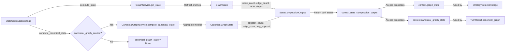

### Key Points

- **Parallel computation**: Both graphs computed in same stage
- **Conditional canonical**: If `enable_canonical_slots=False`, canonical_graph_state=None
- **Service dependency**: CanonicalGraphService injected only when flag enabled
- **StateComputationOutput**: Now includes optional canonical_graph_state field
- **Observability**: TurnResult includes canonical_graph and graph_comparison fields

## Cross-References

| Path | Primary Stages | Secondary Stages | Database Tables |
|------|---------------|------------------|-----------------|
| Turn Count Evolution | 1, 5, 6, 7, 10 | 2, 3, 4, 8, 9 | sessions |
| Joint Strategy-Node Selection (D1) | 4, 6 | 1, 5, 10 | nodes |
| Graph State Mutation | 3, 4, 5 | 6, 7 | nodes, edges |
| Node State Tracking (Exhaustion) | 3, 4, 6 | - | - |
| Node Tracker Persistence | SessionService | 6, 10 | sessions |
| Strategy History (Diversity) | 1, 6, 10 | - | sessions |
| Traceability Chain (ADR-010) | 2, 3, 4 | 5, 6 | utterances, nodes, edges |
| Signal Detection | 6 | - | - |
| Canonical Slot Discovery | 4.5 | 5 | canonical_slots, surface_to_slot_mapping, canonical_edges |
| Dual-Graph State Computation | 5 | 6, 10 | nodes, canonical_slots |

## Usage for Development

When working on the pipeline:

1. **Adding a new stage**: Identify which paths your stage intersects with
2. **Adding a new context field**: Trace its flow through relevant paths
3. **Debugging state issues**: Follow the path for the affected state
4. **Adding a new global signal**: Add to appropriate pool in `src/methodologies/signals/`:
   - `graph/` for knowledge graph signals
   - `llm/` for LLM-based signals (fresh per response)
   - `temporal/` for turn-level temporal signals
   - `meta/` for composite signals
5. **Adding a new node-level signal**: Create `NodeSignalDetector` subclass in `graph/` or `technique/`:
   - Override `detect_for_node(node_id, node_state, ...) -> Dict[node_id, signal_value]`
   - Register in `registry.py` with `"node_level"` flag
6. **Adding a new methodology**: Create YAML config in `src/methodologies/config/`
7. **Debugging joint scoring**: Check `rank_strategy_node_pairs()` output with alternatives list

## Related Documentation

- [Pipeline Contracts](./pipeline_contracts.md) - Stage read/write specifications
- [ADR-008: Internal API Boundaries](./adr/008-internal-api-boundaries-pipeline-pattern.md) - Architecture rationale
- [ADR-010: Pipeline Contracts](./adr/010-formalize-pipeline-contracts-strengthen-data-models.md) - Contract formalization
- [ADR-014: Signal Pools Architecture](./adr/ADR-014-signal-pools-architecture.md) - Signal pools design
- [ADR-015: Node Exhaustion Backtracking](./adr/ADR-015-node-exhaustion-backtracking.md) - Node exhaustion and backtracking
- [SYSTEM_DESIGN](./SYSTEM_DESIGN.md) - Narrative system architecture for articles
