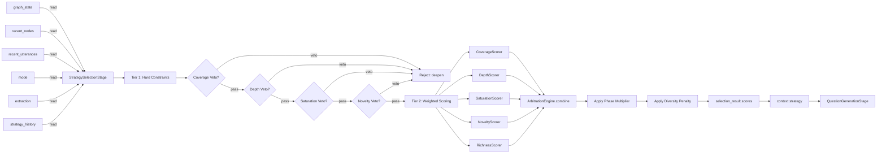
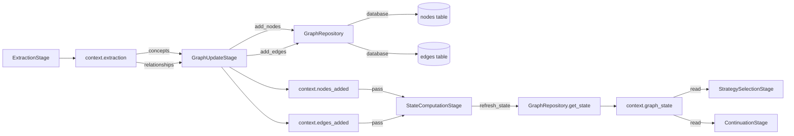
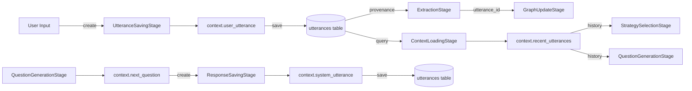
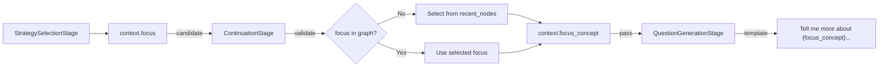

# Data Flow Paths - Critical Path Diagrams

> **Context**: This document visualizes critical data flow paths through the turn processing pipeline.
> **Related**: [Pipeline Contracts](./pipeline_contracts.md) | [ADR-008: Internal API Boundaries](./adr/008-internal-api-boundaries-pipeline-pattern.md)

## Overview

The turn pipeline has several critical data flow paths that are essential to understand for maintaining and extending the system. These paths represent:

1. **State mutation flows** - How interview state evolves across turns
2. **Decision-making flows** - How strategies are selected and applied
3. **Information processing flows** - How user input becomes graph updates
4. **History tracking flows** - How we maintain conversation context and diversity

## Path 1: Turn Count Evolution

**Why Critical**: The turn count controls the entire interview lifecycle, determining:
- Which interview phase we're in (early, middle, late)
- When to apply phase multipliers in strategy scoring
- When to terminate the interview

```mermaid
graph LR
    A[Session.state.turn_count] -->|load| B[ContextLoadingStage]
    B -->|current = turn_count + 1| C[context.turn_number]
    C -->|pass through| D[UtteranceSavingStage]
    D --> E[ExtractionStage]
    E --> F[GraphUpdateStage]
    F --> G[StateComputationStage]
    G -->|refresh| H[graph_state.properties.turn_count]
    H -->|read| I[StrategySelectionStage]
    I --> J[StrategyService._determine_phase]
    J --> K[phase_multipliers applied]
    K --> L[selection_result.phase]
    L --> M[ContinuationStage]
    M -->|check| N{turn_number >= max_turns?}
    N -->|No| O[should_continue = True]
    N -->|Yes| P[should_continue = False]
    O --> Q[ScoringPersistenceStage]
    P --> Q
    Q -->|increment| R[Session.state.turn_count += 1]
    R --> S[Next Turn]
```



### Key Points

- **`turn_count`** (stored in database) = number of *completed* turns
- **`turn_number`** (in context) = current turn being processed = `turn_count + 1`
- Turn count is **loaded** from database in ContextLoadingStage
- Turn count is **refreshed** from graph state in StateComputationStage
- Turn count is **checked** against max_turns in ContinuationStage
- Turn count is **incremented** and saved back in ScoringPersistenceStage

### Implementation Note

In `ContextLoadingStage`, the turn number is calculated as:
```python
# turn_count is completed turns, so current turn is turn_count + 1
context.turn_number = (session.state.turn_count or 0) + 1
```

This ensures that:
- Turn 1 starts with `turn_count = 0` (no completed turns yet)
- After turn 1 completes, `turn_count = 1`
- Turn 2 starts with `turn_number = 2`

## Path 2: Strategy Selection Two-Tier Scoring

**Why Critical**: Strategy selection is the core decision-making logic that determines interview quality and coverage.



### Key Points

- **Tier 1** is early-exit: first veto rejects immediately
- **Tier 2** aggregates all scorer outputs
- **Phase multiplier** adjusts scores based on interview phase
- **Diversity penalty** reduces scores for recently-used strategies

## Path 3: Graph State Mutation

**Why Critical**: Understanding how the knowledge graph evolves is essential for debugging coverage and depth issues.



### Key Points

- Extraction produces concepts and relationships
- GraphUpdateStage persists to database AND tracks in context
- StateComputationStage refreshes to get accurate metrics (node_count, coverage, depth)
- Multiple downstream stages read the refreshed graph state

## Path 4: Strategy History Tracking (Diversity)

**Why Critical**: Strategy history prevents repetitive questioning and ensures interview diversity.

```mermaid
graph LR
    A[Session.state.strategy_history] -->|load| B[ContextLoadingStage]
    B --> C[context.strategy_history]

    C -->|read| D[StrategySelectionStage]
    D --> E[StrategyService._calculate_diversity_penalty]

    E -->|recent_strategies| F{strategy in history?}
    F -->|Yes| G[Apply penalty: -0.3]
    F -->|No| H[No penalty: 0.0]

    G --> I[selection_result.diversity_penalty]
    H --> I

    I --> J[ScoringPersistenceStage]
    J -->|append| K[Session.state.strategy_history]
    K -->|save| L[(Database)]
    L -->|next turn| M[ContextLoadingStage]
```



### Key Points

- History is loaded at start of each turn
- Penalty is applied during Tier 2 scoring
- History is appended and saved at end of turn
- Creates a feedback loop for diversity

## Path 5: Utterance Provenance Tracking

**Why Critical**: Every user input and system response is tracked for debugging and conversation history.



### Key Points

- Each utterance gets a unique ID and timestamp
- User utterance ID is attached to graph nodes/edges for provenance
- Recent utterances are loaded for conversation context
- Both user and system utterances are persisted

## Path 6: Focus Concept Selection

**Why Critical**: The focus concept determines what the next question will explore.



### Key Points

- Strategy stage proposes a focus concept
- Continuation stage validates and selects final focus
- Falls back to recent nodes if proposed focus not in graph
- Used by question generation for templating

## Cross-References

| Path | Primary Stages | Secondary Stages | Database Tables |
|------|---------------|------------------|-----------------|
| Turn Count Evolution | 1, 5, 6, 7, 10 | 2, 3, 4, 8, 9 | sessions |
| Strategy Selection | 6, 10 | 1 | strategies, scoring |
| Graph State Mutation | 3, 4, 5 | 6, 7 | nodes, edges |
| Strategy History | 1, 6, 10 | - | sessions |
| Utterance Provenance | 1, 2, 4, 9 | 3, 6, 8 | utterances |
| Focus Concept | 6, 7, 8 | - | - |

## Usage for Development

When working on the pipeline:

1. **Adding a new stage**: Identify which paths your stage intersects with
2. **Adding a new context field**: Trace its flow through relevant paths
3. **Debugging state issues**: Follow the path for the affected state
4. **Performance optimization**: Identify hot paths (commonly traversed stages)

## Related Documentation

- [Pipeline Contracts](./pipeline_contracts.md) - Stage read/write specifications
- [ADR-008: Internal API Boundaries](./adr/008-internal-api-boundaries-pipeline-pattern.md) - Architecture rationale
- [ADR-004: Two-Tier Scoring System](./adr/004-two-tier-scoring-system.md) - Scoring algorithm details
