# Data Flow Paths - Critical Path Diagrams

> **Context**: This document visualizes critical data flow paths through the turn processing pipeline.
> **Related**: [Pipeline Contracts](./pipeline_contracts.md)

## Overview

The turn pipeline has several critical data flow paths that are essential to understand for maintaining and extending the system. These paths represent:

1. **State mutation flows** - How interview state evolves across turns
2. **Decision-making flows** - How strategies are selected using signal pools
3. **Information processing flows** - How user input becomes graph updates
4. **History tracking flows** - How we maintain conversation context and diversity


## Path 1: Turn Count Evolution

**Why Critical**: The turn count controls the entire interview lifecycle, determining:
- Which interview phase we're in (early, middle, late)
- When to apply phase multipliers in strategy scoring
- When to terminate the interview

```mermaid
graph LR
    A[Session.state.turn_count] -->|load| B[ContextLoadingStage]
    B -->|current = turn_count + 1| C[context.turn_number]
    C -->|pass through| D[SRLPreprocessingStage]
    D --> E[UtteranceSavingStage]
    E --> F[ExtractionStage]
    F --> G[GraphUpdateStage]
    G --> H[StateComputationStage]
    H -->|sync| I[graph_state.turn_count]
    I -->|read| J[StrategySelectionStage]
    J --> K[MethodologyStrategyService.select_strategy_and_focus]
    K --> L[focus + strategy]
    L --> M[ContinuationStage]
    M --> N{turn_number >= max_turns?}
    N -->|No| O[should_continue = True]
    N -->|Yes| P[should_continue = False]
    O --> Q[ScoringPersistenceStage]
    P --> Q
    Q -->|store| R[Session.state.turn_count = context.turn_number]
    R --> S[Next Turn]
```

### Key Points

- **`turn_count`** (stored in database) = number of *completed* turns
- **`turn_number`** (in context) = current turn being processed = `turn_count + 1`
- Turn count is **loaded** from database in ContextLoadingStage
- Turn count is **synced** to graph state in StateComputationStage
- Turn count is **checked** against max_turns in ContinuationStage (also considers strategy termination and saturation)
- Turn count is **updated** to the current turn number and saved back in ScoringPersistenceStage (represents completed turns after this turn)

### Implementation Note

In `ContextLoadingStage`, the turn number is calculated as:
```python
# turn_count is completed turns, so current turn is turn_count + 1
context_loading_output = ContextLoadingOutput(
    turn_number=(session.state.turn_count or 0) + 1,
    ...
)
# Accessed via context.turn_number property (reads from context_loading_output)
```

This ensures that:
- Turn 1 starts with `turn_count = 0` (no completed turns yet)
- After turn 1 completes, `turn_count = 1`
- Turn 2 starts with `turn_number = 2`


## Path 2: Strategy Selection Pipeline

**Why Critical**: Strategy selection is the core decision-making logic that determines interview quality and coverage.

The system uses methodology-based signal detection with YAML configuration. Phase-based weight multipliers are applied to strategy scores based on interview phase (early/mid/late). Two-stage strategy→node selection (D2 architecture) enables per-node exhaustion awareness and intelligent backtracking: first select strategy from global signals, then conditionally select node for node-bound strategies.

### Signal Detection (Foundation)

**Why Critical**: Signal detection is the foundation of strategy selection in the new methodology-centric architecture.

Signal detection operates in two modes:
- **Global signals**: Single value per interview (graph.*, llm.*, temporal.*, meta.*)
- **Node-level signals**: Per-node values (graph.node.*, technique.node.*, meta.node.*)

**Detection Flow**:

1. **GlobalSignalDetectionService** extracts last question from `recent_utterances` (last system utterance) and passes it to `ComposedSignalDetector` for context-aware LLM scoring
2. **ComposedSignalDetector.detect()** accepts optional `question` parameter and threads it to `LLMBatchDetector`
3. **NodeSignalDetectionService** detects node-level signals via hardcoded detector instances
4. **InterviewPhaseSignal** is called explicitly (not via ComposedSignalDetector) to detect phase

**Key implementation details**:

- **GlobalSignalDetectionService** extracts last question from recent_utterances for context
- **ComposedSignalDetector** performs global signal detection (graph.*, llm.*, temporal.*, meta.*)
- **NodeSignalDetectionService** detects per-node signals (graph.node.*, technique.node.*)
- **LLMBatchDetector** loads rubrics from `src/signals/llm/prompts/signals.md`
- All 5 LLM signals detected in single API call
- Response text truncated to 500 chars, question to 200 chars
- **InterviewPhaseSignal** detects current phase (early/mid/late)

**LLM Batch Detection**:
- `LLMBatchDetector` loads rubrics from `src/signals/llm/prompts/signals.md` using indentation-based parsing
- Rubric structure: `signal_name: description` (no indent) followed by indented scoring criteria
- All 5 LLM signals (response_depth, specificity, certainty, valence, engagement) detected in single API call
- **Question context**: Receives the preceding interviewer question for context-aware scoring (extracted from `recent_utterances` by `GlobalSignalDetectionService`)
- **Truncation**: Response text truncated to 500 chars (~75 words), question text to 200 chars — balances scoring accuracy with token costs
- Rubrics injected into prompt to guide LLM scoring
- LLM returns structured JSON with scores and rationales; stored signal value is score only (rationales logged but not persisted)

**Signal Types**:
- `llm.response_depth`: Categorical string (surface/shallow/moderate/deep)
- `llm.specificity`, `llm.certainty`, `llm.valence`, `llm.engagement`, `llm.intellectual_engagement`: Float [0,1] (normalized from Likert 1-5)

**LLM signals are fresh** - computed every response via rubric-based prompts, no cross-response caching

**Signal normalization**: Non-categorical LLM signals (specificity, certainty, valence, engagement) normalized to [0,1] from Likert 1-5 scale

**Rubric parsing** - Rubric definitions use indentation-based structure (signal_name: description, with indented content for scoring criteria)

**Dependency ordering**: Signals with dependencies receive accumulated signals via context wrapper; detection proceeds sequentially

**Namespaced output**: All signals returned as `{pool.signal_name: value}` dict

**Node signals format**: `{node_id: {signal_name: value}}` for per-node signals

### Two-Stage Strategy→Node Selection (D2 Architecture)

**Why Critical**: The D2 architecture separates strategy selection from node selection, enabling cleaner separation of concerns while maintaining node exhaustion awareness and intelligent backtracking.

The D2 architecture replaces joint (strategy, node) pair scoring with a two-stage approach: first select strategy from global signals only, then conditionally select node for strategies with `node_binding="required"`. This enables the system to be aware of per-node exhaustion and automatically backtrack to fresh nodes, while keeping strategies like `reflect` and `revitalize` that operate at the conversation level.

**Two-Stage Process**:

**Stage 1: Strategy Selection** (`rank_strategies()`)
- Scores all strategies using global signals only (graph.*, llm.*, temporal.*, meta.*)
- `partition_signal_weights()` auto-excludes node-scoped weights (graph.node.*, technique.node.*, meta.node.*)
- Applies phase-based multipliers (multiplicative) and bonuses (additive)
- Returns ranked list of (strategy_config, score) tuples

**Stage 2: Node Selection** (`rank_nodes_for_strategy()`)
- Conditionally executed only when `node_binding="required"` and node_signals exist
- Scores nodes for the selected strategy using node-scoped signals only
- No phase weights applied (uses raw signal weights)
- Returns ranked list of (node_id, score) tuples with `ScoredCandidate` decomposition

**Key implementation details**:

- `rank_strategies()` selects strategy from global signals via `partition_signal_weights()`
- `rank_nodes_for_strategy()` scores nodes for node-bound strategies
- `node_binding` field controls Stage 2 execution: `"required"` (default) vs `"none"`
- Strategies like `reflect` and `revitalize` use `node_binding: none` (conversation-level)
- Response depth appended to previous_focus BEFORE update_focus() (critical ordering)
- **FocusSelectionService** resolves focus_node_id with graceful fallback

**Node Exhaustion Awareness**:
- Stage 2 applies node-scoped weights (e.g., `graph.node.exhaustion_score.low: 1.0`)
- `meta.node.opportunity: "exhausted"` signals exhausted nodes
- Automatically backtracks to fresh nodes

**Phase-Aware Scoring**: Phase weights and bonuses applied in Stage 1 only (strategy selection), not Stage 2 (node selection)

**Output**: Returns (strategy_name, focus_node_id, alternatives, ...) where:
- `strategy_name`: Selected strategy name
- `focus_node_id`: Selected node ID (None if `node_binding="none"`)
- `alternatives`: List of (strategy_name, score) tuples for observability (2-tuple, not 3-tuple)

**Response Depth Tracking**: `llm.response_depth` appended to `previous_focus` node BEFORE `update_focus()` (critical ordering)

**NodeTracker Integration**: `update_focus()` called after response depth append to set `previous_focus` for next turn

**strategy_alternatives** returns list of (strategy_name, score) tuples for debugging (changed from 3-tuple)

### Phase Weights & Strategy Selection

**InterviewPhaseSignal** detects current phase (`early`, `mid`, `late`) from `meta.interview.phase` signal

**Phase weights and bonuses** are defined in YAML config under `config.phases[phase]`:
- `signal_weights`: Multiplicative strategy weights (e.g., `deepen: 1.5`)
- `phase_bonuses`: Additive strategy bonuses (e.g., `broaden: 0.2`)

**Scoring formula**: `final_score = (base_score × multiplier) + bonus` when phase weights are available

**MethodologyStrategyService** loads YAML configs from `config/methodologies/`

**NodeStateTracker** provides per-node state for node-level signals

### Signal Namespacing

All signals use dot-notation namespacing to prevent collisions:

| Pool | Namespace | Examples |
|------|-----------|----------|
| **Graph (Global)** | `graph.*` | max_depth, chain_completion.ratio, chain_completion.has_complete, canonical_concept_count, canonical_edge_density, canonical_exhaustion_score |
| **Graph (Node)** | `graph.node.*` | exhausted, exhaustion_score, yield_stagnation, focus_streak, recency_score, is_orphan, edge_count |
| **LLM** | `llm.*` | response_depth, valence, certainty, specificity, engagement |
| **Temporal** | `temporal.*` | strategy_repetition_count, turns_since_strategy_change |
| **Meta** | `meta.*` | interview_progress, interview.phase |
| **Meta (Node)** | `meta.node.*` | opportunity (exhausted/probe_deeper/fresh) |
| **Technique (Node)** | `technique.node.*` | strategy_repetition (consecutive same strategy on node) |

**Note**: Legacy signals `node_count`, `edge_count`, `orphan_count` are still computed in graph state but no longer used in strategy scoring signal weights.

### YAML Configuration Flow

```mermaid
graph LR
    A[methodology_config.yaml] -->|MethodologyRegistry.load| B[MethodologyConfig]
    B -->|config.signals| C[ComposedSignalDetector]
    B -->|config.strategies| D[rank_strategies]
    B -->|config.phases| E[Phase Weights]

    C -->|detect| F[Signals Dict]
    F --> G[InterviewPhaseSignal]
    G --> H[meta.interview.phase]

    H --> I{Phase in config?}
    I -->|Yes| J["config.phases[phase].signal_weights"]
    I -->|No| K[No phase weights]

    J --> L[rank_strategies with phase_weights]
    K --> L

    L --> M[partition_signal_weights excludes node signals]
    M --> N[Base Score × Phase Weight + Bonus]
    N --> O[Best Strategy]

    O --> P{node_binding == "required"?}
    P -->|Yes| Q[rank_nodes_for_strategy]
    P -->|No| R[No node selection]

    Q --> S[partition_signal_weights extracts node signals]
    S --> T[Score nodes with node weights]
    T --> U[Best Node]

    U --> V[Technique Lookup]
    R --> V
    V --> W[Technique Pool]
    W --> X[Question Generation]
```

**Phase Weights and Bonuses Example**:
```yaml
phases:
  early:
    signal_weights:      # Multiplicative weights
      deepen: 1.5        # Boost deepen in early phase
      clarify: 1.2
      reflect: 0.8       # Reduce reflect in early phase
    phase_bonuses:       # Additive bonuses
      broaden: 0.2       # Small bonus for broaden strategy
  mid:
    signal_weights:      # Default scoring in mid phase
      deepen: 1.0
      clarify: 1.0
      reflect: 1.0
    phase_bonuses:
      probe: 0.1
  late:
    signal_weights:
      deepen: 0.5        # Reduce deepen in late phase
      clarify: 0.8
      reflect: 1.8       # Boost reflect in late phase
    phase_bonuses:
      synthesize: 0.3
      validate: 0.2
```

**Scoring Formula**:
```python
# Apply phase weight multiplier if available
multiplier = phase_weights.get(strategy.name, 1.0)

# Apply phase bonus additively if available
bonus = phase_bonuses.get(strategy.name, 0.0)

# Final score: (base_score × multiplier) + bonus
final_score = (base_score × multiplier) + bonus
```

### Complete Flow Diagram

```mermaid
graph TB
    subgraph "1. Context & History Loading"
        A[graph_state] -->|read| B[StrategySelectionStage]
        C[recent_nodes] -->|read| B
        D[recent_utterances] -->|read| B
        E[extraction] -->|read| B
        F[strategy_history] -->|read| B
        G[node_tracker] -->|read| B
    end

    subgraph "2. Signal Detection"
        B --> H[MethodologyStrategyService]
        H --> I[MethodologyRegistry.get_methodology]
        I --> J[YAML Config]
        
        J --> K1[GlobalSignalDetectionService]
        J --> K2[NodeSignalDetectionService]
        
        K1 --> L1[Extract last question from recent_utterances]
        L1 --> L2[ComposedSignalDetector]
        
        L2 --> M1[graph.* global signals]
        L2 --> M2[llm.* signals - batch detect]
        L2 --> M3[temporal.* signals]
        L2 --> M4[meta.* global signals]
        
        K2 --> N1[graph.node.* signals]
        K2 --> N2[technique.node.* signals]
        K2 --> N3[meta.node.* signals]
        
        M1 --> O[Global Signals Dict]
        M2 --> O
        M3 --> O
        M4 --> O
        
        N1 --> P[Node Signals Dict per node_id]
        N2 --> P
        N3 --> P
    end

    subgraph "3. Phase Detection"
        O --> Q[InterviewPhaseSignal.detect]
        Q --> R[meta.interview.phase]
        R --> S{Phase in config?}
        
        S -->|Yes| T["config.phases[phase]"]
        S -->|No| U[phase_weights = None]
        
        T --> V1[signal_weights - multiplicative]
        T --> V2[phase_bonuses - additive]
    end

    subgraph "4. Stage 1: Strategy Selection"
        O --> W[rank_strategies]
        V1 --> W
        V2 --> W
        U --> W

        W --> X[partition_signal_weights excludes node signals]
        X --> Y[Score each strategy with global signals]

        Y --> Z{phase_weights available?}

        Z -->|Yes| AA["final_score = base_score × multiplier + bonus"]
        Z -->|No| AB[final_score = base_score]

        AA --> AC[Sort strategies by score descending]
        AB --> AC

        AC --> AD[Select best_strategy_config]
    end

    subgraph "5. Stage 2: Node Selection (Conditional)"
        AD --> AE{node_binding == "required"?}

        AE -->|Yes| AF{node_signals exist?}
        AE -->|No| AK[focus_node_id = None]

        AF -->|Yes| AG[rank_nodes_for_strategy]
        AF -->|No| AK

        P --> AG

        AG --> AH[partition_signal_weights extracts node weights]
        AH --> AI[Score each node with node signals]

        AI --> AJ[Sort nodes by score descending]
        AJ --> AL[Select best node_id]

        AL --> AM[focus_node_id = best node_id]
    end

    subgraph "6. Build Alternatives & Focus Update"
        AD --> AN[strategy_alternatives = [(strategy, score), ...]]
        AN --> AO[2-tuple format for observability]

        AO --> AP[Append llm.response_depth to previous_focus]
        AM --> AP
        AM --> AQ[node_tracker.update_focus new focus]
        AP --> AQ
        AQ --> AR[Set previous_focus for next turn]
    end

    subgraph "7. Output to Continuation"
        AD --> AS[context.strategy]
        AM --> AS[context.focus_node_id]
        O --> AT[context.signals]
        P --> AT

        AS --> AU[ContinuationStage]
        AM --> AU
        AT --> AU

        AU --> AV[FocusSelectionService.resolve_focus]
        AV --> AW[context.focus_concept with fallback]
        AW --> AX[QuestionGenerationStage]
    end

    style K1 fill:#e1f5ff
    style K2 fill:#e1f5ff
    style W fill:#ffe1e1
    style AD fill:#e1ffe1
    style AG fill:#fff4e1
```


## Path 3: Graph State Mutation

**Why Critical**: Understanding how the knowledge graph evolves is essential for debugging coverage and depth issues.

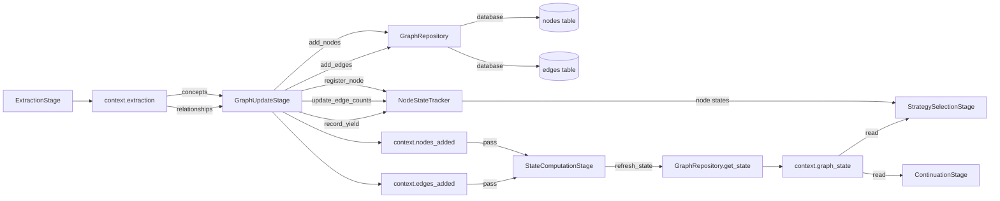

### Key Points

- Extraction produces concepts and relationships
- GraphUpdateStage persists to database AND tracks in context
- **Surface deduplication**: GraphUpdateStage performs 3-step deduplication (exact → semantic → create) before persistence (see Path 12)
- **NodeStateTracker integration**:
  - `register_node()` - Registers new nodes when added
  - `update_edge_counts()` - Updates relationship counts
  - `record_yield()` - Records yield when graph changes occur
- StateComputationStage refreshes to get accurate metrics (node_count, coverage, depth)
- NodeStateTracker provides per-node state for node-level signals in StrategySelectionStage
- Multiple downstream stages read the refreshed graph state
- **Repository**: GraphRepository class in `graph_repo.py` (note: file name uses short form)


## Path 4: Strategy History Tracking (Diversity)

**Why Critical**: Strategy history prevents repetitive questioning and ensures interview diversity.

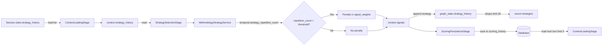

### Key Points

- History is loaded at start of each turn as `List[str]` (limited to 5 recent strategies by `SessionRepository.get_recent_strategies()`)
- **Temporal signals** track strategy repetition (`temporal.strategy_repetition_count`)
- Signal weights in YAML configs automatically penalize repetition
- History append happens in StrategySelectionStage after strategy selection; stored in GraphState deque (maxlen=30)
- History persistence to database happens in ScoringPersistenceStage via `scoring_history` table
- Creates a feedback loop for diversity with bounded memory usage (DB query limit: 5, deque limit: 30)


## Path 5: Traceability Chain

**Why Critical**: Every piece of extracted data is linked back to its source utterance for debugging and analysis.

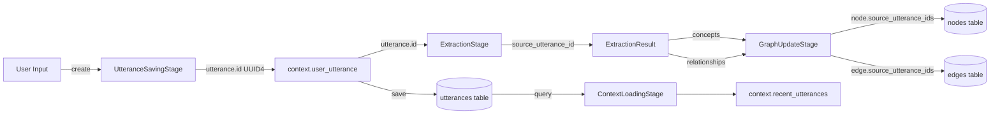

### Key Points

**Enhanced Traceability:**
- `UtteranceSavingStage` generates `utterance.id` as UUID4 (e.g., "a1b2c3d4-e5f6-7890-abcd-ef1234567890")
- `ExtractionStage` passes `source_utterance_id` to all extracted data:
  - `ExtractedConcept.source_utterance_id` - Links concept to utterance
  - `ExtractedRelationship.source_utterance_id` - Links edge to utterance
- `GraphUpdateStage` stores provenance in database:
  - `node.source_utterance_ids` - Which utterances created this node (supports multiple sources for deduplication)
  - `edge.source_utterance_ids` - Which utterances created this edge (supports multiple sources)

**Debugging Benefits:**
- Trace any concept/edge back to specific user response
- Debug signal extraction by reviewing LLM model and prompt version
- Analyze response quality by correlating with signal confidence scores
- Reconstruct conversation provenance for analysis


## Path 8: Node State Lifecycle

**Why Critical**: NodeStateTracker maintains per-node state for exhaustion detection, enabling intelligent backtracking. NodeStateTracker persists across turns, enabling response depth tracking for saturation detection.

### State Tracking & Exhaustion Detection

**NodeStateTracker maintains**:
- **Basic info**: node_id, label, created_at_turn, depth, node_type, is_terminal, level
- **Engagement metrics**: focus_count, last_focus_turn, turns_since_last_focus, current_focus_streak
- **Yield metrics**: last_yield_turn, turns_since_last_yield, yield_count, yield_rate
- **Response quality**: all_response_depths (list of surface/shallow/moderate/deep)
- **Relationships**: connected_node_ids, edge_count_outgoing, edge_count_incoming
- **Strategy usage**: strategy_usage_count, last_strategy_used, consecutive_same_strategy
- **previous_focus**: Tracks the focus node from the previous turn

**Response Depth Tracking**:
1. `llm.response_depth` signal detected in StrategySelectionStage
2. Appended to `previous_focus` node's `all_response_depths` list
3. Enables `consecutive_shallow` saturation detection in StateComputationStage

**Exhaustion Detection Criteria** (NodeExhaustedSignal):
1. Minimum engagement: `focus_count >= 1`
2. Yield stagnation: `turns_since_last_yield >= 2` (tightened from 3 for faster node rotation)
3. Persistent focus: `current_focus_streak >= 2`
4. Shallow responses: 2/3 of recent responses are "surface"

**Exhaustion Score** (NodeExhaustionScoreSignal):
```python
exhaustion_score = (
    min(turns_since_last_yield, 10) / 10.0 * 0.4 +  # 0.0-0.4: Yield stagnation
    min(current_focus_streak, 5) / 5.0 * 0.3 +      # 0.0-0.3: Persistent focus
    shallow_response_ratio * 0.3                      # 0.0-0.3: Response quality
)
```

**Node Opportunity** (meta.node.opportunity):
- `"exhausted"`: Node is exhausted (backtrack recommended)
- `"probe_deeper"`: Deep responses but no yield (extraction opportunity)
- `"fresh"`: Node has opportunity for exploration

### Persistence Across Turns

**Persistence Flow**:
1. **Load** (turn start): `SessionService._get_or_create_node_tracker()`
   - Queries `sessions.node_tracker_state` from database
   - If found: `NodeStateTracker.from_dict()` restores all node states
   - If not found: Creates fresh `NodeStateTracker()`

2. **Use** (during turn):
   - `StrategySelectionStage.append_response_signal()`: Appends `llm.response_depth` to `previous_focus` node
   - `StrategySelectionStage.update_focus()`: Updates `previous_focus` for next turn

3. **Save** (turn end): `SessionService._save_node_tracker()`
   - `NodeStateTracker.to_dict()`: Serializes to JSON-compatible dict
   - Stores in `sessions.node_tracker_state` column

**Schema Versioning**:
- `NODE_TRACKER_SCHEMA_VERSION = 1` for future compatibility
- Includes: schema_version, previous_focus, states dict

**Backwards Compatibility**:
- Existing sessions with `node_tracker_state = NULL` create fresh tracker (no change in behavior)
- Graceful degradation: If load fails, creates fresh tracker with warning log

**State Size**: ~15KB JSON for 25 nodes (varies by interview length)

**Enables**:
- `consecutive_shallow` saturation detection (now works correctly)
- Response depth tracking across entire interview
- Future features: pause/resume interviews, interview replay

### Complete Lifecycle Diagram

```mermaid
graph TB
    subgraph "Turn Start: Load Node Tracker"
        A[SessionService.process_turn] -->|load or create| B[SessionService._get_or_create_node_tracker]
        B -->|query| C[(sessions.node_tracker_state)]
        C -->|state exists?| D{Has persisted state?}
        D -->|Yes| E[NodeStateTracker.from_dict]
        D -->|No| F[New NodeStateTracker]
        E -->|restored states| G[node_tracker]
        F --> G
    end

    subgraph "Turn Processing: Graph Updates"
        G -->|inject| H[GraphUpdateStage]
        H -->|new nodes| I[NodeStateTracker.register_node]
        H -->|edges added| J[NodeStateTracker.update_edge_counts]
        H -->|graph changed| K[NodeStateTracker.record_yield]
        
        I --> L[Initialize NodeState:<br/>node_id, label, created_at_turn<br/>depth, node_type, is_terminal, level]
        
        J --> M[Update relationship metrics:<br/>connected_node_ids<br/>edge_count_outgoing<br/>edge_count_incoming]
        
        K --> N[Update yield metrics:<br/>last_yield_turn<br/>turns_since_last_yield<br/>yield_count, yield_rate]
    end

    subgraph "Turn Processing: Strategy Selection"
        G -->|inject| O[StrategySelectionStage]
        L --> O
        M --> O
        N --> O
        
        O -->|detect response depth| P[llm.response_depth signal]
        P -->|append to previous_focus| Q[NodeStateTracker.append_response_signal]
        Q -->|update| R[all_response_depths list]
        
        O -->|after selection| S[NodeStateTracker.update_focus]
        S --> T[Update engagement metrics:<br/>focus_count++<br/>current_focus_streak<br/>last_focus_turn<br/>turns_since_last_focus]
        S --> U[Update strategy metrics:<br/>strategy_usage_count<br/>last_strategy_used<br/>consecutive_same_strategy]
        S --> V[Set previous_focus<br/>for next turn]
    end

    subgraph "Signal Detection from Node States"
        R --> W[NodeExhaustedSignal:<br/>graph.node.exhausted.true/false]
        R --> X[NodeExhaustionScoreSignal:<br/>graph.node.exhaustion_score 0.0-1.0]
        T --> W
        T --> X
        N --> W
        N --> X
        
        W --> Y[NodeOpportunitySignal:<br/>meta.node.opportunity]
        X --> Y
        T --> Y
        
        Y --> Z{Node opportunity?}
        Z -->|exhausted| AA[Backtrack recommended]
        Z -->|probe_deeper| AB[Extraction opportunity]
        Z -->|fresh| AC[Exploration ready]
        
        W --> AD[NodeYieldStagnationSignal:<br/>graph.node.yield_stagnation]
        T --> AE[NodeFocusStreakSignal:<br/>graph.node.focus_streak]
        
        U --> AF[TechniqueNodeStrategyRepetitionSignal:<br/>technique.node.strategy_repetition]
    end

    subgraph "Two-Stage Strategy Selection (D2)"
        AA --> AG[Stage 1: rank_strategies - global signals]
        AB --> AG
        AC --> AG
        AD --> AG
        AE --> AG
        AF --> AG
        X --> AG

        AG --> AH[Select best strategy]
        AH --> AI{node_binding == "required"?}

        AI -->|Yes| AJ[Stage 2: rank_nodes_for_strategy]
        AI -->|No| AK[No node selection]

        AJ --> AL[Score nodes with node-scoped signals]
        AL --> AM[Select best node]

        AM --> AN[negative weight for exhausted → backtrack]
        AK --> AN
    end

    subgraph "Turn End: Save Node Tracker"
        V --> AM[SessionService._save_node_tracker]
        AM -->|serialize| AN[NodeStateTracker.to_dict]
        AN --> AO[JSON dict:<br/>schema_version<br/>previous_focus<br/>states dict]
        AO -->|write| AP[(sessions.node_tracker_state)]
        AP -->|next turn| A
    end

    style G fill:#e1f5e1
    style R fill:#fff3cd
    style V fill:#fff3cd
    style AG fill:#d1ecf1
    style AP fill:#f8d7da
```

### Key Integration Points

**GraphUpdateStage → NodeStateTracker**:
- `register_node()`: Creates initial node state when nodes are added to graph
- `update_edge_counts()`: Updates relationship metrics when edges are created
- `record_yield()`: Tracks yield events when graph structure changes

**StrategySelectionStage → NodeStateTracker**:
- `append_response_signal()`: Records response depth to `previous_focus` node BEFORE updating focus
- `update_focus()`: Updates engagement and strategy metrics after two-stage strategy→node selection
- Critical ordering: Response depth append happens before focus update to target correct node

**NodeStateTracker → Signal Detection**:
- Node states feed multiple signal detectors (NodeExhaustedSignal, NodeExhaustionScoreSignal, NodeOpportunitySignal, etc.)
- Node signals flow into `rank_nodes_for_strategy()` for Stage 2 node selection
- Exhausted nodes receive negative weights, enabling intelligent backtracking

**SessionService → Persistence**:
- Load: `_get_or_create_node_tracker()` restores state at turn start
- Save: `_save_node_tracker()` persists state at turn end
- Enables cross-turn response depth tracking and saturation detection


## Path 10: Canonical Slot Discovery & Mapping (Dual-Graph Architecture)

**Why Critical**: Canonical slot discovery is the foundation of the dual-graph architecture, enabling deduplication of paraphrased concepts for stable exhaustion tracking.

**Dual-Graph Architecture**: System discovers canonical slots via LLM proposal + embedding similarity.

```mermaid
graph LR
    A[GraphUpdateStage] -->|nodes_added| B[SlotDiscoveryStage]
    B -->|has nodes?| C{nodes_added > 0?}
    C -->|No| D[Skip LLM call, return empty]
    C -->|Yes| E[CanonicalSlotService.discover_slots_for_nodes]

    E -->|Group by node_type| F[Nodes by type]
    F -->|LLM call| G[Propose canonical slots]
    G -->|For each proposal| H{Similar match exists?}

    H -->|Yes, similarity >= threshold| I[Merge into existing slot]
    H -->|No| J[Create new candidate slot]

    I --> K[Map surface node to slot]
    J --> K

    K -->|Update mapping| L[surface_to_slot_mapping table]
    L -->|Aggregate edges| M[CanonicalEdge aggregation]

    M -->|Slot promotion| N{support_count >= threshold?}
    N -->|Yes| O[candidate to active promotion]
    N -->|No| P[Remain candidate]

    O -->|Save| Q[canonical_slots table]
    P --> Q

    Q -->|Output| R[SlotDiscoveryOutput]
    R -->|Pass| S[StateComputationStage]
```

### Key Points

- **Feature flag**: Controlled by `enable_canonical_slots` in Settings
- **Stage 4.5**: Runs after GraphUpdateStage, before StateComputationStage
- **LLM proposal**: Uses scoring LLM (KIMI) for structured JSON extraction
- **Embedding similarity**: all-MiniLM-L6-v2 (384-dim) for candidate matching
- **Candidate lifecycle**:
  - New slots start as "candidate"
  - Promoted to "active" when support_count >= canonical_min_support_nodes
- **Edge aggregation**: Surface edges aggregated to canonical edges (many-to-one)
- **Output**: SlotDiscoveryOutput with slots_created, slots_updated, mappings_created

### Configuration

From `src/core/config.py`:
```python
enable_canonical_slots: bool = True  # Feature flag
surface_similarity_threshold: float = 0.80  # Cosine similarity for surface dedup
canonical_similarity_threshold: float = 0.60  # Lower threshold for canonical slot merging
canonical_min_support_nodes: int = 2  # Support needed for promotion
```

### Services

- **CanonicalSlotService**: LLM-based slot discovery and management
- **EmbeddingService**: Text embeddings via sentence-transformers
- **CanonicalSlotRepository**: CRUD on slots, mappings, edges

## Path 11: Dual-Graph State Computation & Observability

**Why Critical**: Stage 5 now computes both surface and canonical graph states in parallel, enabling dual-graph observability.

**Dual-Graph Architecture**: StateComputationStage now returns both graph states.

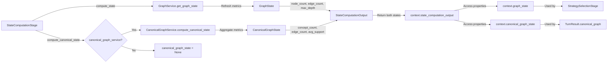

### Key Points

- **Parallel computation**: Both graphs computed in same stage
- **Conditional canonical**: If `enable_canonical_slots=False`, canonical_graph_state=None
- **Service dependency**: CanonicalGraphService injected only when flag enabled
- **StateComputationOutput**: Now includes optional canonical_graph_state field
- **Observability**: TurnResult includes canonical_graph and graph_comparison fields

---

## Graph Quality Optimizations (Paths 12-14)

> **Context**: These paths describe complementary techniques for improving graph connectivity and semantic quality. Each uses a different mechanism but serves the common goal of producing higher-quality knowledge graphs.

## Path 12: Surface Semantic Deduplication

**Why Critical**: Surface semantic deduplication merges near-duplicate surface nodes before they reach canonical slot discovery, reducing graph clutter and improving NodeStateTracker accuracy.

**Three-Step Deduplication**: Exact match → Semantic similarity → Create new node.

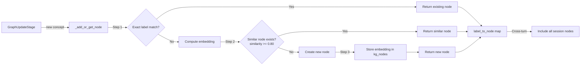

### Key Points

- **Threshold**: `surface_similarity_threshold = 0.80` (vs 0.60 for canonical slots)
- **Same node_type required**: Only merge nodes of the same type (attribute, consequence, value)
- **Embedding storage**: Embeddings stored in `kg_nodes.embedding` BLOB column
- **NodeStateTracker benefit**: Accurate exhaustion tracking when duplicates are merged
- **Source preservation**: `source_quote` retains original respondent language even when merged

### Configuration

From `src/core/config.py`:
```python
surface_similarity_threshold: float = 0.80  # Cosine similarity for surface dedup
canonical_similarity_threshold: float = 0.60  # Lower threshold for canonical slots
```

---

## Path 13: Cross-Turn Edge Resolution

**Why Critical**: Cross-turn edge resolution allows edges to reference nodes from previous turns, dramatically improving graph connectivity.

**Problem**: Previously, `label_to_node` only contained current-turn concepts, so edges referencing previous-turn nodes failed silently.

```mermaid
graph LR
    A[ContextLoadingStage] -->|Load session| B[get_nodes_by_session]
    B --> C[recent_node_labels]

    C -->|Inject| D[ExtractionStage]
    D -->|Context| E[Extraction Prompt]

    E -->|"Reference existing concepts"| F[ExtractedRelationship]

    F -->|source/target| G[GraphUpdateStage]
    G -->|Expand| H[label_to_node dict]

    H -->|All session nodes| I[Resolve edge endpoints]
    I -->|Previous-turn node| J[Edge created!]
```

### Key Points

- **ContextLoadingStage**: Loads existing node labels via `get_nodes_by_session()`
- **ExtractionStage**: Injects up to 30 recent node labels into extraction context
- **GraphUpdateStage**: Expands `label_to_node` with all session nodes (not just current turn)
- **Result**: Edges can connect across turns instead of failing with "edge_skipped_missing_node"
- **Dramatic improvement**: Edge/node ratio improved from 0.54 to 1.18 (+118%)

### Implementation Details

**Context Loading** (`context_loading_stage.py`):
```python
all_nodes = await self.graph.repo.get_nodes_by_session(session_id)
recent_node_labels = [n.label for n in all_nodes]
```

**Extraction Context** (`extraction_stage.py`):
```python
existing_labels = _format_node_labels(context.recent_node_labels)
# Injected into prompt: "EXISTING CONCEPTS (reference but don't re-extract): ..."
```

**Graph Update** (`graph_service.py`):
```python
# Step 1.5: Expand label_to_node with all session nodes
all_session_nodes = await self.repo.get_nodes_by_session(session_id)
for node in all_session_nodes:
    if node.label.lower() not in label_to_node:
        label_to_node[node.label.lower()] = node
```

---

## Path 14: Methodology-Aware Concept Naming

**Why Critical**: Methodology-specific naming conventions guide the LLM to produce more consistent, analysis-ready concept labels.

```mermaid
graph LR
    A[ExtractionStage] -->|Load| B[MethodologySchema]
    B -->|ontology.concept_naming_convention| C[Naming Guidance]

    C -->|Inject| D[System Prompt]
    D -->|"Use verb-object format..."| E[LLM Extraction]

    E -->|Better labels| F[Concept Labels]
    F -->|Examples:| G["get reliable quality coffee"<br/>"avoid wasting money"]
```

### Key Points

- **YAML Configuration**: Each methodology defines `concept_naming_convention` under `ontology:`
- **Dynamic injection**: Naming guidance inserted into extraction system prompt
- **JTBD Example**: "Use verb-object format (e.g., 'get coffee', 'avoid waste')"
- **MEC Example**: "Use attribute/consequence/value categories"
- **Result**: More consistent labeling → better canonical slot mapping → higher connectivity

### YAML Configuration

```yaml
# config/methodologies/jobs_to_be_done.yaml
ontology:
  concept_naming_convention: |
    Use VERB-OBJECT format for job statements:
    - "get reliable coffee" not "reliable coffee"
    - "avoid wasting money" not "waste avoidance"
```

### Critical Bug Fix

**Issue**: `extraction_guidelines`, `relationship_examples`, `extractability_criteria`, and `concept_naming_convention` were nested under `ontology:` in YAML but `MethodologySchema` read them at top level, so they were always `None`.

**Fix**: Added fields to `OntologySpec` class with delegation getters in `MethodologySchema`:
```python
class OntologySpec(BaseModel):
    extraction_guidelines: Optional[List[str]] = None
    relationship_examples: Optional[Dict[str, Any]] = None
    extractability_criteria: Optional[Dict[str, Any]] = None
    concept_naming_convention: Optional[str] = None
```

---

## Path 15: SRL Preprocessing

**Why Critical**: Semantic Role Labeling (SRL) provides structural hints that improve relationship extraction quality.

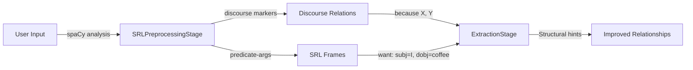

### Key Points

- **Stage 2.5**: Runs after UtteranceSavingStage, before ExtractionStage
- **Feature flag**: `enable_srl` in Settings (default: True)
- **spaCy model**: `en_core_web_md` for SRL and discourse parsing
- **Discourse relations**: Causal/temporal markers (because, when, before)
- **SRL frames**: Predicate-argument structures (who did what to whom)
- **Graceful degradation**: Empty output if spaCy model unavailable

### Configuration

```python
# src/core/config.py
enable_srl: bool = True  # Feature flag for SRL preprocessing
```

---

## Path 16: Saturation Signal Computation (Information Velocity)

**Why Critical**: Saturation signals measure interview completion using information velocity (rate of new concept discovery), replacing the broken `meta.interview_progress` signal. The EWMA-based approach detects when the interview reaches theoretical saturation—when new turns stop producing new concepts.

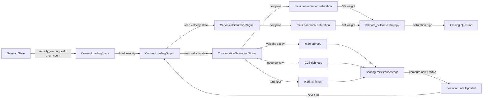

### Key Points

- **EWMA Formula**: `new_ewma = α × delta + (1-α) × old_ewma` where α=0.4 (hardcoded)
- **Velocity Delta**: `max(current_count - prev_count, 0)` — never decreases
- **Peak Tracking**: Peak velocity observed in session enables normalization
- **Velocity Decay**: `1 - (ewma / max(peak, 1.0))` — 0 when at peak, 1 when stalled
- **Saturation Score**: `0.60 × velocity_decay + 0.25 × edge_density_norm + 0.15 × turn_floor`
- **Graceful Degradation**: `CanonicalSaturationSignal` returns empty dict if canonical slots disabled

### Component Breakdown

| Component | Weight | Description |
|-----------|--------|-------------|
| velocity_decay | 60% | Primary indicator — slows as discovery rate decreases |
| edge_density_norm | 25% | Graph richness — edges/nodes normalized to 2.0 |
| turn_floor | 15% | Minimum duration — turn_number/15 prevents early saturation |

### Data Model

**SessionState fields** (persisted to DB):
```python
surface_velocity_ewma: float = 0.0      # EWMA of surface node delta per turn
surface_velocity_peak: float = 0.0     # Peak surface node delta observed
prev_surface_node_count: int = 0        # Surface node count at end of previous turn
canonical_velocity_ewma: float = 0.0    # EWMA of canonical node delta per turn
canonical_velocity_peak: float = 0.0   # Peak canonical node delta observed
prev_canonical_node_count: int = 0       # Canonical node count at end of previous turn
```

### Flow Summary

1. **Turn Start**: ContextLoadingStage loads velocity state from SessionState → ContextLoadingOutput
2. **Signal Detection**: Saturation signals read velocity via `context.context_loading_output`
3. **Strategy Selection**: validate_outcome uses saturation scores (0.5 conversation, 0.3 canonical)
4. **Turn End**: ScoringPersistenceStage computes new EWMA and updates SessionState

### Configuration

**Methodology YAML** (jobs_to_be_done.yaml):
```yaml
signals:
  meta:
    - meta.conversation.saturation
    - meta.canonical.saturation

strategies:
  - name: validate_outcome
    signal_weights:
      meta.conversation.saturation: 0.5
      meta.canonical.saturation: 0.3
```

### Related

- **Replaces**: `meta.interview.progress` (had double-normalization bug, MEC-specific)
- **Theoretical Basis**: Theoretical saturation from qualitative research methodology
- **Design Document**: `docs/plans/2026-02-18-interview-saturation-signals-design.md`
- **Implementation Plan**: `docs/plans/2026-02-18-interview-saturation-signals-implementation.md`

---

## Path 17: Focus Tracing for Post-Hoc Analysis

**Why Critical**: Focus tracing records the sequence of strategy-node decisions across turns, enabling post-hoc analysis of the exploration path through the knowledge graph.

```mermaid
graph LR
    A[Session.state.focus_history] -->|load| B[ContextLoadingStage]
    B -->|carry forward| C[ContextLoadingOutput.focus_history]

    C -->|read existing| D[ScoringPersistenceStage._update_turn_count]
    D -->|build FocusEntry| E{strategy_selection_output.focus}

    E -->|extract node_id| F[focus_node_id or ""]
    F -->|lookup label| G[NodeStateTracker.get_state]
    G -->|get node.label| H[node_label or ""]

    H -->|create entry| I[FocusEntry:<br/>turn, node_id, label, strategy]
    I -->|append| J[updated_history = existing + [entry]]

    J -->|persist| K[SessionState.focus_history]
    K -->|save to DB| L[sessions.state]

    L -->|GET /status| M[SessionService.get_status]
    M -->|model_dump| N[focus_tracing array]
    N -->|API response| O[SessionStatusResponse]
```

### Key Points

- **Stage 1**: Loads `focus_history` from `SessionState` into `ContextLoadingOutput`
- **Stage 10**: Appends `FocusEntry` with current turn's strategy and optional node focus
- **Turn 1 handling**: Empty `node_id`/`label` (graph was empty) — entry still created
- **No gaps**: Every turn creates an entry, enabling accurate trace reading
- **API exposure**: `GET /sessions/{id}/status` returns `focus_tracing` array

### FocusEntry Model

```python
class FocusEntry(BaseModel):
    turn: int        # Turn number (1-indexed)
    node_id: str     # Target node ID (empty if no node focus)
    label: str       # Human-readable node label
    strategy: str    # Strategy selected for this turn
```

### Example Output

```json
"focus_tracing": [
  {"turn": 1, "node_id": "", "label": "", "strategy": "explore_situation"},
  {"turn": 2, "node_id": "abc123", "label": "morning coffee ritual", "strategy": "dig_motivation"},
  {"turn": 3, "node_id": "def456", "label": "caffeine sensitivity", "strategy": "explore_situation"}
]
```

### Use Cases

- **Debugging**: Understand why the system explored certain concepts
- **Analysis**: Evaluate exploration coverage and node selection patterns
- **Evaluation**: Compare strategy selection across different personas
- **Research**: Study interview dynamics and knowledge graph evolution

---

## Path 18: Score Decomposition for Simulation Observability

**Why Critical**: The two-stage architecture produces `ScoredCandidate` decomposition from both Stage 1 (strategy selection) and Stage 2 (node selection) for full observability. This captures the per-signal breakdown at compute time and serializes it into the simulation JSON for accurate CSV output.

**Important**: Score decomposition now contains **both Stage 1 and Stage 2 scores**:
- **Stage 1 entries**: `node_id=""` (strategy-level scoring with phase multipliers)
- **Stage 2 entries**: `node_id="<uuid>"` (node-level scoring)

Each entry includes `signal_contributions` (per-signal name/value/weight/contribution), `base_score`, `phase_multiplier`, `phase_bonus`, `final_score`, `rank`, and `selected` flags.

```mermaid
graph LR
    A[rank_strategies Stage 1] -->|return_decomposition=True| B[ScoredCandidate per strategy]
    C[rank_nodes_for_strategy Stage 2] -->|returns decomposition| D[ScoredCandidate per node]

    B -->|stage1_decomposition| E[Combined decomposition]
    D -->|stage2_decomposition| E

    E -->|6th return element| F[select_strategy_and_focus]
    F -->|score_decomposition| G[StrategySelectionOutput]
    G -->|context.score_decomposition| H[PipelineContext]

    H -->|TurnResult.score_decomposition| I[TurnResult]
    I -->|_serialize_decomposition| J[List[Dict]]
    J -->|SimulationTurn.score_decomposition| K[SimulationTurn]
    K -->|_save_simulation_result| L[JSON turn.score_decomposition]

    J -->|generate_scoring_csv.py| K[Scoring CSV]
```

### ScoredCandidate Structure

```python
@dataclass
class ScoredCandidate:
    strategy: str
    node_id: str
    signal_contributions: list[SignalContribution]  # Per-signal breakdown (global signals in Stage 1, node signals in Stage 2)
    base_score: float        # Sum of signal contributions
    phase_multiplier: float  # Phase weights applied in Stage 1, always 1.0 in Stage 2
    phase_bonus: float       # Phase bonuses applied in Stage 1, always 0.0 in Stage 2
    final_score: float       # (base_score × phase_multiplier) + phase_bonus
    rank: int                # 1 = best candidate
    selected: bool           # True for the winning candidate

@dataclass
class SignalContribution:
    name: str          # e.g. "graph.node.exhaustion_score"
    value: Any         # Resolved value (True/False/float)
    weight: float      # From YAML signal_weights
    contribution: float  # Effective contribution to base_score
```

### Key Points

- **Capture time**: Decomposition is captured at both Stage 1 (`rank_strategies()`) and Stage 2 (`rank_nodes_for_strategy()`)
- **Stage 1 signals**: Global signals only (graph.*, llm.*, temporal.*, meta.*) with phase multipliers/bonuses
- **Stage 2 signals**: Node-scoped signals only (graph.node.*, technique.node.*, meta.node.*) via `partition_signal_weights()`
- **Distinguishing stages**: Stage 1 entries have `node_id=""`; Stage 2 entries have `node_id="<uuid>"`
- **Accuracy**: CSV scores match pipeline scores exactly (live decomposition, not post-hoc)
- **Simulation-only**: `score_decomposition` is `Optional` in `TurnResult` and `StrategySelectionOutput`; the live API pipeline sets it to `None`
- **Backward-compatible**: `generate_scoring_csv.py` emits a placeholder N/A row for old JSON files without `score_decomposition`
- **Empty for node_binding="none"**: When strategy has `node_binding: none`, `score_decomposition` contains only Stage 1 entries
- **Scale**: ~70 candidates per turn (7 strategies + 7 strategies × ~10 nodes) → ~700 rows per turn in CSV for a 10-turn simulation

### JSON Schema (per turn)

```json
"score_decomposition": [
  {
    "strategy": "deepen",
    "node_id": "",
    "signal_contributions": [
      {"name": "llm.response_depth.low", "value": true, "weight": 0.8, "contribution": 0.8},
      {"name": "llm.engagement.high", "value": true, "weight": 0.7, "contribution": 0.7}
    ],
    "base_score": 1.5,
    "phase_multiplier": 1.3,
    "phase_bonus": 0.2,
    "final_score": 2.15,
    "rank": 1,
    "selected": true
  },
  {
    "strategy": "deepen",
    "node_id": "abc-123-def",
    "signal_contributions": [
      {"name": "graph.node.exhaustion_score.low", "value": true, "weight": 1.0, "contribution": 1.0}
    ],
    "base_score": 1.0,
    "phase_multiplier": 1.0,
    "phase_bonus": 0.0,
    "final_score": 1.0,
    "rank": 1,
    "selected": true
  }
]
```

---

## Path 19: NodeStateTracker Per-Turn Lifecycle

**Why Critical**: NodeStateTracker maintains per-node state across turns, enabling exhaustion detection and intelligent backtracking. Understanding the exact timing of state mutations is essential for debugging node rotation bugs and signal detection accuracy.

### Stage-by-Stage State Transitions

**Timeline**: Stage 1 (Load) -> Stage 4 (Mutate) -> Stage 5 (Read) -> Stage 6 (Read & Mutate) -> Stage 10 (Save)

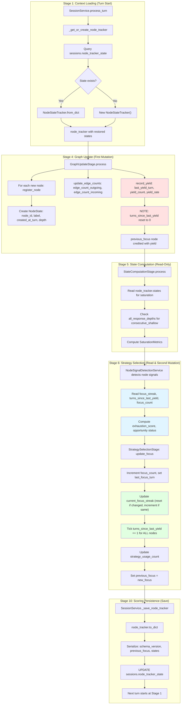

### Critical Timing Relationship: Stage 4 < Stage 6

**Why This Matters**: The order of operations means that `record_yield()` (Stage 4) runs BEFORE signal detection (Stage 6). This timing affects what values signals see:

| Field | Stage 4 (record_yield) | Stage 6 (signal detection) | Stage 6 (update_focus) |
|-------|------------------------|----------------------------|------------------------|
| `last_yield_turn` | Set to `turn_number` | Read for yield_stagnation | Unchanged |
| `turns_since_last_yield` | Reset to `0` | Read as `0` (just yielded!) | Ticked to `1` for ALL nodes |
| `yield_count` | Incremented | Read for yield_rate | Unchanged |
| `yield_rate` | Recalculated | Read for exhaustion scoring | Unchanged |
| `focus_streak` | Unchanged | Read for exhaustion scoring | Reset to `1` or incremented |
| `focus_count` | Unchanged | Read for exhaustion scoring | Incremented |
| `last_focus_turn` | Unchanged | Unchanged | Set to `turn_number` |

**Key Insight**: When `record_yield()` runs in Stage 4, it resets `turns_since_last_yield` to `0`. Signal detection in Stage 6 sees this value as `0`, which means the node appears "fresh" from a yield perspective even though it just yielded. This is correct behavior—the node produced value this turn, so it's not stagnant.

### Field-Level State Transitions

**Example: Single Node Across 3 Turns**

```
Turn 1 (node created):
  Stage 1: Load -> No state (new node)
  Stage 4: register_node -> created_at_turn=1, focus_count=0, yield_count=0
  Stage 6: update_focus(node_A) -> focus_count=1, current_focus_streak=1, turns_since_last_yield=1
  Stage 10: Save -> persisted

Turn 2 (node yields):
  Stage 1: Load -> focus_count=1, current_focus_streak=1, turns_since_last_yield=1
  Stage 4: record_yield -> yield_count=1, last_yield_turn=2, turns_since_last_yield=0
  Stage 6: signal detection -> reads turns_since_last_yield=0 (not stagnant)
           update_focus(node_A) -> focus_count=2, current_focus_streak=2, turns_since_last_yield=1
  Stage 10: Save -> persisted

Turn 3 (node yields again, focus changes):
  Stage 1: Load -> focus_count=2, current_focus_streak=2, turns_since_last_yield=1
  Stage 4: record_yield -> yield_count=2, last_yield_turn=3, turns_since_last_yield=0
  Stage 6: signal detection -> reads focus_streak=2 (potential exhaustion)
           update_focus(node_B) -> node_A focus_streak resets to 1 (turns_since_last_focus=1)
                              -> node_B focus_count=1, turns_since_last_focus=0
                              -> ALL nodes: turns_since_last_yield += 1 (node_A: 0->1, node_B: 0->1)
  Stage 10: Save -> persisted
```

### Mutation Summary

| Stage | Method | Fields Modified |
|-------|--------|-----------------|
| **Stage 4** | `register_node` | node_id, label, created_at_turn, depth, node_type, is_terminal, level |
| **Stage 4** | `update_edge_counts` | edge_count_outgoing, edge_count_incoming, connected_node_ids |
| **Stage 4** | `record_yield` | last_yield_turn, turns_since_last_yield, yield_count, yield_rate |
| **Stage 6** | `append_response_signal` | all_response_depths (append) |
| **Stage 6** | `update_focus` | focus_count, last_focus_turn, current_focus_streak, turns_since_last_focus, turns_since_last_yield (tick all), strategy_usage_count, last_strategy_used, consecutive_same_strategy, previous_focus |
| **Stage 10** | `to_dict` | Serialization to JSON |

### Integration Points

**Signal Detection Reads NodeState**:
- `NodeExhaustedSignal`: Reads `focus_count`, `turns_since_last_yield`, `current_focus_streak`, `all_response_depths`
- `NodeExhaustionScoreSignal`: Reads `turns_since_last_yield`, `current_focus_streak`, `all_response_depths`
- `NodeFocusStreakSignal`: Reads `current_focus_streak`
- `NodeYieldStagnationSignal`: Reads `turns_since_last_yield`
- `NodeOpportunitySignal`: Reads exhaustion status

**Bug Prevention**:
- The Stage 4 < Stage 6 ordering means `current_focus_streak` accumulates correctly across turns
- If `record_yield()` reset `focus_streak`, it would always appear as `0` during signal detection
- `turns_since_last_yield` is reset to `0` in Stage 4, then ticked to `1` in Stage 6 for all nodes

---

## Optimization Results Summary

Optimizations to surface and canonical graph processing produced dramatic improvements in graph quality and connectivity:

| Metric | Before Optimizations | After Optimizations | Change |
|--------|---------------------|-------------------|--------|
| Surface Nodes | 93 | 73 | **-21.5%** |
| Surface Edges | 50 | 86 | **+72%** |
| Canonical Slots | 19 | 56 | +194% |
| Unmapped | 46 (49%) | 1 (1.4%) | **-97%** |
| Edge/Node | 0.54 | 1.18 | **+118%** |

### Key Improvements

1. **Surface Semantic Dedup**: Reduced over-extraction by merging near-duplicates
2. **Cross-Turn Edge Resolution**: Biggest impact — edges now resolve across turns
3. **Methodology-Aware Naming**: Better labels → better slot mapping
4. **SRL Infrastructure**: Foundation for relationship extraction improvements

---

## Cross-References

| Path | Primary Stages | Secondary Stages | Database Tables |
|------|---------------|------------------|-----------------|
| Turn Count Evolution | 1, 2.5, 5, 6, 7, 10 | 3, 4, 8, 9 | sessions |
| Strategy Selection Pipeline | 6 | 1, 5, 10 | nodes |
| Graph State Mutation | 4, 5 | 6, 7 | nodes, edges |
| Strategy History (Diversity) | 1, 6, 10 | - | sessions, scoring_history |
| Traceability Chain | 2, 3, 4 | 1, 5, 6 | utterances, nodes, edges |
| Node State Lifecycle | 4, 6, SessionService | 9 | sessions |
| Signal Detection | 6 | - | - |
| Canonical Slot Discovery & Mapping | 4.5 | 5 | canonical_slots, surface_to_slot_mapping, canonical_edges |
| Dual-Graph State Computation & Observability | 5 | 6, 10 | nodes, canonical_slots |
| Surface Semantic Dedup | 4 | - | kg_nodes |
| Cross-Turn Edge Resolution | 1, 3, 4 | - | kg_nodes, kg_edges |
| Methodology-Aware Naming | 3 | - | methodology YAML |
| SRL Preprocessing | 2.5 | 3 | - |
| Saturation Signal Computation | 1, 6, 10 | - | sessions |
| Focus Tracing for Post-Hoc Analysis | 1, 10 | - | sessions |
| Score Decomposition for Simulation Observability | 6 | - | - |
| NodeStateTracker Per-Turn Lifecycle | 1, 4, 5, 6, 10, SessionService | - | sessions |

## Usage for Development

When working on the pipeline:

1. **Adding a new stage**: Identify which paths your stage intersects with
2. **Adding a new context field**: Trace its flow through relevant paths
3. **Debugging state issues**: Follow the path for the affected state
4. **Adding a new global signal**: Add to appropriate pool in `src/signals/`:
   - `graph/` for knowledge graph signals
   - `llm/` for LLM-based signals (fresh per response)
   - `temporal/` for turn-level temporal signals
   - `meta/` for composite signals
5. **Adding a new node-level signal**: Create signal detector in `src/signals/graph/` or `src/signals/session/`:
   - Implement detection logic for per-node signals
   - Register in `signal_registry.py`
6. **Adding a new methodology**: Create YAML config in `config/methodologies/`
7. **Debugging two-stage selection**: Check `rank_strategies()` and `rank_nodes_for_strategy()` outputs with alternatives list
   - `strategies_ranked` log shows Stage 1 strategy scores (strategy_name, score)
   - `score_decomposition` in simulation JSON provides per-signal breakdown for node selection (Stage 2)
   - `generate_scoring_csv.py` converts this to a spreadsheet-friendly format; scores exactly match pipeline values

## Related Documentation

- [Pipeline Contracts](./pipeline_contracts.md) - Stage read/write specifications
- [SYSTEM_DESIGN](./SYSTEM_DESIGN.md) - Narrative system architecture for articles
