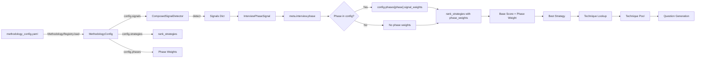
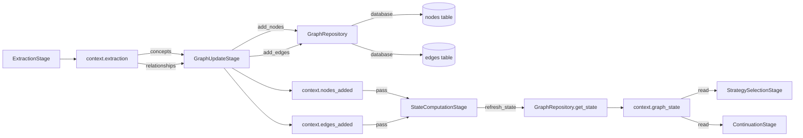
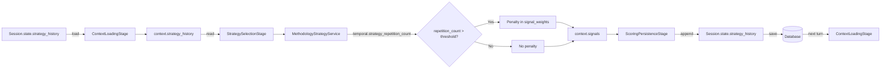
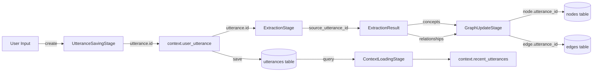
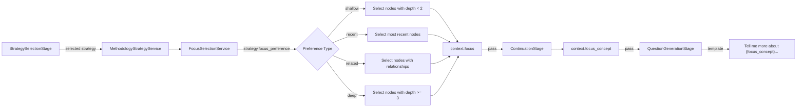

# Data Flow Paths - Critical Path Diagrams

> **Context**: This document visualizes critical data flow paths through the turn processing pipeline.
> **Related**: [Pipeline Contracts](./pipeline_contracts.md) | [ADR-008: Internal API Boundaries](./adr/008-internal-api-boundaries-pipeline-pattern.md) | [ADR-014: Signal Pools Architecture](./adr/ADR-014-signal-pools-architecture.md)

## Overview

The turn pipeline has several critical data flow paths that are essential to understand for maintaining and extending the system. These paths represent:

1. **State mutation flows** - How interview state evolves across turns
2. **Decision-making flows** - How strategies are selected using signal pools
3. **Information processing flows** - How user input becomes graph updates
4. **History tracking flows** - How we maintain conversation context and diversity

## Path 1: Turn Count Evolution

**Why Critical**: The turn count controls the entire interview lifecycle, determining:
- Which interview phase we're in (early, middle, late)
- When to apply phase multipliers in strategy scoring
- When to terminate the interview

```mermaid
graph LR
    A[Session.state.turn_count] -->|load| B[ContextLoadingStage]
    B -->|current = turn_count + 1| C[context.turn_number]
    C -->|pass through| D[UtteranceSavingStage]
    D --> E[ExtractionStage]
    E --> F[GraphUpdateStage]
    F --> G[StateComputationStage]
    G -->|refresh| H[graph_state.turn_count]
    H -->|read| I[StrategySelectionStage]
    I --> J[MethodologyStrategyService.select_strategy]
    J --> K[focus + strategy]
    K --> L[ContinuationStage]
    L --> M{turn_number >= max_turns?}
    M -->|No| N[should_continue = True]
    M -->|Yes| O[should_continue = False]
    N --> P[ScoringPersistenceStage]
    O --> P
    P -->|increment| Q[Session.state.turn_count += 1]
    Q --> R[Next Turn]
```



### Key Points

- **`turn_count`** (stored in database) = number of *completed* turns
- **`turn_number`** (in context) = current turn being processed = `turn_count + 1`
- Turn count is **loaded** from database in ContextLoadingStage
- Turn count is **refreshed** from graph state in StateComputationStage
- Turn count is **checked** against max_turns in ContinuationStage
- Turn count is **incremented** and saved back in ScoringPersistenceStage

### Implementation Note

In `ContextLoadingStage`, the turn number is calculated as:
```python
# turn_count is completed turns, so current turn is turn_count + 1
context.turn_number = (session.state.turn_count or 0) + 1
```

This ensures that:
- Turn 1 starts with `turn_count = 0` (no completed turns yet)
- After turn 1 completes, `turn_count = 1`
- Turn 2 starts with `turn_number = 2`

## Path 2: Strategy Selection with Signal Pools

**Why Critical**: Strategy selection is the core decision-making logic that determines interview quality and coverage.

**Phase 6 (2026-01-28)**: System now uses methodology-based signal detection with YAML configuration, replacing the old two-tier scoring system.

**Phase Weights (2026-01-29)**: Phase-based weight multipliers are applied to strategy scores based on interview phase (early/mid/late).

```mermaid
graph LR
    A[graph_state] -->|read| B[StrategySelectionStage]
    C[recent_nodes] -->|read| B
    D[recent_utterances] -->|read| B
    E[extraction] -->|read| B
    F[strategy_history] -->|read| B

    B --> G[MethodologyStrategyService]
    G --> H[MethodologyRegistry.get_methodology]
    H --> I[YAML Config]
    I --> J[ComposedSignalDetector]

    J --> K[Signal Pool Detection]
    K --> L1[graph.* signals]
    K --> L2[llm.* signals - fresh per response]
    K --> L3[temporal.* signals]
    K --> L4[meta.* composite signals]

    L1 --> M[Signal Detection Complete]
    L2 --> M
    L3 --> M
    L4 --> M

    M --> N[InterviewPhaseSignal.detect]
    N --> O[meta.interview.phase]
    O --> P{Phase in config?}

    P -->|Yes| Q["config.phases[phase].signal_weights"]
    P -->|No| R[phase_weights = None]

    Q --> S[rank_strategies]
    R --> S

    S --> T[Base Score Calculation]
    T --> U{phase_weights?}

    U -->|Yes| V[base_score × phase_weight]
    U -->|No| W[final_score = base_score]

    V --> X[Final Score]
    W --> X

    X --> Y[Select Best Strategy]
    Y --> Z[FocusSelectionService]
    Z --> AA[context.strategy, focus, signals]

    AA --> AB[ContinuationStage]
```



### Key Points

- **MethodologyStrategyService** loads YAML configs from `src/methodologies/config/`
- **ComposedSignalDetector** pools signals from all pools (graph, llm, temporal, meta)
- **Signals are namespaced**: `graph.node_count`, `llm.response_depth`, `temporal.strategy_repetition_count`, etc.
- **LLM signals are fresh** - computed every response, no cross-response caching
- **InterviewPhaseSignal** detects current phase (`early`, `mid`, `late`) from `meta.interview.phase` signal
- **Phase weights** are defined in YAML config under `config.phases[phase].signal_weights`
- **Phase weight multiplication**: `final_score = base_score × phase_weight` (or `base_score` if no phase weight)
- **rank_strategies()** scores strategies using YAML-defined signal_weights and optional phase multipliers
- **FocusSelectionService** centralizes focus selection based on strategy.focus_preference

### Signal Namespacing

All signals use dot-notation namespacing to prevent collisions:

| Pool | Namespace | Examples |
|------|-----------|----------|
| **Graph** | `graph.*` | node_count, max_depth, orphan_count, coverage_breadth |
| **LLM** | `llm.*` | response_depth, sentiment, topics |
| **Temporal** | `temporal.*` | strategy_repetition_count, turns_since_focus_change |
| **Meta** | `meta.*` | interview_progress, exploration_score |

### YAML Configuration Flow



**Phase Weight Example**:
```yaml
phases:
  early:
    signal_weights:
      deepen: 1.5      # Boost deepen in early phase
      clarify: 1.2
      reflect: 0.8     # Reduce reflect in early phase
  mid:
    signal_weights:
      deepen: 1.0      # Default scoring in mid phase
      clarify: 1.0
      reflect: 1.0
  late:
    signal_weights:
      deepen: 0.5      # Reduce deepen in late phase
      clarify: 0.8
      reflect: 1.8     # Boost reflect in late phase
```

## Path 3: Graph State Mutation

**Why Critical**: Understanding how the knowledge graph evolves is essential for debugging coverage and depth issues.



### Key Points

- Extraction produces concepts and relationships
- GraphUpdateStage persists to database AND tracks in context
- StateComputationStage refreshes to get accurate metrics (node_count, coverage, depth)
- Multiple downstream stages read the refreshed graph state

## Path 4: Strategy History Tracking (Diversity)

**Why Critical**: Strategy history prevents repetitive questioning and ensures interview diversity.



### Key Points

- History is loaded at start of each turn
- **Temporal signals** track strategy repetition (`temporal.strategy_repetition_count`)
- Signal weights in YAML configs automatically penalize repetition
- History is appended and saved at end of turn
- Creates a feedback loop for diversity

## Path 5: Traceability Chain (ADR-010 Phase 2)

**Why Critical**: Every piece of extracted data is linked back to its source utterance for debugging and analysis.



### Key Points

**ADR-010 Phase 2 Enhanced Traceability:**
- `UtteranceSavingStage` generates `utterance.id` (e.g., "utter_123")
- `ExtractionStage` passes `source_utterance_id` to all extracted data:
  - `ExtractedConcept.source_utterance_id` - Links concept to utterance
  - `ExtractedRelationship.source_utterance_id` - Links edge to utterance
- `GraphUpdateStage` stores provenance in database:
  - `node.utterance_id` - Which utterance created this node
  - `edge.utterance_id` - Which utterance created this edge

**Debugging Benefits:**
- Trace any concept/edge back to specific user response
- Debug signal extraction by reviewing LLM model and prompt version
- Analyze response quality by correlating with signal confidence scores
- Reconstruct conversation provenance for analysis

## Path 6: Focus Selection Flow

**Why Critical**: The focus concept determines what the next question will explore.



### Key Points

- **FocusSelectionService** centralizes focus selection logic
- **Focus preferences** are defined per-strategy in YAML configs:
  - `shallow`: For laddering (need room to go deeper)
  - `recent`: For elaboration (expanding on recent topics)
  - `related`: For probing (finding connections)
  - `deep`: For validation (confirming deep understanding)
- Continuation stage validates focus exists in graph
- Used by question generation for templating

## Path 7: Signal Detection Flow

**Why Critical**: Signal detection is the foundation of strategy selection in the new methodology-centric architecture.

```mermaid
graph LR
    A[StrategySelectionStage] -->|context, response_text| B[MethodologyStrategyService]
    B --> C[MethodologyRegistry]
    C -->|load YAML| D[MethodologyConfig]

    D -->|config.signals| E[ComposedSignalDetector]
    E -->|create detectors| F[Signal Pool Registry]

    F --> G[Pass 1: Non-Meta Signals]
    G --> H[graph.* signals]
    G --> I[llm.* signals]
    G --> J[temporal.* signals]

    H --> K[Signal Detection Complete]
    I --> K
    J --> K

    K -->|signals dict| L[Pass 2: Meta Signals]
    L --> M[meta.* composite signals]
    M --> N[All Signals]

    N -->|meta.interview.phase| O[InterviewPhaseSignal]
    O --> P[Current Phase]

    P -->|phase| Q{Phase in config?}
    Q -->|Yes| R["config.phases[phase].signal_weights"]
    Q -->|No| S[No phase weights]

    N -->|signals| T[rank_strategies]
    R -->|phase_weights| T
    S -->|phase_weights=None| T

    T --> U[Base Score Calculation]
    U --> V{phase_weights?}
    V -->|Yes| W[base_score × phase_weight]
    V -->|No| X[final_score = base_score]
    W --> Y[Final Score]
    X --> Y
    Y --> Z[Best Strategy Selected]
```



### Key Points

- **Two-pass detection**: Meta signals depend on non-meta signals
- **Fresh LLM signals**: Always computed per response (no cross-response caching)
- **Namespaced output**: All signals returned as `{pool.signal_name: value}` dict
- **Cost tiers**: Signals declare computation cost (FREE/LOW/MEDIUM/HIGH)
- **Refresh triggers**: Signals declare when to refresh (PER_RESPONSE/PER_TURN/PER_SESSION)
- **Phase detection**: `InterviewPhaseSignal` determines current phase from `meta.interview.phase`
- **Phase weights**: Applied from `config.phases[phase].signal_weights` if phase is defined
- **Score multiplication**: `final_score = base_score × phase_weight` when phase weights are available

## Cross-References

| Path | Primary Stages | Secondary Stages | Database Tables |
|------|---------------|------------------|-----------------|
| Turn Count Evolution | 1, 5, 6, 7, 10 | 2, 3, 4, 8, 9 | sessions |
| Strategy Selection (Signal Pools) | 6 | 1, 10 | - |
| Graph State Mutation | 3, 4, 5 | 6, 7 | nodes, edges |
| Strategy History (Diversity) | 1, 6, 10 | - | sessions |
| Traceability Chain (ADR-010) | 2, 3, 4 | 5, 6 | utterances, nodes, edges |
| Focus Selection | 6, 7 | - | - |
| Signal Detection | 6 | - | - |

## Usage for Development

When working on the pipeline:

1. **Adding a new stage**: Identify which paths your stage intersects with
2. **Adding a new context field**: Trace its flow through relevant paths
3. **Debugging state issues**: Follow the path for the affected state
4. **Adding a new signal**: Add to appropriate pool in `src/methodologies/signals/`
5. **Adding a new methodology**: Create YAML config in `src/methodologies/config/`

## Related Documentation

- [Pipeline Contracts](./pipeline_contracts.md) - Stage read/write specifications
- [ADR-008: Internal API Boundaries](./adr/008-internal-api-boundaries-pipeline-pattern.md) - Architecture rationale
- [ADR-010: Pipeline Contracts](./adr/010-formalize-pipeline-contracts-strengthen-data-models.md) - Contract formalization
- [ADR-014: Signal Pools Architecture](./adr/ADR-014-signal-pools-architecture.md) - Signal pools design
- [SYSTEM_DESIGN](./SYSTEM_DESIGN.md) - Narrative system architecture for articles
