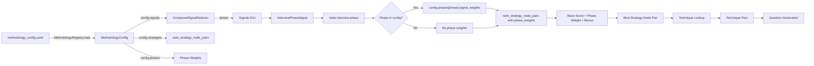
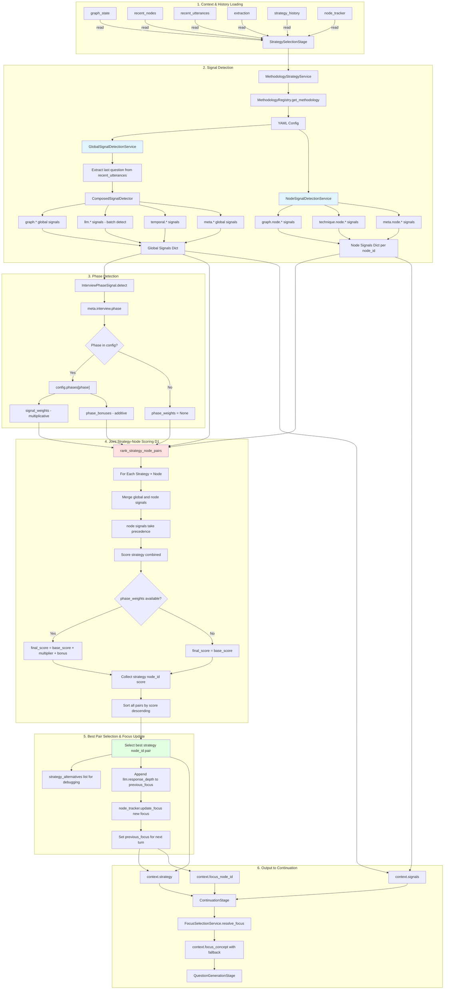
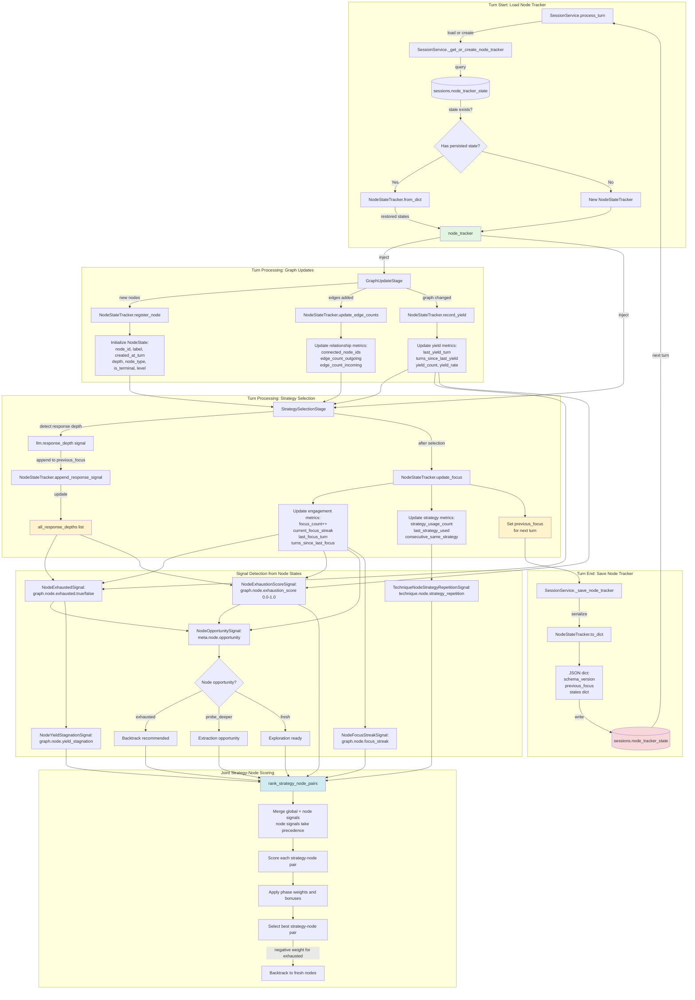

# Data Flow Paths - Critical Path Diagrams

> **Context**: This document visualizes critical data flow paths through the turn processing pipeline.
> **Related**: [Pipeline Contracts](./pipeline_contracts.md)

## Overview

The turn pipeline has several critical data flow paths that are essential to understand for maintaining and extending the system. These paths represent:

1. **State mutation flows** - How interview state evolves across turns
2. **Decision-making flows** - How strategies are selected using signal pools
3. **Information processing flows** - How user input becomes graph updates
4. **History tracking flows** - How we maintain conversation context and diversity


## Path 1: Turn Count Evolution

**Why Critical**: The turn count controls the entire interview lifecycle, determining:
- Which interview phase we're in (early, middle, late)
- When to apply phase multipliers in strategy scoring
- When to terminate the interview


### Key Points

- **`turn_count`** (stored in database) = number of *completed* turns
- **`turn_number`** (in context) = current turn being processed = `turn_count + 1`
- Turn count is **loaded** from database in ContextLoadingStage
- Turn count is **synced** to graph state in StateComputationStage
- Turn count is **checked** against max_turns in ContinuationStage (also considers strategy termination and saturation)
- Turn count is **updated** to the current turn number and saved back in ScoringPersistenceStage (represents completed turns after this turn)

### Implementation Note

In `ContextLoadingStage`, the turn number is calculated as:
```python
# turn_count is completed turns, so current turn is turn_count + 1
context_loading_output = ContextLoadingOutput(
    turn_number=(session.state.turn_count or 0) + 1,
    ...
)
# Accessed via context.turn_number property (reads from context_loading_output)
```

This ensures that:
- Turn 1 starts with `turn_count = 0` (no completed turns yet)
- After turn 1 completes, `turn_count = 1`
- Turn 2 starts with `turn_number = 2`


## Path 2: Strategy Selection Pipeline

**Why Critical**: Strategy selection is the core decision-making logic that determines interview quality and coverage.

The system uses methodology-based signal detection with YAML configuration. Phase-based weight multipliers are applied to strategy scores based on interview phase (early/mid/late). Joint strategy-node scoring enables per-node exhaustion awareness and backtracking via `rank_strategy_node_pairs()`.

### Signal Detection (Foundation)

**Why Critical**: Signal detection is the foundation of strategy selection in the new methodology-centric architecture.

Signal detection operates in two modes:
- **Global signals**: Single value per interview (graph.*, llm.*, temporal.*, meta.*)
- **Node-level signals**: Per-node values (graph.node.*, technique.node.*, meta.node.*)

**Detection Flow**:

1. **GlobalSignalDetectionService** extracts last question from `recent_utterances` (last system utterance) and passes it to `ComposedSignalDetector` for context-aware LLM scoring
2. **ComposedSignalDetector.detect()** accepts optional `question` parameter and threads it to `LLMBatchDetector`
3. **NodeSignalDetectionService** detects node-level signals via hardcoded detector instances
4. **InterviewPhaseSignal** is called explicitly (not via ComposedSignalDetector) to detect phase

**Key implementation details**:

- **GlobalSignalDetectionService** extracts last question from recent_utterances for context
- **ComposedSignalDetector** performs global signal detection (graph.*, llm.*, temporal.*, meta.*)
- **NodeSignalDetectionService** detects per-node signals (graph.node.*, technique.node.*)
- **LLMBatchDetector** loads rubrics from `src/signals/llm/prompts/signals.md`
- All 5 LLM signals detected in single API call
- Response text truncated to 500 chars, question to 200 chars
- **InterviewPhaseSignal** detects current phase (early/mid/late)

**LLM Batch Detection**:
- `LLMBatchDetector` loads rubrics from `src/signals/llm/prompts/signals.md` using indentation-based parsing
- Rubric structure: `signal_name: description` (no indent) followed by indented scoring criteria
- All 5 LLM signals (response_depth, specificity, certainty, valence, engagement) detected in single API call
- **Question context**: Receives the preceding interviewer question for context-aware scoring (extracted from `recent_utterances` by `GlobalSignalDetectionService`)
- **Truncation**: Response text truncated to 500 chars (~75 words), question text to 200 chars — balances scoring accuracy with token costs
- Rubrics injected into prompt to guide LLM scoring
- LLM returns structured JSON with scores and rationales; stored signal value is score only (rationales logged but not persisted)

**Signal Types**:
- `llm.response_depth`: Categorical string (surface/shallow/moderate/deep)
- `llm.specificity`, `llm.certainty`, `llm.valence`, `llm.engagement`: Float [0,1] (normalized from Likert 1-5)

**LLM signals are fresh** - computed every response via rubric-based prompts, no cross-response caching

**Signal normalization**: Non-categorical LLM signals (specificity, certainty, valence, engagement) normalized to [0,1] from Likert 1-5 scale

**Rubric parsing** - Rubric definitions use indentation-based structure (signal_name: description, with indented content for scoring criteria)

**Dependency ordering**: Signals with dependencies receive accumulated signals via context wrapper; detection proceeds sequentially

**Namespaced output**: All signals returned as `{pool.signal_name: value}` dict

**Node signals format**: `{node_id: {signal_name: value}}` for per-node signals

### Joint Strategy-Node Scoring (D1 Architecture)

**Why Critical**: The D1 architecture selects strategy and node jointly, enabling node exhaustion awareness and intelligent backtracking.

The D1 architecture replaces separate strategy-then-node selection with joint (strategy, node) pair scoring. This enables the system to be aware of per-node exhaustion and automatically backtrack to fresh nodes.

**Joint Scoring Process**:

- `rank_strategy_node_pairs()` scores all (strategy, node) combinations
- Each (strategy, node) pair receives a combined score from:
  - Global signals (graph.*, llm.*, temporal.*, meta.*)
  - Node-specific signals (graph.node.*, technique.node.*, meta.node.*)
  - Node signals take precedence when merging (override global)
- Returns best (strategy, node_id) pair with alternatives list

**Key implementation details**:

- `rank_strategy_node_pairs()` scores all (strategy, node) combinations
- Merges global signals with node-specific signals (node signals take precedence)
- Returns best (strategy, node_id) pair with alternatives list
- Response depth appended to previous_focus BEFORE update_focus() (critical ordering)
- **FocusSelectionService** resolves focus_node_id with graceful fallback

**Node Exhaustion Awareness**:
- `graph.node.exhausted.true` applies negative weight in YAML configs
- `meta.node.opportunity: "exhausted"` signals exhausted nodes
- Automatically backtracks to fresh nodes

**Phase-Aware Scoring**: Applies both multiplicative weights and additive bonuses

**Output**: Returns best (strategy, node_id, score) with alternatives list for debugging

**Response Depth Tracking**: `llm.response_depth` appended to `previous_focus` node BEFORE `update_focus()` (critical ordering)

**NodeTracker Integration**: `update_focus()` called after response depth append to set `previous_focus` for next turn

**strategy_alternatives** returns list of (strategy, node_id, score) tuples for debugging

### Phase Weights & Strategy Selection

**InterviewPhaseSignal** detects current phase (`early`, `mid`, `late`) from `meta.interview.phase` signal

**Phase weights and bonuses** are defined in YAML config under `config.phases[phase]`:
- `signal_weights`: Multiplicative strategy weights (e.g., `deepen: 1.5`)
- `phase_bonuses`: Additive strategy bonuses (e.g., `broaden: 0.2`)

**Scoring formula**: `final_score = (base_score × multiplier) + bonus` when phase weights are available

**MethodologyStrategyService** loads YAML configs from `config/methodologies/`

**NodeStateTracker** provides per-node state for node-level signals

### Signal Namespacing

All signals use dot-notation namespacing to prevent collisions:

| Pool | Namespace | Examples |
|------|-----------|----------|
| **Graph (Global)** | `graph.*` | max_depth, chain_completion.ratio, chain_completion.has_complete, canonical_concept_count, canonical_edge_density, canonical_exhaustion_score |
| **Graph (Node)** | `graph.node.*` | exhausted, exhaustion_score, yield_stagnation, focus_streak, recency_score, is_orphan, edge_count |
| **LLM** | `llm.*` | response_depth, valence, certainty, specificity, engagement |
| **Temporal** | `temporal.*` | strategy_repetition_count, turns_since_strategy_change |
| **Meta** | `meta.*` | interview_progress, interview.phase |
| **Meta (Node)** | `meta.node.*` | opportunity (exhausted/probe_deeper/fresh) |
| **Technique (Node)** | `technique.node.*` | strategy_repetition (consecutive same strategy on node) |

**Note**: Legacy signals `node_count`, `edge_count`, `orphan_count` are still computed in graph state but no longer used in strategy scoring signal weights.

### YAML Configuration Flow



**Phase Weights and Bonuses Example**:
```yaml
phases:
  early:
    signal_weights:      # Multiplicative weights
      deepen: 1.5        # Boost deepen in early phase
      clarify: 1.2
      reflect: 0.8       # Reduce reflect in early phase
    phase_bonuses:       # Additive bonuses
      broaden: 0.2       # Small bonus for broaden strategy
  mid:
    signal_weights:      # Default scoring in mid phase
      deepen: 1.0
      clarify: 1.0
      reflect: 1.0
    phase_bonuses:
      probe: 0.1
  late:
    signal_weights:
      deepen: 0.5        # Reduce deepen in late phase
      clarify: 0.8
      reflect: 1.8       # Boost reflect in late phase
    phase_bonuses:
      synthesize: 0.3
      validate: 0.2
```

**Scoring Formula**:
```python
# Apply phase weight multiplier if available
multiplier = phase_weights.get(strategy.name, 1.0)

# Apply phase bonus additively if available
bonus = phase_bonuses.get(strategy.name, 0.0)

# Final score: (base_score × multiplier) + bonus
final_score = (base_score × multiplier) + bonus
```

### Complete Flow Diagram




## Path 3: Graph State Mutation

**Why Critical**: Understanding how the knowledge graph evolves is essential for debugging coverage and depth issues.


### Key Points

- Extraction produces concepts and relationships
- GraphUpdateStage persists to database AND tracks in context
- **Surface deduplication**: GraphUpdateStage performs 3-step deduplication (exact → semantic → create) before persistence (see Path 12)
- **NodeStateTracker integration**:
  - `register_node()` - Registers new nodes when added
  - `update_edge_counts()` - Updates relationship counts
  - `record_yield()` - Records yield when graph changes occur
- StateComputationStage refreshes to get accurate metrics (node_count, coverage, depth)
- NodeStateTracker provides per-node state for node-level signals in StrategySelectionStage
- Multiple downstream stages read the refreshed graph state
- **Repository**: GraphRepository class in `graph_repo.py` (note: file name uses short form)


## Path 4: Strategy History Tracking (Diversity)

**Why Critical**: Strategy history prevents repetitive questioning and ensures interview diversity.


### Key Points

- History is loaded at start of each turn as `List[str]` (limited to 5 recent strategies by `SessionRepository.get_recent_strategies()`)
- **Temporal signals** track strategy repetition (`temporal.strategy_repetition_count`)
- Signal weights in YAML configs automatically penalize repetition
- History append happens in StrategySelectionStage after strategy selection; stored in GraphState deque (maxlen=30)
- History persistence to database happens in ScoringPersistenceStage via `scoring_history` table
- Creates a feedback loop for diversity with bounded memory usage (DB query limit: 5, deque limit: 30)


## Path 5: Traceability Chain

**Why Critical**: Every piece of extracted data is linked back to its source utterance for debugging and analysis.


### Key Points

**Enhanced Traceability:**
- `UtteranceSavingStage` generates `utterance.id` as UUID4 (e.g., "a1b2c3d4-e5f6-7890-abcd-ef1234567890")
- `ExtractionStage` passes `source_utterance_id` to all extracted data:
  - `ExtractedConcept.source_utterance_id` - Links concept to utterance
  - `ExtractedRelationship.source_utterance_id` - Links edge to utterance
- `GraphUpdateStage` stores provenance in database:
  - `node.source_utterance_ids` - Which utterances created this node (supports multiple sources for deduplication)
  - `edge.source_utterance_ids` - Which utterances created this edge (supports multiple sources)

**Debugging Benefits:**
- Trace any concept/edge back to specific user response
- Debug signal extraction by reviewing LLM model and prompt version
- Analyze response quality by correlating with signal confidence scores
- Reconstruct conversation provenance for analysis


## Path 8: Node State Lifecycle

**Why Critical**: NodeStateTracker maintains per-node state for exhaustion detection, enabling intelligent backtracking. NodeStateTracker persists across turns, enabling response depth tracking for saturation detection.

### State Tracking & Exhaustion Detection

**NodeStateTracker maintains**:
- **Basic info**: node_id, label, created_at_turn, depth, node_type, is_terminal, level
- **Engagement metrics**: focus_count, last_focus_turn, turns_since_last_focus, current_focus_streak
- **Yield metrics**: last_yield_turn, turns_since_last_yield, yield_count, yield_rate
- **Response quality**: all_response_depths (list of surface/shallow/moderate/deep)
- **Relationships**: connected_node_ids, edge_count_outgoing, edge_count_incoming
- **Strategy usage**: strategy_usage_count, last_strategy_used, consecutive_same_strategy
- **previous_focus**: Tracks the focus node from the previous turn

**Response Depth Tracking**:
1. `llm.response_depth` signal detected in StrategySelectionStage
2. Appended to `previous_focus` node's `all_response_depths` list
3. Enables `consecutive_shallow` saturation detection in StateComputationStage

**Exhaustion Detection Criteria** (NodeExhaustedSignal):
1. Minimum engagement: `focus_count >= 1`
2. Yield stagnation: `turns_since_last_yield >= 3`
3. Persistent focus: `current_focus_streak >= 2`
4. Shallow responses: 2/3 of recent responses are "surface"

**Exhaustion Score** (NodeExhaustionScoreSignal):
```python
exhaustion_score = (
    min(turns_since_last_yield, 10) / 10.0 * 0.4 +  # 0.0-0.4: Yield stagnation
    min(current_focus_streak, 5) / 5.0 * 0.3 +      # 0.0-0.3: Persistent focus
    shallow_response_ratio * 0.3                      # 0.0-0.3: Response quality
)
```

**Node Opportunity** (meta.node.opportunity):
- `"exhausted"`: Node is exhausted (backtrack recommended)
- `"probe_deeper"`: Deep responses but no yield (extraction opportunity)
- `"fresh"`: Node has opportunity for exploration

### Persistence Across Turns

**Persistence Flow**:
1. **Load** (turn start): `SessionService._get_or_create_node_tracker()`
   - Queries `sessions.node_tracker_state` from database
   - If found: `NodeStateTracker.from_dict()` restores all node states
   - If not found: Creates fresh `NodeStateTracker()`

2. **Use** (during turn):
   - `StrategySelectionStage.append_response_signal()`: Appends `llm.response_depth` to `previous_focus` node
   - `StrategySelectionStage.update_focus()`: Updates `previous_focus` for next turn

3. **Save** (turn end): `SessionService._save_node_tracker()`
   - `NodeStateTracker.to_dict()`: Serializes to JSON-compatible dict
   - Stores in `sessions.node_tracker_state` column

**Schema Versioning**:
- `NODE_TRACKER_SCHEMA_VERSION = 1` for future compatibility
- Includes: schema_version, previous_focus, states dict

**Backwards Compatibility**:
- Existing sessions with `node_tracker_state = NULL` create fresh tracker (no change in behavior)
- Graceful degradation: If load fails, creates fresh tracker with warning log

**State Size**: ~15KB JSON for 25 nodes (varies by interview length)

**Enables**:
- `consecutive_shallow` saturation detection (now works correctly)
- Response depth tracking across entire interview
- Future features: pause/resume interviews, interview replay

### Complete Lifecycle Diagram



### Key Integration Points

**GraphUpdateStage → NodeStateTracker**:
- `register_node()`: Creates initial node state when nodes are added to graph
- `update_edge_counts()`: Updates relationship metrics when edges are created
- `record_yield()`: Tracks yield events when graph structure changes

**StrategySelectionStage → NodeStateTracker**:
- `append_response_signal()`: Records response depth to `previous_focus` node BEFORE updating focus
- `update_focus()`: Updates engagement and strategy metrics after strategy-node selection
- Critical ordering: Response depth append happens before focus update to target correct node

**NodeStateTracker → Signal Detection**:
- Node states feed multiple signal detectors (NodeExhaustedSignal, NodeExhaustionScoreSignal, NodeOpportunitySignal, etc.)
- Signals flow into `rank_strategy_node_pairs()` for joint strategy-node scoring
- Exhausted nodes receive negative weights, enabling intelligent backtracking

**SessionService → Persistence**:
- Load: `_get_or_create_node_tracker()` restores state at turn start
- Save: `_save_node_tracker()` persists state at turn end
- Enables cross-turn response depth tracking and saturation detection


## Path 10: Canonical Slot Discovery & Mapping (Dual-Graph Architecture)

**Why Critical**: Canonical slot discovery is the foundation of the dual-graph architecture, enabling deduplication of paraphrased concepts for stable exhaustion tracking.

**Dual-Graph Architecture**: System discovers canonical slots via LLM proposal + embedding similarity.


### Key Points

- **Feature flag**: Controlled by `enable_canonical_slots` in Settings
- **Stage 4.5**: Runs after GraphUpdateStage, before StateComputationStage
- **LLM proposal**: Uses scoring LLM (KIMI) for structured JSON extraction
- **Embedding similarity**: all-MiniLM-L6-v2 (384-dim) for candidate matching
- **Candidate lifecycle**:
  - New slots start as "candidate"
  - Promoted to "active" when support_count >= canonical_min_support_nodes
- **Edge aggregation**: Surface edges aggregated to canonical edges (many-to-one)
- **Output**: SlotDiscoveryOutput with slots_created, slots_updated, mappings_created

### Configuration

From `src/core/config.py`:
```python
enable_canonical_slots: bool = True  # Feature flag
surface_similarity_threshold: float = 0.80  # Cosine similarity for surface dedup
canonical_similarity_threshold: float = 0.60  # Lower threshold for canonical slot merging
canonical_min_support_nodes: int = 2  # Support needed for promotion
```

### Services

- **CanonicalSlotService**: LLM-based slot discovery and management
- **EmbeddingService**: Text embeddings via sentence-transformers
- **CanonicalSlotRepository**: CRUD on slots, mappings, edges

## Path 11: Dual-Graph State Computation & Observability

**Why Critical**: Stage 5 now computes both surface and canonical graph states in parallel, enabling dual-graph observability.

**Dual-Graph Architecture**: StateComputationStage now returns both graph states.


### Key Points

- **Parallel computation**: Both graphs computed in same stage
- **Conditional canonical**: If `enable_canonical_slots=False`, canonical_graph_state=None
- **Service dependency**: CanonicalGraphService injected only when flag enabled
- **StateComputationOutput**: Now includes optional canonical_graph_state field
- **Observability**: TurnResult includes canonical_graph and graph_comparison fields

---

## Graph Quality Optimizations (Paths 12-14)

> **Context**: These paths describe complementary techniques for improving graph connectivity and semantic quality. Each uses a different mechanism but serves the common goal of producing higher-quality knowledge graphs.

## Path 12: Surface Semantic Deduplication

**Why Critical**: Surface semantic deduplication merges near-duplicate surface nodes before they reach canonical slot discovery, reducing graph clutter and improving NodeStateTracker accuracy.

**Three-Step Deduplication**: Exact match → Semantic similarity → Create new node.


### Key Points

- **Threshold**: `surface_similarity_threshold = 0.80` (vs 0.60 for canonical slots)
- **Same node_type required**: Only merge nodes of the same type (attribute, consequence, value)
- **Embedding storage**: Embeddings stored in `kg_nodes.embedding` BLOB column
- **NodeStateTracker benefit**: Accurate exhaustion tracking when duplicates are merged
- **Source preservation**: `source_quote` retains original respondent language even when merged

### Configuration

From `src/core/config.py`:
```python
surface_similarity_threshold: float = 0.80  # Cosine similarity for surface dedup
canonical_similarity_threshold: float = 0.60  # Lower threshold for canonical slots
```

---

## Path 13: Cross-Turn Edge Resolution

**Why Critical**: Cross-turn edge resolution allows edges to reference nodes from previous turns, dramatically improving graph connectivity.

**Problem**: Previously, `label_to_node` only contained current-turn concepts, so edges referencing previous-turn nodes failed silently.


### Key Points

- **ContextLoadingStage**: Loads existing node labels via `get_nodes_by_session()`
- **ExtractionStage**: Injects up to 30 recent node labels into extraction context
- **GraphUpdateStage**: Expands `label_to_node` with all session nodes (not just current turn)
- **Result**: Edges can connect across turns instead of failing with "edge_skipped_missing_node"
- **Dramatic improvement**: Edge/node ratio improved from 0.54 to 1.18 (+118%)

### Implementation Details

**Context Loading** (`context_loading_stage.py`):
```python
all_nodes = await self.graph.repo.get_nodes_by_session(session_id)
recent_node_labels = [n.label for n in all_nodes]
```

**Extraction Context** (`extraction_stage.py`):
```python
existing_labels = _format_node_labels(context.recent_node_labels)
# Injected into prompt: "EXISTING CONCEPTS (reference but don't re-extract): ..."
```

**Graph Update** (`graph_service.py`):
```python
# Step 1.5: Expand label_to_node with all session nodes
all_session_nodes = await self.repo.get_nodes_by_session(session_id)
for node in all_session_nodes:
    if node.label.lower() not in label_to_node:
        label_to_node[node.label.lower()] = node
```

---

## Path 14: Methodology-Aware Concept Naming

**Why Critical**: Methodology-specific naming conventions guide the LLM to produce more consistent, analysis-ready concept labels.

```mermaid
graph LR
    A[ExtractionStage] -->|Load| B[MethodologySchema]
    B -->|ontology.concept_naming_convention| C[Naming Guidance]

    C -->|Inject| D[System Prompt]
    D -->|"Use verb-object format..."| E[LLM Extraction]

    E -->|Better labels| F[Concept Labels]
    F -->|Examples:| G["get reliable quality coffee"<br/>"avoid wasting money"]
```

### Key Points

- **YAML Configuration**: Each methodology defines `concept_naming_convention` under `ontology:`
- **Dynamic injection**: Naming guidance inserted into extraction system prompt
- **JTBD Example**: "Use verb-object format (e.g., 'get coffee', 'avoid waste')"
- **MEC Example**: "Use attribute/consequence/value categories"
- **Result**: More consistent labeling → better canonical slot mapping → higher connectivity

### YAML Configuration

```yaml
# config/methodologies/jobs_to_be_done.yaml
ontology:
  concept_naming_convention: |
    Use VERB-OBJECT format for job statements:
    - "get reliable coffee" not "reliable coffee"
    - "avoid wasting money" not "waste avoidance"
```

### Critical Bug Fix

**Issue**: `extraction_guidelines`, `relationship_examples`, `extractability_criteria`, and `concept_naming_convention` were nested under `ontology:` in YAML but `MethodologySchema` read them at top level, so they were always `None`.

**Fix**: Added fields to `OntologySpec` class with delegation getters in `MethodologySchema`:
```python
class OntologySpec(BaseModel):
    extraction_guidelines: Optional[List[str]] = None
    relationship_examples: Optional[Dict[str, Any]] = None
    extractability_criteria: Optional[Dict[str, Any]] = None
    concept_naming_convention: Optional[str] = None
```

---

## Path 15: SRL Preprocessing

**Why Critical**: Semantic Role Labeling (SRL) provides structural hints that improve relationship extraction quality.


### Key Points

- **Stage 2.5**: Runs after UtteranceSavingStage, before ExtractionStage
- **Feature flag**: `enable_srl` in Settings (default: True)
- **spaCy model**: `en_core_web_md` for SRL and discourse parsing
- **Discourse relations**: Causal/temporal markers (because, when, before)
- **SRL frames**: Predicate-argument structures (who did what to whom)
- **Graceful degradation**: Empty output if spaCy model unavailable

### Configuration

```python
# src/core/config.py
enable_srl: bool = True  # Feature flag for SRL preprocessing
```

---

## Path 16: Saturation Signal Computation (Information Velocity)

**Why Critical**: Saturation signals measure interview completion using information velocity (rate of new concept discovery), replacing the broken `meta.interview_progress` signal. The EWMA-based approach detects when the interview reaches theoretical saturation—when new turns stop producing new concepts.


### Key Points

- **EWMA Formula**: `new_ewma = α × delta + (1-α) × old_ewma` where α=0.4 (hardcoded)
- **Velocity Delta**: `max(current_count - prev_count, 0)` — never decreases
- **Peak Tracking**: Peak velocity observed in session enables normalization
- **Velocity Decay**: `1 - (ewma / max(peak, 1.0))` — 0 when at peak, 1 when stalled
- **Saturation Score**: `0.60 × velocity_decay + 0.25 × edge_density_norm + 0.15 × turn_floor`
- **Graceful Degradation**: `CanonicalSaturationSignal` returns empty dict if canonical slots disabled

### Component Breakdown

| Component | Weight | Description |
|-----------|--------|-------------|
| velocity_decay | 60% | Primary indicator — slows as discovery rate decreases |
| edge_density_norm | 25% | Graph richness — edges/nodes normalized to 2.0 |
| turn_floor | 15% | Minimum duration — turn_number/15 prevents early saturation |

### Data Model

**SessionState fields** (persisted to DB):
```python
surface_velocity_ewma: float = 0.0      # EWMA of surface node delta per turn
surface_velocity_peak: float = 0.0     # Peak surface node delta observed
prev_surface_node_count: int = 0        # Surface node count at end of previous turn
canonical_velocity_ewma: float = 0.0    # EWMA of canonical node delta per turn
canonical_velocity_peak: float = 0.0   # Peak canonical node delta observed
prev_canonical_node_count: int = 0       # Canonical node count at end of previous turn
```

### Flow Summary

1. **Turn Start**: ContextLoadingStage loads velocity state from SessionState → ContextLoadingOutput
2. **Signal Detection**: Saturation signals read velocity via `context.context_loading_output`
3. **Strategy Selection**: validate_outcome uses saturation scores (0.5 conversation, 0.3 canonical)
4. **Turn End**: ScoringPersistenceStage computes new EWMA and updates SessionState

### Configuration

**Methodology YAML** (jobs_to_be_done.yaml):
```yaml
signals:
  meta:
    - meta.conversation.saturation
    - meta.canonical.saturation

strategies:
  - name: validate_outcome
    signal_weights:
      meta.conversation.saturation: 0.5
      meta.canonical.saturation: 0.3
```

### Related

- **Replaces**: `meta.interview_progress` (had double-normalization bug, MEC-specific)
- **Theoretical Basis**: Theoretical saturation from qualitative research methodology
- **Design Document**: `docs/plans/2026-02-18-interview-saturation-signals-design.md`
- **Implementation Plan**: `docs/plans/2026-02-18-interview-saturation-signals-implementation.md`

---

## Optimization Results Summary

Optimizations to surface and canonical graph processing produced dramatic improvements in graph quality and connectivity:

| Metric | Before Optimizations | After Optimizations | Change |
|--------|---------------------|-------------------|--------|
| Surface Nodes | 93 | 73 | **-21.5%** |
| Surface Edges | 50 | 86 | **+72%** |
| Canonical Slots | 19 | 56 | +194% |
| Unmapped | 46 (49%) | 1 (1.4%) | **-97%** |
| Edge/Node | 0.54 | 1.18 | **+118%** |

### Key Improvements

1. **Surface Semantic Dedup**: Reduced over-extraction by merging near-duplicates
2. **Cross-Turn Edge Resolution**: Biggest impact — edges now resolve across turns
3. **Methodology-Aware Naming**: Better labels → better slot mapping
4. **SRL Infrastructure**: Foundation for relationship extraction improvements

---

## Cross-References

| Path | Primary Stages | Secondary Stages | Database Tables |
|------|---------------|------------------|-----------------|
| Turn Count Evolution | 1, 2.5, 5, 6, 7, 10 | 3, 4, 8, 9 | sessions |
| Strategy Selection Pipeline | 6 | 1, 5, 10 | nodes |
| Graph State Mutation | 4, 5 | 6, 7 | nodes, edges |
| Strategy History (Diversity) | 1, 6, 10 | - | sessions, scoring_history |
| Traceability Chain | 2, 3, 4 | 1, 5, 6 | utterances, nodes, edges |
| Node State Lifecycle | 4, 6, SessionService | 9 | sessions |
| Signal Detection | 6 | - | - |
| Canonical Slot Discovery & Mapping | 4.5 | 5 | canonical_slots, surface_to_slot_mapping, canonical_edges |
| Dual-Graph State Computation & Observability | 5 | 6, 10 | nodes, canonical_slots |
| Surface Semantic Dedup | 4 | - | kg_nodes |
| Cross-Turn Edge Resolution | 1, 3, 4 | - | kg_nodes, kg_edges |
| Methodology-Aware Naming | 3 | - | methodology YAML |
| SRL Preprocessing | 2.5 | 3 | - |
| Saturation Signal Computation | 1, 6, 10 | - | sessions |

## Usage for Development

When working on the pipeline:

1. **Adding a new stage**: Identify which paths your stage intersects with
2. **Adding a new context field**: Trace its flow through relevant paths
3. **Debugging state issues**: Follow the path for the affected state
4. **Adding a new global signal**: Add to appropriate pool in `src/signals/`:
   - `graph/` for knowledge graph signals
   - `llm/` for LLM-based signals (fresh per response)
   - `temporal/` for turn-level temporal signals
   - `meta/` for composite signals
5. **Adding a new node-level signal**: Create signal detector in `src/signals/graph/` or `src/signals/session/`:
   - Implement detection logic for per-node signals
   - Register in `signal_registry.py`
6. **Adding a new methodology**: Create YAML config in `config/methodologies/`
7. **Debugging joint scoring**: Check `rank_strategy_node_pairs()` output with alternatives list

## Related Documentation

- [Pipeline Contracts](./pipeline_contracts.md) - Stage read/write specifications
- [SYSTEM_DESIGN](./SYSTEM_DESIGN.md) - Narrative system architecture for articles
