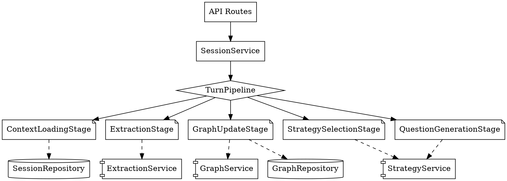

# Pipeline Architecture Visualization & Modification Guide

**Purpose**: This document explains how the code operates after ADR-008 and how to safely modify components without breaking others.

---

## How The Code Operates: The Pipeline Pattern

### Before ADR-008: The "God Method" Problem

```python
# OLD: SessionService.process_turn() - 200 lines, tightly coupled
async def process_turn(self, session_id: str, user_input: str):
    # 1. Load context (DB access mixed with business logic)
    async with aiosqlite.connect(self.db_path) as db:
        session = await db.execute(...)

    # 2. Extract concepts (direct LLM call)
    extraction = await self.extraction_service.extract(...)

    # 3. Update graph (direct graph service call)
    nodes, edges = await self.graph_service.add_extraction_to_graph(...)

    # 4. Compute state (direct graph service call)
    graph_state = await self.graph_service.get_graph_state(...)

    # 5. Select strategy (complex scoring logic)
    candidates = await self._generate_candidates(...)
    scores = await self._score_candidates(candidates, graph_state)

    # ... 5 more steps tightly coupled ...

    # PROBLEM: Changing step 5 requires understanding steps 1-10
    # PROBLEM: Cannot test step 5 in isolation
    # PROBLEM: Adding new scorer requires modifying 200-line method
```

**Change amplification**: Adding a scorer → modify 4-5 files, risk breaking unrelated code.

---

### After ADR-008: The Pipeline Pattern

```python
# NEW: SessionService.process_turn() - 21 lines, delegatd to pipeline
async def process_turn(self, session_id: str, user_input: str) -> TurnResult:
    """Process a single turn through the pipeline."""

    # Build initial context (lightweight data transfer object)
    context = TurnContext(
        session_id=session_id,
        user_input=user_input,
        turn_number=await self._get_next_turn_number(session_id),
    )

    # Execute pipeline (stages handle everything)
    return await self.pipeline.execute(context)


# TurnPipeline: Orchestrates stages sequentially
class TurnPipeline:
    async def execute(self, context: TurnContext) -> TurnResult:
        for stage in self.stages:
            context = await stage.process(context)  # ← Each stage is independent
        return self._build_result(context)
```

**Key insight**: Each stage is **isolated** - changes in one stage don't affect others.

---

## Visual: Pipeline Flow Diagram

```
┌─────────────────────────────────────────────────────────────────────────────┐
│                          API Layer (HTTP only)                              │
│  POST /sessions/{id}/turns → SessionService.process_turn()               │
└─────────────────────────────────────────────────────────────────────────────┘
                                    │
                                    ▼
┌─────────────────────────────────────────────────────────────────────────────┐
│                        SessionService (Orchestrator)                         │
│  • Creates TurnContext (data transfer object)                            │
│  • Delegates to pipeline                                                 │
│  • Returns TurnResult                                                   │
└─────────────────────────────────────────────────────────────────────────────┘
                                    │
                                    ▼
┌─────────────────────────────────────────────────────────────────────────────┐
│                          TurnPipeline Orchestrator                         │
│  ┌──────────────────────────────────────────────────────────────────────┐  │
│  │  for stage in stages:                                              │  │
│  │      context = await stage.process(context)  ← Sequential execution │  │
│  │  ┌─────────────────────────────────────────────────────────────────┐│  │
│  │  │ TurnContext flows through stages, accumulating state:         ││  │
│  │  │                                                               ││  │
│  │  │  ContextLoadingStage      → adds session metadata            ││  │
│  │  │  UtteranceSavingStage     → adds user_utterance               ││  │
│  │  │  ExtractionStage          → adds extraction                  ││  │
│  │  │  GraphUpdateStage        → adds nodes_added, edges_added     ││  │
│  │  │  StateComputationStage   → adds updated graph_state         ││  │
│  │  │  StrategySelectionStage  → adds strategy, focus             ││  │
│  │  │  ContinuationStage       → adds should_continue              ││  │
│  │  │  QuestionGenerationStage → adds next_question               ││  │
│  │  │  ResponseSavingStage     → adds system_utterance             ││  │
│  │  │  ScoringPersistenceStage → adds scoring                      ││  │
│  │  └─────────────────────────────────────────────────────────────────┘│  │
│  └──────────────────────────────────────────────────────────────────────┘  │
│  return TurnResult(context)                                                      │
└─────────────────────────────────────────────────────────────────────────────┘
                                    │
                    ┌───────────────┴───────────────┐
                    ▼                               ▼
        ┌──────────────────────┐      ┌──────────────────────┐
        │  Repository Layer     │      │   Service Layer      │
        │  (Database Access)    │      │  (Business Logic)    │
        ├──────────────────────┤      ├──────────────────────┤
        │ • SessionRepository  │      │ • ExtractionService  │
        │ • GraphRepository    │      │ • GraphService       │
        │ • UtteranceRepository│      │ • QuestionService    │
        └──────────────────────┘      │ • StrategyService    │
                                    └──────────────────────┘
```

---

## Visual: TurnContext Data Flow

`TurnContext` is a **data bucket** that gets passed between stages:

```
Initial Context (created by SessionService)
┌─────────────────────────────────────────┐
│ session_id: "abc123"                   │
│ user_input: "I love coffee"            │
│ turn_number: 1                         │
└─────────────────────────────────────────┘
           │
           ▼
┌─────────────────────────────────────────┐
│ ContextLoadingStage adds:               │
│ + methodology: "mec"                   │
│ + concept_id: "coffee"                 │
│ + recent_utterances: [...]              │
│ + graph_state: GraphState(...)          │
└─────────────────────────────────────────┘
           │
           ▼
┌─────────────────────────────────────────┐
│ ExtractionStage adds:                   │
│ + extraction: ExtractionResult(...)     │
└─────────────────────────────────────────┘
           │
           ▼
┌─────────────────────────────────────────┐
│ StrategySelectionStage adds:            │
│ + strategy: "deepen"                   │
│ + focus: {node_id: "n1", type: "depth"} │
│ + scoring: {...}                       │
└─────────────────────────────────────────┘
           │
           ▼
┌─────────────────────────────────────────┐
│ QuestionGenerationStage adds:           │
│ + next_question: "Why do you love...?" │
└─────────────────────────────────────────┘
```

**Key insight**: Each stage **only reads and writes specific fields**. No stage reaches into another stage's internal state.

---

## Why This Prevents Breakage: Dependency Inversion

### Before: Tight Coupling

```
SessionService
    │
    ├─ directly calls → ExtractionService.extract()
    ├─ directly calls → GraphService.add_extraction()
    ├─ directly calls → GraphService.get_state()
    ├─ directly calls → StrategyService._score_candidates()  ← CHANGE THIS
    └─ directly calls → QuestionService.generate()

PROBLEM: Changing StrategyService requires:
  1. Understanding SessionService's 200-line method
  2. Finding all direct calls to StrategyService
  3. Risking breaking GraphService calls (unrelated!)
```

### After: Loose Coupling via Interfaces

```
TurnPipeline
    │
    ├─ → ContextLoadingStage (only reads TurnContext.session_id)
    ├─ → ExtractionStage (only reads TurnContext.user_input)
    ├─ → GraphUpdateStage (only reads TurnContext.extraction)
    ├─ → StrategySelectionStage (only reads TurnContext.graph_state)  ← CHANGE THIS
    └─ → QuestionGenerationStage (only reads TurnContext.strategy)

BENEFIT: Changing StrategySelectionStage requires:
  1. Open src/services/turn_pipeline/stages/strategy_selection_stage.py
  2. Modify process() method
  3. No impact on other stages!
```

---

## Hypothetical Example: Adding a New Scorer

### Scenario

You want to add a **`SentimentScorer`** that boosts positive engagement strategies when the respondent shows positive sentiment.

### What You Need to Do

#### Step 1: Create the Scorer (New File)

```python
# src/services/scoring/tier2/sentiment.py
from typing import Optional
from src.services.scoring.base import ScorerOutput, ScorerBase

class SentimentScorer(ScorerBase):
    """
    Boost strategies that match respondent sentiment.

    Positive respondent → boost positive/rapport-building strategies
    Negative respondent → boost analytical/neutral strategies
    """

    def __init__(self, config: Optional[dict] = None):
        super().__init__(config or {})
        self.sentiment_threshold = self.config.get("sentiment_threshold", 0.5)

    async def score(self, candidate, context) -> ScorerOutput:
        # 1. Get sentiment from recent utterances (READ from context)
        recent_texts = [
            u.get("text", "") for u in context.recent_utterances[-3:]
        ]
        sentiment = await self._compute_sentiment(recent_texts)

        # 2. Apply scoring (WRITE to output only)
        if sentiment > self.sentiment_threshold:
            # Positive sentiment → boost rapport/positive strategies
            if candidate.strategy_id in ["rapport", "positive_reflection"]:
                raw_score = 1.3  # Boost
            else:
                raw_score = 0.9  # Neutral
        else:
            # Negative/neutral → boost analytical strategies
            if candidate.strategy_id in ["deepen", "analyze"]:
                raw_score = 1.2  # Boost
            else:
                raw_score = 1.0  # Neutral

        return self.make_output(
            raw_score=raw_score,
            weight=self.weight,
        )
```

**Files touched**: 1 (NEW file)

---

#### Step 2: Register in Scoring System (Edit 1 File)

```python
# src/services/scoring/tier2/__init__.py
from .sentiment import SentimentScorer

# In get_tier2_scorers() function:
def get_tier2_scorers(config: dict) -> list:
    return [
        CoverageGapScorer(config.get("coverage_gap", {})),
        AmbiguityScorer(config.get("ambiguity", {})),
        SentimentScorer(config.get("sentiment", {})),  # ← ADD THIS LINE
        # ... other scorers
    ]
```

**Files touched**: 1 (existing file)

---

#### Step 3: Add Configuration (Edit 1 File)

```yaml
# config/scoring.yaml
tier2_scorers:
  sentiment:
    enabled: true
    weight: 0.15
    sentiment_threshold: 0.5
    # ... other config
```

**Files touched**: 1 (existing file)

---

#### Step 4: Write Tests (New File)

```python
# tests/unit/test_sentiment_scorer.py
import pytest
from src.services.scoring.tier2.sentiment import SentimentScorer
from src.services.turn_pipeline.context import TurnContext

async def test_positive_sentiment_boosts_rapport():
    # Arrange
    scorer = SentimentScorer({"weight": 0.15})
    context = TurnContext(
        session_id="test",
        user_input="I love this!",
        recent_utterances=[
            {"text": "Great!", "speaker": "respondent"},
            {"text": "This is wonderful", "speaker": "respondent"},
        ]
    )
    candidate = MagicMock(strategy_id="rapport")

    # Act
    result = await scorer.score(candidate, context)

    # Assert
    assert result.final_score > 1.0  # Should be boosted
```

**Files touched**: 1 (NEW file)

---

### Summary: What Changed?

| Action | Files | Risk |
|--------|-------|------|
| Create scorer | 1 new file | **Zero** - isolated component |
| Register scorer | 1 existing file | **Low** - additive change |
| Add config | 1 existing file | **Zero** - additive change |
| Write tests | 1 new file | **Zero** - isolated tests |

**Total**: 2 new files, 2 modified files (additive only)

**What you DON'T touch**:
- ❌ SessionService (200 lines → 21 lines, no need to modify)
- ❌ Other stages (ContextLoading, Extraction, etc.)
- ❌ Pipeline orchestrator
- ❌ API routes
- ❌ Database schema

---

## Comparison: Before vs After

### Before ADR-008: Adding a Scorer

```
1. Open src/services/session_service.py (200 lines)
2. Find the scoring section (lines 150-180)
3. Add scorer logic mixed with other code
4. Update _score_candidates() method
5. Update StrategyService to pass new data
6. Update SessionService to handle new data
7. Update API routes to serialize new data
8. Hope you didn't break extraction/graph/question generation

Files modified: 4-5 files
Risk: HIGH (change in one place breaks another)
Testability: LOW (must test entire 200-line method)
```

### After ADR-008: Adding a Scorer

```
1. Create src/services/scoring/tier2/sentiment.py (NEW)
2. Edit src/services/scoring/tier2/__init__.py (1 line added)
3. Edit config/scoring.yaml (5 lines added)
4. Create tests/unit/test_sentiment_scorer.py (NEW)

Files modified: 2 existing files (additive only)
Files created: 2 new files
Risk: LOW (isolated component)
Testability: HIGH (test scorer in isolation)
```

---

## Key Principles for Safe Modifications

### 1. **Read from Context, Write to Context**

Each stage should:
- ✅ **READ** specific fields from `TurnContext`
- ✅ **WRITE** specific fields to `TurnContext`
- ❌ **NEVER** read from another stage directly
- ❌ **NEVER** call another stage's methods

```python
# ✅ GOOD: Read/write through context
class MyStage(TurnStage):
    async def process(self, context: TurnContext) -> TurnContext:
        # Read from context
        extraction = context.extraction
        # Compute something
        result = self._compute(extraction)
        # Write to context
        context.my_result = result
        return context

# ❌ BAD: Bypass context
class MyStage(TurnStage):
    async def process(self, context: TurnContext) -> TurnContext:
        # Don't call another stage directly!
        result = await some_other_stage.do_something()
        return context
```

### 2. **Use Dependency Injection for Services**

Stages receive services via constructor, not by importing them:

```python
# ✅ GOOD: Dependency injection
class ExtractionStage(TurnStage):
    def __init__(self, extraction_service: IExtractionService):
        self.extraction_service = extraction_service

# ❌ BAD: Direct import
class ExtractionStage(TurnStage):
    def __init__(self):
        from src.services.extraction_service import ExtractionService
        self.extraction_service = ExtractionService()  # Hard to test!
```

### 3. **Keep Stages Stateless**

Stages shouldn't maintain internal state between turns:

```python
# ✅ GOOD: Stateless (all data in context)
class MyStage(TurnStage):
    async def process(self, context: TurnContext) -> TurnContext:
        # All state comes from context
        return context

# ❌ BAD: Stateful (hard to test/reason about)
class MyStage(TurnStage):
    def __init__(self):
        self.cache = {}  # Don't do this!
```

---

## How to Visualize Dependencies

### File: `docs/raw_ideas/pipeline_dependencies.dot`

You can generate a dependency graph with Graphviz:



Generate with: `dot -Tpng pipeline_dependencies.dot -o pipeline.png`

---

## Checklist: Adding New Functionality

When adding new functionality, ask yourself:

| Question | Yes | No |
|----------|-----|-----|
| Can I create a new file instead of modifying existing code? | ✅ Safe | ❌ Reconsider |
| Does my change only touch one stage? | ✅ Safe | ❌ Reconsider |
| Am I reading from TurnContext instead of calling other stages? | ✅ Safe | ❌ Reconsider |
| Can I test my change in isolation? | ✅ Safe | ❌ Reconsider |
| Does my change require touching the API layer? | ❌ Why? | ✅ Good |
| Does my change require modifying SessionService? | ❌ Why? | ✅ Good |

---

## Summary

### Before ADR-008
- **Tightly coupled**: Changes ripple through 4-5 files
- **Hard to test**: Must test entire 200-line method
- **Change amplification**: HIGH

### After ADR-008
- **Loosely coupled**: Changes isolated to single stage/file
- **Easy to test**: Each stage tested independently
- **Change amplification**: LOW (1-2 files max)

### The Key Insight

> **"TurnContext is the only thing that connects stages."**

If you only read/write to `TurnContext`, you're isolated from other stages. If you call another stage directly, you're breaking the pattern.

### Adding a New Scorer = 4 Steps

1. Create `src/services/scoring/tier2/my_scorer.py`
2. Register in `src/services/scoring/tier2/__init__.py`
3. Add config to `config/scoring.yaml`
4. Write `tests/unit/test_my_scorer.py`

**No other files need to be touched.**
