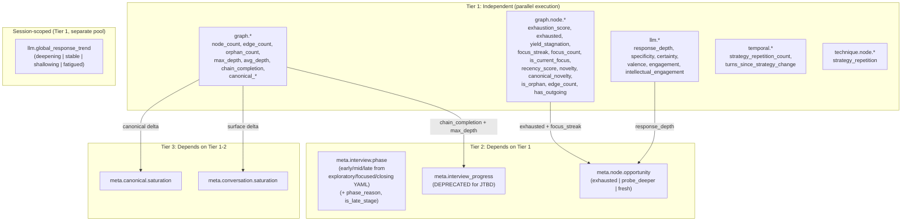

# Signals and Strategy Scoring Guide

**Purpose**: Comprehensive guide to understanding the Signal Pools Architecture for adaptive strategy selection.

---

## Table of Contents

1. [What is Signal-Based Strategy Selection?](#what-is-signal-based-strategy-selection)
2. [How It Works: The Pipeline](#how-it-works-the-pipeline)
3. [Signal Pools Overview](#signal-pools-overview)
   - [Signal Design Philosophy](#signal-design-philosophy)
4. [Node-Level Signals](#node-level-signals)
5. [Strategy Scoring Mechanics](#strategy-scoring-mechanics)
6. [Configuration Parameters](#configuration-parameters)
7. [YAML Configuration Guide](#yaml-configuration-guide)
8. [Tools and Debugging](#tools-and-debugging)
9. [Practical Examples](#practical-examples)
10. [Troubleshooting](#troubleshooting)
11. [References](#references)

---

## What is Signal-Based Strategy Selection?

Signal-based strategy selection is an **adaptive decision system** that chooses questioning strategies based on real-time signals extracted from the interview context.

### The Problem It Solves

Traditional interview systems use fixed rules or simple heuristics:

```
Traditional: Always ask "Why?" after every answer
Problem: Boring, repetitive, doesn't adapt to user engagement

Signal-Based: Analyze response depth, engagement, graph state
Decision: Choose strategy based on 20+ signals
Result: Dynamic, context-aware conversation flow
```

### Signal Pools Architecture

```
┌─────────────────────────────────────────────────────────────────────┐
│                    SIGNAL POOLS ARCHITECTURE                         │
├─────────────────────────────────────────────────────────────────────┤
│                                                                     │
│  ┌─────────────┐  ┌─────────────┐  ┌─────────────┐  ┌────────────┐ │
│  │ GRAPH POOL  │  │  LLM POOL   │  │ TEMPORAL    │  │ META POOL  │ │
│  │  (graph.*)  │  │  (llm.*)    │  │  (temporal.*)│  │  (meta.*)  │ │
│  ├─────────────┤  ├─────────────┤  ├─────────────┤  ├────────────┤ │
│  │ node_count  │  │resp_depth   │  │strategy_rep │  │progress    │ │
│  │ max_depth   │  │specificity  │  │turns_since  │  │phase       │ │
│  │ chain_comp  │  │certainty    │  │last_change  │  │node_opp    │ │
│  │ ...         │  │valence      │  │response_trend│ │            │ │
│  │             │  │engagement   │  │             │  │conv_sat    │ │
│  └──────┬──────┘  └──────┬──────┘  └──────┬──────┘  └─────┬──────┘ │
│  │             │  │             │  │             │  │can_sat     │ │
│         └─────────────────┴─────────────────┴──────────────┘       │
│                                    │                                │
│                                    ▼                                │
│                         ┌─────────────────────┐                     │
│                         │  SIGNAL DETECTION   │                     │
│                         │    (Async Batch)    │                     │
│                         └──────────┬──────────┘                     │
│                                    │                                │
│                                    ▼                                │
│                         ┌─────────────────────┐                     │
│                         │ TWO-STAGE SCORING   │                     │
│                         │  Stage 1: Strategy  │                     │
│                         │  Stage 2: Node      │                     │
│                         └──────────┬──────────┘                     │
│                                    │                                │
│                                    ▼                                │
│                         ┌─────────────────────┐                     │
│                         │  STRATEGY SELECTED  │                     │
│                         │   (Best Score)      │                     │
│                         └─────────────────────┘                     │
│                                                                     │
└─────────────────────────────────────────────────────────────────────┘
```

---

## How It Works: The Pipeline

### Stage 8: Strategy Selection

Located in `src/services/turn_pipeline/stages/strategy_selection_stage.py`.

```python
# Simplified flow (two-stage architecture)
async def execute(self, context: PipelineContext) -> PipelineContext:
    # 1. Load methodology configuration
    methodology = await self.registry.load(context.methodology)

    # 2. Detect global signals (graph, llm, temporal, meta)
    global_signals = await self.global_service.detect(
        methodology_name=methodology,
        context=context,
        graph_state=context.graph_state,
        response_text=response_text
    )

    # 3. Detect node-level signals for candidate nodes
    node_signals = await self.node_service.detect(
        context=context,
        graph_state=context.graph_state,
        response_text=response_text,
        node_tracker=context.node_tracker
    )

    # 4. Two-stage strategy→node selection
    result = await self.strategy_service.select_strategy_and_focus(
        context=context,
        graph_state=context.graph_state,
        response_text=response_text
    )

    # Result: (strategy_name, focus_node_id, alternatives, global_signals, node_signals, score_decomposition)
    context.strategy = result.strategy_name
    context.focus_node_id = result.focus_node_id  # None if node_binding="none"
    context.signals = result.global_signals
    context.strategy_alternatives = result.alternatives  # List of (strategy_name, score) tuples
    context.score_decomposition = result.score_decomposition  # Stage 1 (node_id="") + Stage 2 (node_id="<uuid>")
```

### Two-Stage Architecture

The system uses a two-stage approach for strategy and node selection:

**Stage 1: Strategy Selection**
- Scores all strategies using **global signals only** (graph.*, llm.*, temporal.*, meta.*)
- `partition_signal_weights()` auto-excludes node-scoped weights (graph.node.*, technique.node.*, meta.node.*)
- Applies phase-based multipliers (multiplicative) and bonuses (additive)
- Returns ranked list of strategies with full score decomposition
- Represented in `score_decomposition` with `node_id=""` (empty string)
- Output format: `strategy_alternatives = [(strategy_name, score), ...]` (2-tuple list)

**Stage 2: Node Selection (Conditional)**
- Conditionally executed only when `node_binding="required"` and node_signals exist
- Scores nodes for the selected strategy using **node-scoped signals only**
- `partition_signal_weights()` extracts only node-scoped weights from strategy config
- Applies phase-based multipliers and bonuses: `(base_score × multiplier) + bonus`
- Returns ranked list of nodes with full score decomposition
- Represented in `score_decomposition` with `node_id="<uuid>"`
- Output format: Each score_decomposition entry includes `node_id`, `strategy`, `base_score`, `phase_multiplier`, `phase_bonus`, `final_score`, `rank`, `selected`

```
┌─────────────────────────────────────────────────────────────────────┐
│                    TWO-STAGE ARCHITECTURE                           │
├─────────────────────────────────────────────────────────────────────┤
│                                                                     │
│  STAGE 1: Strategy Selection                                        │
│  ───────────────────────                                            │
│  Input: global_signals (graph.*, llm.*, temporal.*, meta.*)         │
│  Process: rank_strategies() with partition_signal_weights()         │
│         - Auto-excludes node-scoped weights                         │
│         - Applies phase multipliers (×) and bonuses (+)             │
│  Output: ranked strategies with decomposition (node_id="")          │
│                                                                     │
│                              ↓                                       │
│                     Select best_strategy                            │
│                              ↓                                       │
│  STAGE 2: Node Selection (Conditional)                              │
│  ─────────────────────────────────────                              │
│  Condition: node_binding="required" AND node_signals exist          │
│  Input: node_signals (graph.node.*, technique.node.*, meta.node.*) │
│  Process: rank_nodes_for_strategy() with node-scoped weights        │
│         - Extracts only node.* weights from strategy config         │
│         - Applies phase multipliers (×) and bonuses (+)             │
│  Output: ranked nodes with decomposition (node_id="<uuid>")         │
│                                                                     │
└─────────────────────────────────────────────────────────────────────┘
```

### Signal Detection Flow

```
┌─────────────────────────────────────────────────────────────────────┐
│                     SIGNAL DETECTION FLOW                           │
├─────────────────────────────────────────────────────────────────────┤
│                                                                     │
│  Step 1: YAML Configuration                                         │
│  ───────────────────────                                            │
│  signals:                                                           │
│    graph: [max_depth, chain_completion]                              │
│    llm: [response_depth, valence]                                   │
│    temporal: [strategy_repetition_count]                            │
│    meta: [interview.phase]                                          │
│                                                                     │
│                           ↓                                         │
│                                                                     │
│  Step 2: Dependency Resolution                                      │
│  ─────────────────────────────                                      │
│  Signals declare dependencies:                                      │
│    InterviewPhaseSignal depends on [turn_number]                    │
│                                                                     │
│  ComposedSignalDetector performs topological sort:                  │
│    turn_number → meta.interview.phase                               │
│                                                                     │
│                           ↓                                         │
│                                                                     │
│  Step 3: Parallel Detection by Pool                                 │
│  ─────────────────────────────────                                  │
│  ┌─────────────┐  ┌─────────────┐  ┌─────────────┐                  │
│  │GraphSignals │  │ LLMSignals  │  │SessionSignals│                  │
│  │  (async)    │  │  (async)    │  │   (async)    │                  │
│  └─────────────┘  └─────────────┘  └─────────────┘                  │
│       O(1) cached      Batching          O(1) cached                │
│                         (Single API Call)                           │## Signal Pools Overview

### Signal Design Philosophy

The signal system follows three deliberate design patterns that may initially seem like redundancy but serve distinct purposes in YAML-driven scoring.

#### Pattern 1: Raw → Threshold → Composite (The Signal Trio)

Many concepts are expressed as **three complementary signals** at different levels of abstraction:

```
Raw (float)          →  Threshold (bool/categorical)  →  Composite (meta)
────────────────────    ───────────────────────────      ──────────────────
exhaustion_score 0.7    exhausted: true                  opportunity: "exhausted"
recency_score 0.3       novelty: "low"                   (no composite)
focus_streak count      focus_streak: "high"             (no composite)
```

**Why all three?** Each enables a different YAML weighting pattern:

```yaml
# Soft penalty — gradual, proportional
graph.node.exhaustion_score.high: -0.8

# Hard gate — binary reject/accept
graph.node.exhausted.true: -2.0

# Categorical routing — pick the right bucket
meta.node.opportunity.fresh: 1.0
meta.node.opportunity.probe_deeper: 0.5
```

A float alone can't hard-gate; a bool alone can't do gradual penalties; a categorical alone can't express continuous preference. The trio gives methodology authors full expressiveness without writing code.

#### Pattern 2: Namespace by Dependency Tier, Not by Topic

Signals are organized by **when they can be computed**, not by what they measure:

```
TIER 1 — No dependencies (can run in parallel):
├── graph.*           Direct from graph snapshot
├── graph.node.*      Direct from NodeStateTracker
├── llm.*             Independent LLM analysis
├── temporal.*        From strategy history
└── technique.node.*  From node strategy history

TIER 2 — Depends on Tier 1:
├── meta.interview.phase        Needs turn_number
├── meta.node.opportunity       Needs graph.node.exhausted + focus_streak + response_depth
└── meta.interview_progress     Needs graph.chain_completion + graph.max_depth

TIER 3 — Depends on Tier 1-2:
└── meta.conversation.saturation / meta.canonical.saturation
```

This is why `meta.node.opportunity` lives in `meta/` rather than alongside `graph.node.*` — it **depends on** tier-1 node signals. The `ComposedSignalDetector` uses topological sort (Kahn's algorithm) to resolve this ordering automatically.

#### Pattern 3: Directory ≠ Namespace (Known Inconsistencies)

Two signals have directory/namespace mismatches:

| Signal | Namespace | Directory | Why |
|--------|-----------|-----------|-----|
| `llm.global_response_trend` | `llm.*` | `src/signals/session/` | Aggregates LLM history over time (session-scoped), but measures LLM output quality |
| `technique.node.strategy_repetition` | `technique.node.*` | `src/signals/session/` | Tracks strategy application history per-node, not graph structure |

These are intentional: the namespace reflects **what the signal measures** (for YAML authors), while the directory reflects **how it's computed** (for developers). YAML authors never see directories.

#### Signal Value Types and Scoring

| Value Type | Examples | How Scoring Uses It |
|------------|----------|---------------------|
| **float [0,1]** | `exhaustion_score`, `engagement` | Direct weight OR threshold binning (`.high`/`.mid`/`.low`) |
| **bool** | `exhausted`, `is_orphan` | Match via `.true`/`.false` suffix |
| **categorical (str)** | `response_depth`, `focus_streak`, `phase` | String equality match (`.deep`, `.high`, `.early`) |
| **int** | `node_count`, `edge_count` | Used as-is (context-dependent) |

#### Complete Signal Dependency Diagram



---

### 1. Graph Signals (`graph.*`)

**Source**: Knowledge graph snapshot
**Cost**: O(1) - cached on graph update
**Location**: `src/signals/graph/`

| Signal | Type | Description | Use Case |
|--------|------|-------------|----------|
| `graph.node_count` | int | Total concepts extracted | Interview progress |
| `graph.edge_count` | int | Total relationships | Connectivity health |
| `graph.orphan_count` | int | Isolated nodes (no edges) | Needs exploration |
| `graph.max_depth` | float | Longest chain depth, normalized by ontology levels [0,1] | Laddering progress |
| `graph.avg_depth` | float | Average depth across chains | Overall depth |
| `graph.chain_completion.ratio` | float | Ratio of complete chains [0,1] | Completion metric |
| `graph.chain_completion.has_complete` | bool | Whether any chain is complete | Completion flag |
| `graph.canonical_concept_count` | int | Deduplicated concepts | Canonical coverage |
| `graph.canonical_edge_density` | float | Edge-to-concept ratio | Canonical connectivity |
| `graph.canonical_exhaustion_score` | float | Avg exhaustion (0-1) | Overall exhaustion |

**Example Values**:
```python
{
    "graph.max_depth": 0.5,           # 50% of ontology depth
    "graph.chain_completion.ratio": 0.75,  # 75% chains complete
    "graph.chain_completion.has_complete": True
}
```

---

### 2. LLM Signals (`llm.*`)

**Source**: LLM analysis of user response using rubric-based prompts
**Cost**: High (1 API call per response, batched for all LLM signals)
**Location**: `src/signals/llm/`

| Signal | Type | Values | Description |
|--------|------|--------|-------------|
| `llm.response_depth` | categorical | surface, shallow, moderate, deep, comprehensive | Elaboration quantity |
| `llm.specificity` | float | 0.0-1.0 | Concreteness of language |
| `llm.certainty` | float | 0.0-1.0 | Epistemic confidence |
| `llm.valence` | float | 0.0-1.0 | Emotional tone (negative-positive) |
| `llm.engagement` | float | 0.0-1.0 | Willingness to engage (participatory quality) |
| `llm.intellectual_engagement` | float | 0.0-1.0 | Analytical reasoning and motivational depth |

**Rubric-Based Detection**: The LLM batch detector loads rubric definitions from `src/signals/llm/prompts/signals.md` using indentation-based parsing.

**Scale Interpretation (Float Signals)**:
```
0.0 = Very low / minimal / negative
0.25 = Low / somewhat vague / uncertain
0.5 = Moderate / neutral
0.75 = High / fairly concrete / confident
1.0 = Very high / detailed / positive / certain
```

**Categorical Signal (response_depth)**:
```
surface = Minimal or single-word answer
shallow = Brief statement with no supporting detail
moderate = Moderate elaboration with some explanation
deep = Detailed response with reasoning or examples
comprehensive = Rich, layered response exploring multiple angles
```

**Batch Detection**: All LLM signals are detected in a single API call via `LLMBatchDetector`:
```python
# One API call returns all signals:
{
    "llm.response_depth": "deep",  # Categorical string
    "llm.specificity": 0.5,        # Float [0,1]
    "llm.certainty": 1.0,          # Float [0,1]
    "llm.valence": 0.75,           # Float [0,1]
    "llm.engagement": 1.0,         # Float [0,1]
    "llm.intellectual_engagement": 0.75   # Float [0,1]
}
```

**Implementation Note**: The `ComposedSignalDetector` automatically separates LLM signals from non-LLM signals. All LLM signals are batched into a single API call (configured via `llm.signal_scoring` provider in `config/interview_config.yaml`) for efficiency. This batched approach significantly reduces latency and API costs compared to per-signal API calls.

---

### 3. Temporal Signals (`temporal.*`)

**Source**: Conversation history and session state
**Cost**: O(1) - cached per turn
**Location**: `src/signals/session/`

| Signal | Type | Description |
|--------|------|-------------|
| `temporal.strategy_repetition_count` | float | Times current strategy used in last 5 turns, normalized [0,1] |
| `temporal.turns_since_strategy_change` | float | Consecutive turns using current strategy, normalized [0,1] |
| `llm.global_response_trend` | str | Trend: `fatigued`, `shallowing`, `engaged`, `stable` |

**Usage for Diversity**:
```yaml
# Penalize overused strategies
signal_weights:
  temporal.strategy_repetition_count: -0.5  # Negative weight
```

**Note**: `llm.global_response_trend` is a session-scoped signal that aggregates LLM signal history over time. Despite the `llm.*` namespace, it's implemented in `src/signals/session/` rather than `src/signals/llm/` because it tracks conversation-level trends rather than analyzing individual responses.

---

### 4. Meta Signals (`meta.*`)

**Source**: Composite - integrates multiple signal pools
**Cost**: Varies (some O(1), some compute on demand)
**Location**: `src/signals/meta/`

| Signal | Type | Description |
|--------|------|-------------|
| `meta.interview_progress` | float | 0.0-1.0 progress through interview (**DEPRECATED** for JTBD, retained for MEC) |
| `meta.interview.phase` | str | `early`, `mid`, or `late` (**Note**: Signal outputs early/mid/late for YAML compatibility. Phase boundaries derived from YAML config: exploratory→early, focused→mid, closing→late) |
| `meta.node.opportunity` | str | `exhausted`, `probe_deeper`, or `fresh` |
| `meta.conversation.saturation` | float | 0.0-1.0 interview saturation from surface graph extraction yield |
| `meta.canonical.saturation` | float | 0.0-1.0 interview saturation from canonical graph extraction yield |

#### Saturation Signals

**Purpose**: Replace `meta.interview_progress` with methodology-agnostic saturation detection based on extraction yield ratio (current turn vs peak turn).

**Formula**:
```
# Conversation saturation (surface graph)
saturation = 1.0 - min(current_surface_delta / peak_surface_delta, 1.0)

# Canonical saturation (canonical graph)
saturation = 1.0 - min(current_canonical_delta / peak_canonical_delta, 1.0)
```

**Interpretation**:
| Value | Meaning |
|-------|---------|
| 0.0 | Extracting at peak rate (respondent producing new concepts) |
| 0.5 | Extraction yield is 50% of peak (some content drying up) |
| 1.0 | Zero extraction this turn (fully saturated or non-responsive) |

**Key Insight**: Saturation measures **extraction yield ratio**, not interview progress. A respondent can be at 1.0 (saturated) in early turns if they produce brief answers, or at 0.0 (unsaturated) in late turns if they're still revealing new concepts.

**Usage in validate_outcome strategy**:
```yaml
signal_weights:
  meta.conversation.saturation: 0.5  # High saturation → validate & wrap
  meta.canonical.saturation: 0.3     # Supportive metric from canonical graph
```

**Phase Boundaries** (configured in YAML):
```yaml
# config/interview_config.yaml
phases:
  exploratory:
    n_turns: 6   # Maps to early phase (0-5 turns)
  focused:
    n_turns: 7   # Maps to mid phase (6-12 turns)
  closing:
    n_turns: 2   # Maps to late phase (13-14 turns)
```

**Note**: The `InterviewPhaseSignal` outputs `early`, `mid`, `late` for backward compatibility with existing methodology YAML configs. Internally, it maps from the YAML-configured `exploratory`, `focused`, `closing` phases.

---

## Node-Level Signals

Node-level signals provide **per-node** assessments for Stage 2 node selection in the two-stage architecture.

### Signal Namespaces

| Namespace | Description | Example Signals |
|-----------|-------------|-----------------|
| `graph.node.*` | Graph-derived per-node signals | exhaustion_score, focus_streak, has_outgoing |
| `technique.node.*` | Technique-specific signals | strategy_repetition |
| `meta.node.*` | Meta-derived per-node signals | opportunity |

### Available Node Signals

| Signal | Type | Reads NodeState Fields | Timing Notes |
|--------|------|------------------------|--------------|
| `graph.node.exhaustion_score` | float | `focus_count`, `turns_since_last_yield`, `current_focus_streak`, `all_response_depths` | Fresh: updated Stage 5 (yield) or Stage 8 (focus) |
| `graph.node.exhausted` | bool | `focus_count`, `turns_since_last_yield`, `current_focus_streak`, `all_response_depths` | Fresh: updated Stage 5 (yield) or Stage 8 (focus) |
| `graph.node.yield_stagnation` | bool | `focus_count`, `turns_since_last_yield` | Fresh: updated Stage 5 (yield) or Stage 8 (focus) |
| `graph.node.focus_streak` | str | `current_focus_streak` | From previous turn Stage 8 |
| `graph.node.is_current_focus` | bool | `previous_focus` (tracker-level) | From previous turn Stage 8 |
| `graph.node.focus_count` | int | `focus_count` | Cumulative focus count |
| `graph.node.recency_score` | float | `turns_since_last_focus` | Ticked for all nodes in Stage 8 |
| `graph.node.is_orphan` | bool | `edge_count_incoming`, `edge_count_outgoing` | Fresh: updated Stage 5 |
| `graph.node.edge_count` | int | `edge_count_incoming`, `edge_count_outgoing` | Fresh: updated Stage 5 |
| `graph.node.has_outgoing` | bool | `edge_count_outgoing` | Fresh: updated Stage 5 |
| `graph.node.novelty` | str | `turns_since_last_focus` | Categorical: fresh (0-2 turns), stale (3-5), ancient (6+) |
| `graph.node.canonical_novelty` | str | `turns_since_last_focus` | Same as novelty but for canonical slots |
| `technique.node.strategy_repetition` | int | `consecutive_same_strategy` | From previous turn Stage 8 |
| `meta.node.opportunity` | str | Derived from exhaustion + response depth | Computed from node state |

---

## Strategy Scoring Mechanics

### The Scoring Formula

```
base_score = Σ(signal_weight × signal_value)
final_score = (base_score × phase_multiplier) + bonus
```

> **Note**: All signals are normalized at their source (detector layer) to produce values in [0, 1] or bool. No additional normalization step is needed during scoring.

### Signal Value Resolution

The scoring system supports three signal value patterns:

#### 1. Direct Match
```yaml
signal_weights:
  graph.max_depth: 0.5  # Uses signal value directly
```
- Boolean: `true` = 1.0, `false` = 0.0
- Numeric: already normalized to [0,1] at source

#### 2. Compound Key with String Match
```yaml
signal_weights:
  llm.global_response_trend.fatigued: 1.0  # True if trend == "fatigued"
```
- Value is 1.0 if signal equals the suffix, 0.0 otherwise

#### 3. Threshold Binning (Float Signals Only)
```yaml
signal_weights:
  llm.specificity.high: 0.8   # True if value >= 0.75
  llm.specificity.mid: 0.3    # True if 0.25 < value < 0.75
  llm.specificity.low: 0.3    # True if value <= 0.25
```
- `.high` matches values >= 0.75
- `.mid` matches values in (0.25, 0.75) exclusive
- `.low` matches values <= 0.25
- **Important**: Only use with float signals normalized to [0, 1]

**Categorical signals** like `llm.response_depth` use string equality matching:
```yaml
signal_weights:
  llm.response_depth.deep: 0.8      # True if response_depth == "deep"
  llm.response_depth.moderate: 0.3  # True if response_depth == "moderate"
  llm.response_depth.shallow: 0.3   # True if response_depth == "shallow"
```

### Phase Weights and Bonuses (Stage 1 and Stage 2)

**Important**: Phase weights and bonuses are applied in **both stages**:

**Stage 1 (Strategy Selection)**:
- Phase weights retrieved from `config.phases[phase].signal_weights` (multiplicative)
- Phase bonuses retrieved from `config.phases[phase].phase_bonuses` (additive)
- Applied to all strategies during ranking

**Stage 2 (Node Selection)**:
- Phase weights and bonuses retrieved for the **selected strategy only**
- Applied to node scores for that strategy
- Uses the same `config.phases[phase]` values as Stage 1

```yaml
phases:
  early:
    signal_weights:
      explore: 1.5      # 1.5x multiplier (both stages)
    phase_bonuses:
      explore: 0.2      # +0.2 bonus (both stages)
  mid:
    signal_weights:
      deepen: 1.3
    phase_bonuses:
      deepen: 0.3
```

**Example Calculation**:
```
Stage 1 (Strategy):
Base explore score: 2.5
Early phase multiplier: 1.5
Early phase bonus: 0.2
Final score = (2.5 × 1.5) + 0.2 = 3.95

Stage 2 (Node for explore strategy):
Base node score: 1.8
Early phase multiplier: 1.5 (same strategy)
Early phase bonus: 0.2 (same strategy)
Final score = (1.8 × 1.5) + 0.2 = 2.9
```

## Configuration Parameters## Configuration Parameters

All parameters are defined in methodology YAML files and `src/core/config.py`.

### Methodology YAML Structure

```yaml
method:
  name: means_end_chain
  description: "Laddering: attributes → consequences → values"

# Signal declarations
signals:
  graph:
    - graph.max_depth
    - graph.chain_completion
  llm:
    - llm.response_depth
    - llm.specificity
    - llm.certainty
    - llm.valence
  temporal:
    - temporal.strategy_repetition_count
    - llm.global_response_trend
  meta:
    - meta.interview.phase
    - meta.node.opportunity

# Phase boundaries
phase_boundaries:
  early_max_turns: 4
  mid_max_turns: 12

# Strategy definitions
strategies:
  - name: explore
    description: "Find new attributes/branches"
    signal_weights:
      llm.response_depth.shallow: 0.8
      temporal.strategy_repetition_count: -0.5
    node_binding: required  # Optional: "required" (default) or "none"

  - name: reflect
    description: "Summarize and validate understanding"
    signal_weights:
      meta.interview.phase.late: 1.0
    node_binding: none  # Conversation-level strategy, no node targeting

# Phase-based adaptation
phases:
  early:
    signal_weights:
      explore: 1.5
    phase_bonuses:
      explore: 0.2
```

**Note**: Phase configuration (`early`, `mid`, `late`) in methodology YAML files maps to the interview phases defined in `config/interview_config.yaml` (`exploratory`, `focused`, `closing`). The `InterviewPhaseSignal` internally converts from the YAML-configured phases to the signal outputs for backward compatibility.

### Parameter Reference

| Parameter | Location | Description |
|-----------|----------|-------------|
| `signals.{pool}` | YAML (methodology) | List of signals to detect from each pool |
| `phases.{phase}.signal_weights.{strategy}` | YAML (methodology) | Phase-specific multiplier (Stage 1 only) |
| `phases.{phase}.phase_bonuses.{strategy}` | YAML (methodology) | Phase-specific additive bonus (Stage 1 only) |
| `signal_weights.{signal}` | YAML (strategy) | Weight for scoring contribution |
| `node_binding` | YAML (strategy) | Strategy node binding: `"required"` (default) or `"none"` |
| `partition_signal_weights()` | `scoring.py` | Auto-separates global vs node-scoped weights |
| `phases.{phase}.n_turns` | `config/interview_config.yaml` | Turn count for each interview phase |

---

## YAML Configuration Guide

### Complete Configuration Example

```yaml
method:
  name: means_end_chain
  description: "Laddering: attributes → consequences → values"

signals:
  graph:
    - graph.max_depth
    - graph.chain_completion
    - graph.canonical_exhaustion_score
  llm:
    - llm.response_depth
    - llm.specificity
    - llm.certainty
    - llm.valence
    - llm.engagement
  temporal:
    - temporal.strategy_repetition_count
    - llm.global_response_trend
  meta:
    - meta.interview.phase
    - meta.node.opportunity

strategies:
  - name: explore
    description: "Find new attributes/branches"
    signal_weights:
      llm.response_depth.shallow: 0.8
      llm.response_depth.surface: 0.5
      temporal.strategy_repetition_count: -0.5

  - name: deepen
    description: "Explore why something matters (laddering up)"
    signal_weights:
      llm.response_depth.shallow: 0.8
      graph.max_depth: -0.3
      llm.engagement.high: 0.7
      llm.engagement.low: -0.5
      llm.valence.high: 0.4
      temporal.strategy_repetition_count: -0.3
      # Node-level signals
      graph.node.exhaustion_score.low: 1.0
      graph.node.focus_streak.low: 0.5

  - name: clarify
    description: "Get more detail on vague responses"
    signal_weights:
      llm.specificity.low: 0.8
      llm.certainty.low: 0.5
      llm.engagement.mid: 0.3
      temporal.strategy_repetition_count: -0.3

  - name: bridge
    description: "Connect isolated concepts"
    signal_weights:
      graph.node.is_orphan.true: 1.0

  - name: reflect
    description: "Synthesize insights"
    node_binding: none  # Conversation-level strategy
    signal_weights:
      meta.interview.phase.late: 1.0
      graph.chain_completion.high: 0.8
      llm.engagement.low: 0.6
      temporal.strategy_repetition_count: -0.2

phases:
  early:
    description: "Initial exploration phase"
    signal_weights:
      explore: 1.5
      clarify: 1.2
    phase_bonuses:
      explore: 0.2

  mid:
    description: "Deep exploration phase"
    signal_weights:
      deepen: 1.3
      bridge: 1.2
    phase_bonuses:
      deepen: 0.3

  late:
    description: "Synthesis phase"
    signal_weights:
      reflect: 1.2
    phase_bonuses:
      reflect: 0.2
```

---

## Tools and Debugging

### Viewing Signal Detection Logs

Signals are logged at `INFO` level during detection:

```python
# Example log output
logger.info(f"signals_detected: {signal_values}")
logger.info(f"interview_phase_detected: {phase}")
logger.info(f"phase_weights_loaded: {phase_weights}")
logger.info(f"phase_bonuses_loaded: {phase_bonuses}")
logger.info(f"strategies_ranked: {ranked}")
logger.info(f"strategy_selected: {strategy_name}")
```

### Enabling Debug Logging

```bash
# Run with debug logging
uvicorn src.main:app --reload --log-level debug
```

### Inspecting Strategy Selection

The `strategy_alternatives` field in `PipelineContext` contains all scored strategies:

```python
# Access in code or logs
context.strategy_alternatives = [
    (strategy_name, score),  # 2-tuple format
    ...
]
```

---

## Practical Examples

### Example 1: Understanding Strategy Selection

**Scenario**: Debug why `explore` was chosen over `deepen`.

**Check the logs for**:
```
signals_detected: {
    "graph.max_depth": 0.25,
    "llm.response_depth": 0.75,
    "temporal.strategy_repetition_count": 0.0,
    "meta.interview.phase": "early"
}
phase_weights_loaded: {"explore": 1.5, "deepen": 1.0}
strategies_ranked: [
    ("explore", 4.2),
    ("deepen", 2.8)
]
strategy_selected: explore
```

**Analysis**: Early phase gives `explore` a 1.5x multiplier, boosting its score above `deepen`.

---

### Example 2: Adding a New Strategy

**Step 1**: Edit methodology YAML:
```yaml
strategies:
  - name: my_strategy
    description: "Custom questioning approach"
    signal_weights:
      llm.engagement.high: 1.0
      graph.max_depth: 0.5
```

**Step 2**: Test with simulation:
```bash
uv run python scripts/run_simulation.py oat_milk_v2 health_conscious 10
```

**Step 3**: Check logs for `strategies_ranked` to see your strategy's score.

---

### Example 3: Phase-Based Strategy Promotion

**Goal**: Make `reflect` more likely in late phase.

```yaml
phases:
  late:
    signal_weights:
      reflect: 1.5        # 50% score boost
    phase_bonuses:
      reflect: 0.5        # +0.5 flat bonus

strategies:
  - name: reflect
    signal_weights:
      meta.interview.phase.late: 1.0  # Also activated by late phase
```

---

### Example 4: Penalizing Strategy Repetition

**Goal**: Avoid asking the same way repeatedly.

```yaml
strategies:
  - name: deepen
    signal_weights:
      llm.response_depth: 1.0
      temporal.strategy_repetition_count: -0.3  # Negative weight
```

Each time `deepen` is used consecutively, its score drops.

---

### Example 5: Node-Level Strategy Targeting

**Goal**: Target non-exhausted nodes with `deepen`.

```yaml
signals:
  graph:
    - graph.node.exhaustion_score

strategies:
  - name: deepen
    signal_weights:
      graph.node.exhaustion_score.low: 1.0  # Boost nodes with low exhaustion
```

The two-stage architecture scores each node for the selected `deepen` strategy using node-scoped signals, preferring nodes with low exhaustion scores.

---

## Troubleshooting

### Problem: Strategy never selected

**Symptoms**: Your strategy never appears in `strategies_ranked`.

**Check**:
1. Is the strategy defined in YAML under `strategies:`?
2. Are required signals declared in `signals:` section?
3. Check signal values - maybe conditions never match

---

### Problem: Phase detection not working

**Symptoms**: Always in `early` phase regardless of turn count.

**Check**:
1. Verify `phase_boundaries` in YAML
2. Check `meta.interview.phase` signal is declared
3. Check `turn_number` is available in pipeline context

---

### Problem: Node signals not affecting selection

**Symptoms**: Node-level signals seem ignored.

**Check**:
1. Verify the strategy has `node_binding: "required"` (or default, since `"required"` is default)
2. Check `node_signals` are being passed to scoring function
3. Ensure node signal names match exactly (e.g., `graph.node.exhausted`)

---

## References

- **Signal Base Class**: `src/signals/signal_base.py`
- **Signal Registry**: `src/signals/signal_registry.py` — `ComposedSignalDetector` with LLM batching
- **LLM Batch Detector**: `src/signals/llm/batch_detector.py` — `LLMBatchDetector` for single API call
- **Scoring Logic**: `src/methodologies/scoring.py` — `rank_strategies()`, `rank_nodes_for_strategy()`, `partition_signal_weights()`
- **Methodology Registry**: `src/methodologies/registry.py` — `StrategyConfig` with `node_binding` field
- **Strategy Service**: `src/services/methodology_strategy_service.py` — Two-stage orchestration
- **Global Signal Detection**: `src/services/global_signal_detection_service.py`
- **Node Signal Detection**: `src/services/node_signal_detection_service.py`
- **Strategy Selection Stage**: `src/services/turn_pipeline/stages/strategy_selection_stage.py`
- **Example Methodologies**: `config/methodologies/*.yaml`

---

## Quick Reference

### Two-Stage Architecture

| Stage | Function | Signals Used | Phase Weights |
|-------|----------|--------------|---------------|
| **Stage 1** | `rank_strategies()` | Global signals only (graph.*, llm.*, temporal.*, meta.*) | ✅ Applied (multiplicative + bonus) |
| **Stage 2** | `rank_nodes_for_strategy()` | Node signals only (graph.node.*, technique.node.*, meta.node.*) | ✅ Applied (multiplicative + bonus) |

### Signal Namespaces

| Prefix | Pool | Example | Used In Stage |
|--------|------|---------|----------------|
| `graph.*` | Graph (global) | `graph.max_depth` | Stage 1 |
| `llm.*` | LLM | `llm.response_depth` | Stage 1 |
| `temporal.*` | Temporal | `temporal.strategy_repetition_count` | Stage 1 |
| `meta.*` | Meta (global) | `meta.interview.phase` | Stage 1 |
| `graph.node.*` | Node (graph) | `graph.node.exhausted` | Stage 2 |
| `technique.node.*` | Node (technique) | `technique.node.strategy_repetition` | Stage 2 |
| `meta.node.*` | Node (meta) | `meta.node.opportunity` | Stage 2 |

### `node_binding` Field

| Value | Stage 2 Behavior | Example Strategies |
|-------|------------------|-------------------|
| `"required"` (default) | Node selection runs | `explore`, `deepen`, `clarify` |
| `"none"` | Node selection skipped | `reflect`, `revitalize` |

### Compound Key Patterns

| Pattern | Matches When |
|---------|--------------|
| `signal.name` | Signal value (pre-normalized at source [0,1]) |
| `signal.name.value` | Signal equals "value" (string enum match) |
| `signal.name.true` / `signal.name.false` | Boolean signal matches |
| `signal.name.high` | Numeric signal >= 0.75 |
| `signal.name.mid` | Numeric signal in (0.25, 0.75) exclusive |
| `signal.name.low` | Numeric signal <= 0.25 |
