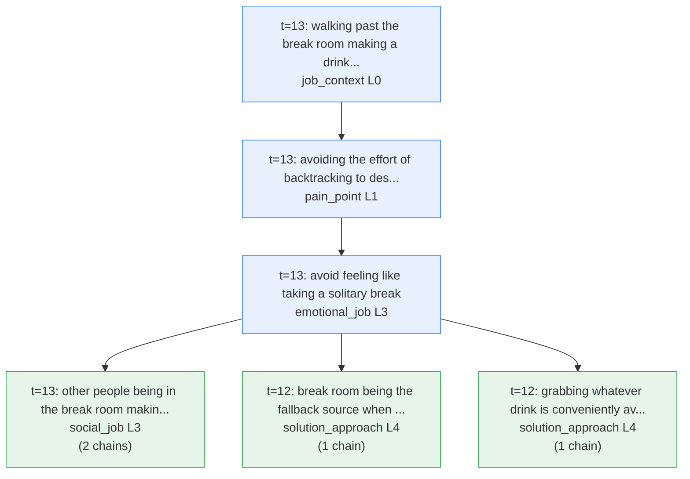
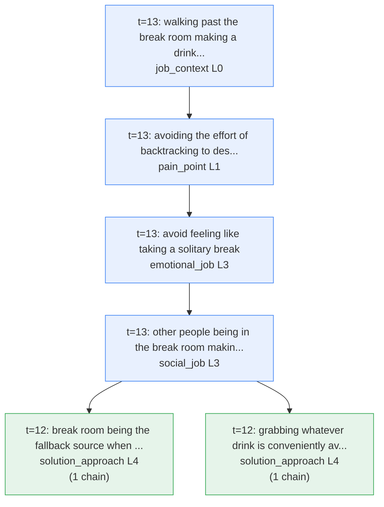
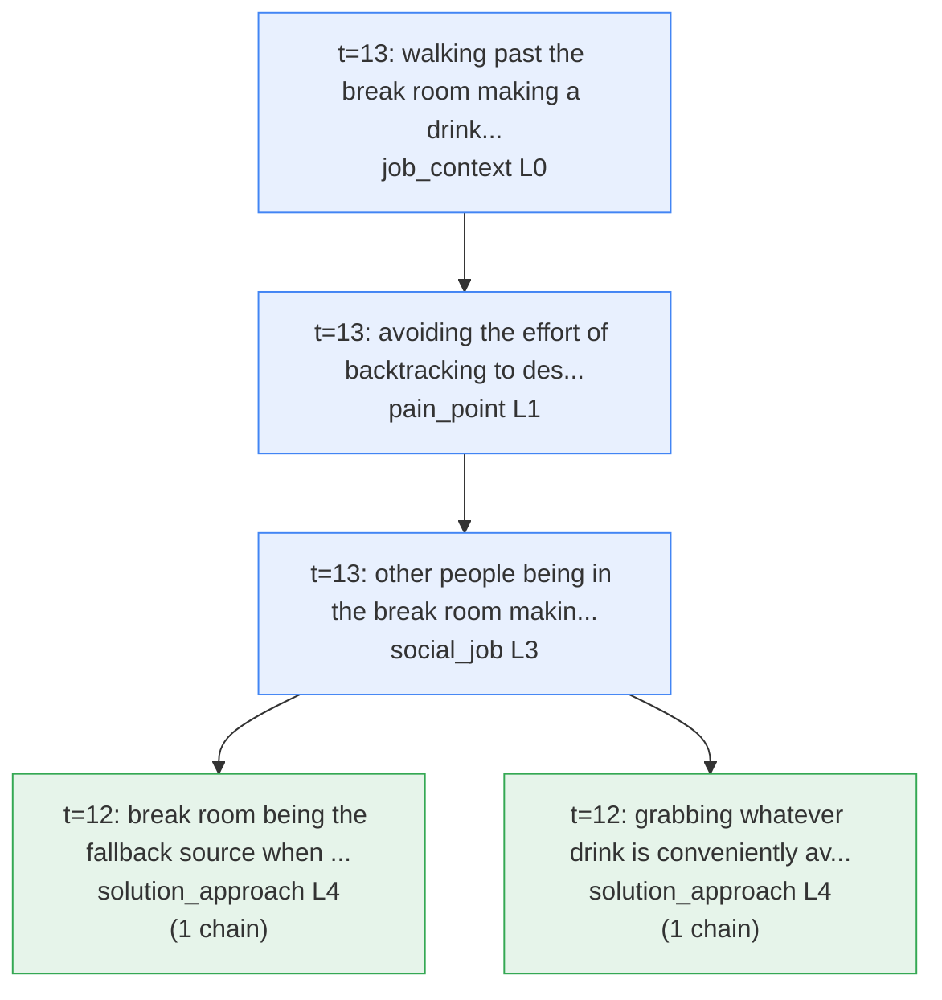
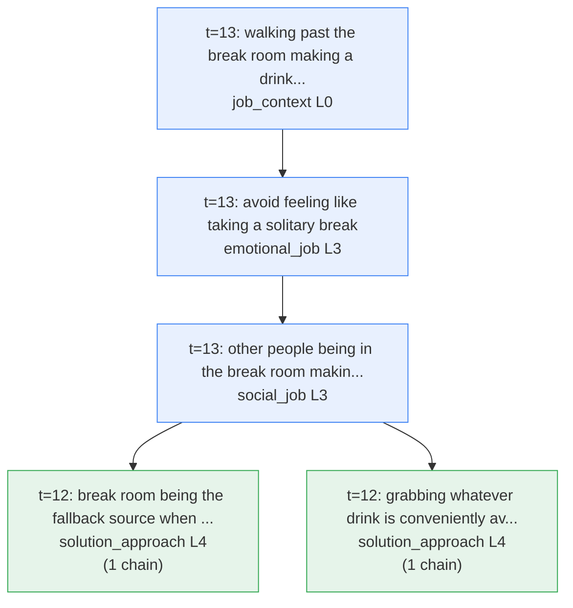

# Causal Chain Extraction — 20260507_170756_zerofizz_beverage_jtbd_baseline_cooperative.json

## Source specs
- **Session ID**: 2ff03e74-8c79-488b-af60-fc302bc91e73
- **Concept**: ZeroFizz Sugar-Free Carbonated Beverage - Jobs to be Done (`zerofizz_beverage_jtbd`)
- **Methodology**: `jobs_to_be_done_v2`
- **Persona**: Baseline Cooperative Respondent (`baseline_cooperative`)
- **Total turns**: 15
- **Status**: Closing strategy selected
- **Saved at**: 2026-05-07T17:07:56.477240+00:00

## Extraction config
- **Chain rules source**: `config/chain_rules/jobs_to_be_done_v2.yaml`
- **Chain edge types**: triggers, implies, supports, drives, addresses, achieves
- **Permitted connections**:
  - `triggers`: upward
  - `implies`: upward
  - `supports`: upward_or_lateral
  - `drives`: upward
  - `addresses`: reverse
  - `achieves`: reverse
- **Superseded nodes excluded**: 0
- **Revises edges excluded from traversal**: 0

## Graph summary
- **Conversation nodes**: 54
- **Themes (canonical slots)**: 10
- **Chain edges traversed**: 111
- **Edges (revises)**: 0

## Chain completeness summary
| Tier | Description | Count |
|------|-------------|-------|
| Full | Reaches solution_approach — complete chain, no missing levels | 0 |
| Advanced | Reaches solution_approach (missing one level) or emotional_job / social_job | 24 |
| Developing | Mid-level progression, terminal not reached | 41 |
| Lateral (excluded) | Same-type only chains | 0 |

---

## Full chains — complete, no missing levels

_No full chains found._

## Advanced chains — near-complete (one gap) or near-terminal

### Chain 1
**Path**:

  → `walking past the break room making a drink grab effortless` (job_context, L0, t=13)  
  → `avoiding the effort of backtracking to desk while thirsty` (pain_point, L1, t=13)  
  → `avoid feeling like taking a solitary break` (emotional_job, L3, t=13)  
  → `other people being in the break room making the stop feel socially normal` (social_job, L3, t=13)  
  → `break room being the fallback source when drinks aren't near the meeting room` (solution_approach, L4, t=12)  

**Evidence**:
- `walking past the break room making a drink grab effortless → avoiding the effort of backtracking to desk while thirsty` [triggers] (t=13): _"If I'm already walking past it, might as well grab something instead of going back to my desk thirsty."_
- `avoiding the effort of backtracking to desk while thirsty → avoid feeling like taking a solitary break` [implies] (t=13): _"might as well grab something instead of going back to my desk thirsty"_
- `avoid feeling like taking a solitary break → other people being in the break room making the stop feel socially normal` [supports] (t=13): _"so it doesn't feel like I'm taking a break alone"_
- `other people being in the break room making the stop feel socially normal → break room being the fallback source when drinks aren't near the meeting room` [supports] (t=13): _"Plus there's usually other people in there so it doesn't feel like I'm taking a break alone."_

### Chain 2
**Path**:

  → `walking past the break room making a drink grab effortless` (job_context, L0, t=13)  
  → `avoiding the effort of backtracking to desk while thirsty` (pain_point, L1, t=13)  
  → `avoid feeling like taking a solitary break` (emotional_job, L3, t=13)  
  → `other people being in the break room making the stop feel socially normal` (social_job, L3, t=13)  
  → `grabbing whatever drink is conveniently available when thirst arises` (solution_approach, L4, t=12)  

**Evidence**:
- `walking past the break room making a drink grab effortless → avoiding the effort of backtracking to desk while thirsty` [triggers] (t=13): _"If I'm already walking past it, might as well grab something instead of going back to my desk thirsty."_
- `avoiding the effort of backtracking to desk while thirsty → avoid feeling like taking a solitary break` [implies] (t=13): _"might as well grab something instead of going back to my desk thirsty"_
- `avoid feeling like taking a solitary break → other people being in the break room making the stop feel socially normal` [supports] (t=13): _"so it doesn't feel like I'm taking a break alone"_
- `other people being in the break room making the stop feel socially normal → grabbing whatever drink is conveniently available when thirst arises` [supports] (t=13): _"Plus there's usually other people in there so it doesn't feel like I'm taking a break alone."_

### Chain 3
**Path**:

  → `sitting passively through slide-based presentations` (job_context, L0, t=3)  
  → `staying energised and functional through the workday without a crash` (gain_point, L1, t=0)  
  → `avoid energy crash after drinking` (job_statement, L2, t=0)  
  → `grabbing whatever sugar-free drink is available in the fridge` (solution_approach, L4, t=0)  

**Evidence**:
- `sitting passively through slide-based presentations → staying energised and functional through the workday without a crash` [triggers] (t=3): _"Usually I'm just sitting there listening to someone talk through slides or whatever."_
- `staying energised and functional through the workday without a crash → avoid energy crash after drinking` [achieves (reversed)] (t=0): _"just needed something to drink that wouldn't make me crash later"_
- `avoid energy crash after drinking → grabbing whatever sugar-free drink is available in the fridge` [drives] (t=0): _"not wanting the sugar crash, that's the main thing for me"_

### Chain 4
**Path**:

  → `sitting passively through slide-based presentations` (job_context, L0, t=3)  
  → `mental fatigue causing brain to check out by afternoon` (pain_point, L1, t=3)  
  → `avoid energy crash after drinking` (job_statement, L2, t=0)  
  → `grabbing whatever sugar-free drink is available in the fridge` (solution_approach, L4, t=0)  

**Evidence**:
- `sitting passively through slide-based presentations → mental fatigue causing brain to check out by afternoon` [triggers] (t=3): _"Usually I'm just sitting there listening to someone talk through slides or whatever."_
- `mental fatigue causing brain to check out by afternoon → avoid energy crash after drinking` [implies] (t=3): _"Like, my brain's kind of checked out by that point, especially if it's been back-to-back meetings since morning."_
- `avoid energy crash after drinking → grabbing whatever sugar-free drink is available in the fridge` [drives] (t=0): _"not wanting the sugar crash, that's the main thing for me"_

### Chain 5
**Path**:

  → `sitting passively through slide-based presentations` (job_context, L0, t=3)  
  → `mental fatigue causing brain to check out by afternoon` (pain_point, L1, t=3)  
  → `getting through afternoon meetings without struggling` (job_statement, L2, t=2)  
  → `drinking ZeroFizz sugar-free beverage to avoid the rollercoaster effect` (solution_approach, L4, t=1)  

**Evidence**:
- `sitting passively through slide-based presentations → mental fatigue causing brain to check out by afternoon` [triggers] (t=3): _"Usually I'm just sitting there listening to someone talk through slides or whatever."_
- `mental fatigue causing brain to check out by afternoon → getting through afternoon meetings without struggling` [implies] (t=3): _"Like, my brain's kind of checked out by that point, especially if it's been back-to-back meetings since morning."_
- `getting through afternoon meetings without struggling → drinking ZeroFizz sugar-free beverage to avoid the rollercoaster effect` [drives] (t=2): _"I can actually get through afternoon meetings without feeling like I need a nap or another caffeine hit to survive them."_

### Chain 6
**Path**:

  → `back-to-back meetings running since morning` (job_context, L0, t=3)  
  → `staying energised and functional through the workday without a crash` (gain_point, L1, t=0)  
  → `avoid energy crash after drinking` (job_statement, L2, t=0)  
  → `grabbing whatever sugar-free drink is available in the fridge` (solution_approach, L4, t=0)  

**Evidence**:
- `back-to-back meetings running since morning → staying energised and functional through the workday without a crash` [triggers] (t=3): _"especially if it's been back-to-back meetings since morning"_
- `staying energised and functional through the workday without a crash → avoid energy crash after drinking` [achieves (reversed)] (t=0): _"just needed something to drink that wouldn't make me crash later"_
- `avoid energy crash after drinking → grabbing whatever sugar-free drink is available in the fridge` [drives] (t=0): _"not wanting the sugar crash, that's the main thing for me"_

### Chain 7
**Path**:

  → `back-to-back meetings running since morning` (job_context, L0, t=3)  
  → `mental fatigue causing brain to check out by afternoon` (pain_point, L1, t=3)  
  → `avoid energy crash after drinking` (job_statement, L2, t=0)  
  → `grabbing whatever sugar-free drink is available in the fridge` (solution_approach, L4, t=0)  

**Evidence**:
- `back-to-back meetings running since morning → mental fatigue causing brain to check out by afternoon` [triggers] (t=3): _"especially if it's been back-to-back meetings since morning"_
- `mental fatigue causing brain to check out by afternoon → avoid energy crash after drinking` [implies] (t=3): _"Like, my brain's kind of checked out by that point, especially if it's been back-to-back meetings since morning."_
- `avoid energy crash after drinking → grabbing whatever sugar-free drink is available in the fridge` [drives] (t=0): _"not wanting the sugar crash, that's the main thing for me"_

### Chain 8
**Path**:

  → `back-to-back meetings running since morning` (job_context, L0, t=3)  
  → `mental fatigue causing brain to check out by afternoon` (pain_point, L1, t=3)  
  → `getting through afternoon meetings without struggling` (job_statement, L2, t=2)  
  → `drinking ZeroFizz sugar-free beverage to avoid the rollercoaster effect` (solution_approach, L4, t=1)  

**Evidence**:
- `back-to-back meetings running since morning → mental fatigue causing brain to check out by afternoon` [triggers] (t=3): _"especially if it's been back-to-back meetings since morning"_
- `mental fatigue causing brain to check out by afternoon → getting through afternoon meetings without struggling` [implies] (t=3): _"Like, my brain's kind of checked out by that point, especially if it's been back-to-back meetings since morning."_
- `getting through afternoon meetings without struggling → drinking ZeroFizz sugar-free beverage to avoid the rollercoaster effect` [drives] (t=2): _"I can actually get through afternoon meetings without feeling like I need a nap or another caffeine hit to survive them."_

### Chain 9
**Path**:

  → `missing meeting decisions and needing to catch up secondhand` (pain_point, L1, t=5)  
  → `staying informed and in the loop at work` (job_statement, L2, t=5)  
  → `feel competent and on top of things at work` (emotional_job, L3, t=5)  
  → `grabbing a drink before meetings start to stay ahead of thirst` (solution_approach, L4, t=8)  

**Evidence**:
- `missing meeting decisions and needing to catch up secondhand → staying informed and in the loop at work` [implies] (t=5): _"if I'm not there I'm always asking someone 'wait, what did they decide on that?' and it's kind of annoying."_
- `staying informed and in the loop at work → feel competent and on top of things at work` [supports] (t=5): _"it's just easier to actually know what's going on instead of getting a secondhand version later."_
- `feel competent and on top of things at work → grabbing a drink before meetings start to stay ahead of thirst` [achieves (reversed)] (t=5): _"it's just easier to actually know what's going on instead of getting a secondhand version later. Like, if I'm not there I'm always asking someone 'wait, what did they decide on that?' and it's kind of annoying."_

### Chain 10
**Path**:

  → `having direct, firsthand knowledge of what's happening in meetings` (gain_point, L1, t=5)  
  → `staying informed and in the loop at work` (job_statement, L2, t=5)  
  → `feel competent and on top of things at work` (emotional_job, L3, t=5)  
  → `grabbing a drink before meetings start to stay ahead of thirst` (solution_approach, L4, t=8)  

**Evidence**:
- `having direct, firsthand knowledge of what's happening in meetings → staying informed and in the loop at work` [supports] (t=5): _"it's just easier to actually know what's going on instead of getting a secondhand version later."_
- `staying informed and in the loop at work → feel competent and on top of things at work` [supports] (t=5): _"it's just easier to actually know what's going on instead of getting a secondhand version later."_
- `feel competent and on top of things at work → grabbing a drink before meetings start to stay ahead of thirst` [achieves (reversed)] (t=5): _"it's just easier to actually know what's going on instead of getting a secondhand version later. Like, if I'm not there I'm always asking someone 'wait, what did they decide on that?' and it's kind of annoying."_

### Chain 11
**Path**:

  → `high-stakes meetings requiring focused attention` (job_context, L0, t=10)  
  → `losing train of thought mid-meeting due to thirst` (pain_point, L1, t=10)  
  → `feel attentive and self-disciplined during important meetings` (emotional_job, L3, t=10)  
  → `grabbing whatever water or drink is nearby for low-stakes meetings` (solution_approach, L4, t=10)  

**Evidence**:
- `high-stakes meetings requiring focused attention → losing train of thought mid-meeting due to thirst` [triggers] (t=10): _"if it's something I actually need to focus on, it's pretty distracting"_
- `losing train of thought mid-meeting due to thirst → feel attentive and self-disciplined during important meetings` [implies] (t=10): _"You lose your train of thought, miss what someone's saying."_
- `feel attentive and self-disciplined during important meetings → grabbing whatever water or drink is nearby for low-stakes meetings` [drives] (t=10): _"you're annoyed at yourself for not paying attention when it matters"_

### Chain 12
**Path**:

  → `high-stakes meetings requiring focused attention` (job_context, L0, t=10)  
  → `losing train of thought mid-meeting due to thirst` (pain_point, L1, t=10)  
  → `feel attentive and self-disciplined during important meetings` (emotional_job, L3, t=10)  
  → `grabbing whatever water or drink is nearby for low-stakes meetings` (solution_approach, L4, t=10)  

**Evidence**:
- `high-stakes meetings requiring focused attention → losing train of thought mid-meeting due to thirst` [triggers] (t=10): _"if it's something I actually need to focus on, it's pretty distracting"_
- `losing train of thought mid-meeting due to thirst → feel attentive and self-disciplined during important meetings` [implies] (t=10): _"You lose your train of thought, miss what someone's saying."_
- `feel attentive and self-disciplined during important meetings → grabbing whatever water or drink is nearby for low-stakes meetings` [achieves (reversed)] (t=10): _"you're annoyed at yourself for not paying attention when it matters"_

### Chain 13
**Path**:

  → `high-stakes meetings requiring focused attention` (job_context, L0, t=10)  
  → `losing train of thought mid-meeting due to thirst` (pain_point, L1, t=10)  
  → `feeling prepared and ready for meetings` (emotional_job, L3, t=9)  
  → `grabbing a drink before meetings start to stay ahead of thirst` (solution_approach, L4, t=8)  

**Evidence**:
- `high-stakes meetings requiring focused attention → losing train of thought mid-meeting due to thirst` [triggers] (t=10): _"if it's something I actually need to focus on, it's pretty distracting"_
- `losing train of thought mid-meeting due to thirst → feeling prepared and ready for meetings` [implies] (t=10): _"You lose your train of thought, miss what someone's saying."_
- `feeling prepared and ready for meetings → grabbing a drink before meetings start to stay ahead of thirst` [drives] (t=9): _"I just feel more prepared when I'm not sitting there with nothing."_

### Chain 14
**Path**:

  → `high-stakes meetings requiring focused attention` (job_context, L0, t=10)  
  → `feeling annoyed at yourself for not paying attention when it matters` (pain_point, L1, t=10)  
  → `feel attentive and self-disciplined during important meetings` (emotional_job, L3, t=10)  
  → `grabbing whatever water or drink is nearby for low-stakes meetings` (solution_approach, L4, t=10)  

**Evidence**:
- `high-stakes meetings requiring focused attention → feeling annoyed at yourself for not paying attention when it matters` [triggers] (t=10): _"if it's something I actually need to focus on, it's pretty distracting"_
- `feeling annoyed at yourself for not paying attention when it matters → feel attentive and self-disciplined during important meetings` [implies] (t=10): _"you're annoyed at yourself for not paying attention when it matters"_
- `feel attentive and self-disciplined during important meetings → grabbing whatever water or drink is nearby for low-stakes meetings` [drives] (t=10): _"you're annoyed at yourself for not paying attention when it matters"_

### Chain 15
**Path**:

  → `high-stakes meetings requiring focused attention` (job_context, L0, t=10)  
  → `feeling annoyed at yourself for not paying attention when it matters` (pain_point, L1, t=10)  
  → `feel attentive and self-disciplined during important meetings` (emotional_job, L3, t=10)  
  → `grabbing whatever water or drink is nearby for low-stakes meetings` (solution_approach, L4, t=10)  

**Evidence**:
- `high-stakes meetings requiring focused attention → feeling annoyed at yourself for not paying attention when it matters` [triggers] (t=10): _"if it's something I actually need to focus on, it's pretty distracting"_
- `feeling annoyed at yourself for not paying attention when it matters → feel attentive and self-disciplined during important meetings` [implies] (t=10): _"you're annoyed at yourself for not paying attention when it matters"_
- `feel attentive and self-disciplined during important meetings → grabbing whatever water or drink is nearby for low-stakes meetings` [achieves (reversed)] (t=10): _"you're annoyed at yourself for not paying attention when it matters"_

### Chain 16
**Path**:

  → `high-stakes meetings requiring focused attention` (job_context, L0, t=10)  
  → `feeling annoyed at yourself for not paying attention when it matters` (pain_point, L1, t=10)  
  → `feeling prepared and ready for meetings` (emotional_job, L3, t=9)  
  → `grabbing a drink before meetings start to stay ahead of thirst` (solution_approach, L4, t=8)  

**Evidence**:
- `high-stakes meetings requiring focused attention → feeling annoyed at yourself for not paying attention when it matters` [triggers] (t=10): _"if it's something I actually need to focus on, it's pretty distracting"_
- `feeling annoyed at yourself for not paying attention when it matters → feeling prepared and ready for meetings` [implies] (t=10): _"you're annoyed at yourself for not paying attention when it matters"_
- `feeling prepared and ready for meetings → grabbing a drink before meetings start to stay ahead of thirst` [drives] (t=9): _"I just feel more prepared when I'm not sitting there with nothing."_

### Chain 17
**Path**:

  → `high-stakes meetings requiring focused attention` (job_context, L0, t=10)  
  → `thirst distracting from focus during meetings` (pain_point, L1, t=9)  
  → `feeling annoyed at missing the opportunity to grab a drink at the start of meetings` (emotional_job, L3, t=8)  
  → `grabbing a drink before meetings start to stay ahead of thirst` (solution_approach, L4, t=8)  

**Evidence**:
- `high-stakes meetings requiring focused attention → thirst distracting from focus during meetings` [triggers] (t=10): _"if it's something I actually need to focus on, it's pretty distracting"_
- `thirst distracting from focus during meetings → feeling annoyed at missing the opportunity to grab a drink at the start of meetings` [implies] (t=9): _"if I've got a drink it's easier to focus instead of being distracted by being thirsty or whatever."_
- `feeling annoyed at missing the opportunity to grab a drink at the start of meetings → grabbing a drink before meetings start to stay ahead of thirst` [drives] (t=8): _"By then I'm already annoyed I didn't grab something at the start."_

### Chain 18
**Path**:

  → `walking past the break room making a drink grab effortless` (job_context, L0, t=13)  
  → `avoiding the effort of backtracking to desk while thirsty` (pain_point, L1, t=13)  
  → `avoid feeling like taking a solitary break` (emotional_job, L3, t=13)  
  → `break room being the fallback source when drinks aren't near the meeting room` (solution_approach, L4, t=12)  

**Evidence**:
- `walking past the break room making a drink grab effortless → avoiding the effort of backtracking to desk while thirsty` [triggers] (t=13): _"If I'm already walking past it, might as well grab something instead of going back to my desk thirsty."_
- `avoiding the effort of backtracking to desk while thirsty → avoid feeling like taking a solitary break` [implies] (t=13): _"might as well grab something instead of going back to my desk thirsty"_
- `avoid feeling like taking a solitary break → break room being the fallback source when drinks aren't near the meeting room` [drives] (t=13): _"so it doesn't feel like I'm taking a break alone"_

### Chain 19
**Path**:

  → `walking past the break room making a drink grab effortless` (job_context, L0, t=13)  
  → `avoiding the effort of backtracking to desk while thirsty` (pain_point, L1, t=13)  
  → `avoid feeling like taking a solitary break` (emotional_job, L3, t=13)  
  → `grabbing whatever drink is conveniently available when thirst arises` (solution_approach, L4, t=12)  

**Evidence**:
- `walking past the break room making a drink grab effortless → avoiding the effort of backtracking to desk while thirsty` [triggers] (t=13): _"If I'm already walking past it, might as well grab something instead of going back to my desk thirsty."_
- `avoiding the effort of backtracking to desk while thirsty → avoid feeling like taking a solitary break` [implies] (t=13): _"might as well grab something instead of going back to my desk thirsty"_
- `avoid feeling like taking a solitary break → grabbing whatever drink is conveniently available when thirst arises` [drives] (t=13): _"so it doesn't feel like I'm taking a break alone"_

### Chain 20
**Path**:

  → `walking past the break room making a drink grab effortless` (job_context, L0, t=13)  
  → `avoiding the effort of backtracking to desk while thirsty` (pain_point, L1, t=13)  
  → `other people being in the break room making the stop feel socially normal` (social_job, L3, t=13)  
  → `break room being the fallback source when drinks aren't near the meeting room` (solution_approach, L4, t=12)  

**Evidence**:
- `walking past the break room making a drink grab effortless → avoiding the effort of backtracking to desk while thirsty` [triggers] (t=13): _"If I'm already walking past it, might as well grab something instead of going back to my desk thirsty."_
- `avoiding the effort of backtracking to desk while thirsty → other people being in the break room making the stop feel socially normal` [supports] (t=13): _"might as well grab something instead of going back to my desk thirsty"_
- `other people being in the break room making the stop feel socially normal → break room being the fallback source when drinks aren't near the meeting room` [supports] (t=13): _"Plus there's usually other people in there so it doesn't feel like I'm taking a break alone."_

### Chain 21
**Path**:

  → `walking past the break room making a drink grab effortless` (job_context, L0, t=13)  
  → `avoiding the effort of backtracking to desk while thirsty` (pain_point, L1, t=13)  
  → `other people being in the break room making the stop feel socially normal` (social_job, L3, t=13)  
  → `grabbing whatever drink is conveniently available when thirst arises` (solution_approach, L4, t=12)  

**Evidence**:
- `walking past the break room making a drink grab effortless → avoiding the effort of backtracking to desk while thirsty` [triggers] (t=13): _"If I'm already walking past it, might as well grab something instead of going back to my desk thirsty."_
- `avoiding the effort of backtracking to desk while thirsty → other people being in the break room making the stop feel socially normal` [supports] (t=13): _"might as well grab something instead of going back to my desk thirsty"_
- `other people being in the break room making the stop feel socially normal → grabbing whatever drink is conveniently available when thirst arises` [supports] (t=13): _"Plus there's usually other people in there so it doesn't feel like I'm taking a break alone."_

### Chain 22
**Path**:

  → `walking past the break room making a drink grab effortless` (job_context, L0, t=13)  
  → `not making a dedicated trip just to get a drink` (pain_point, L1, t=12)  
  → `feeling annoyed at missing the opportunity to grab a drink at the start of meetings` (emotional_job, L3, t=8)  
  → `grabbing a drink before meetings start to stay ahead of thirst` (solution_approach, L4, t=8)  

**Evidence**:
- `walking past the break room making a drink grab effortless → not making a dedicated trip just to get a drink` [triggers] (t=13): _"If I'm already walking past it, might as well grab something instead of going back to my desk thirsty."_
- `not making a dedicated trip just to get a drink → feeling annoyed at missing the opportunity to grab a drink at the start of meetings` [triggers] (t=12): _"It's not like anyone's making a trip somewhere else specifically for it"_
- `feeling annoyed at missing the opportunity to grab a drink at the start of meetings → grabbing a drink before meetings start to stay ahead of thirst` [drives] (t=8): _"By then I'm already annoyed I didn't grab something at the start."_

### Chain 23
**Path**:

  → `sitting passively through slide-based presentations` (job_context, L0, t=3)  
  → `feeling like needing a nap during afternoon meetings` (pain_point, L1, t=2)  
  → `feeling in control of energy without depending on another coffee` (emotional_job, L3, t=1)  

**Evidence**:
- `sitting passively through slide-based presentations → feeling like needing a nap during afternoon meetings` [triggers] (t=3): _"Usually I'm just sitting there listening to someone talk through slides or whatever."_
- `feeling like needing a nap during afternoon meetings → feeling in control of energy without depending on another coffee` [implies] (t=2): _"feeling like I need a nap or another caffeine hit to survive them."_

### Chain 24
**Path**:

  → `back-to-back meetings running since morning` (job_context, L0, t=3)  
  → `feeling like needing a nap during afternoon meetings` (pain_point, L1, t=2)  
  → `feeling in control of energy without depending on another coffee` (emotional_job, L3, t=1)  

**Evidence**:
- `back-to-back meetings running since morning → feeling like needing a nap during afternoon meetings` [triggers] (t=3): _"especially if it's been back-to-back meetings since morning"_
- `feeling like needing a nap during afternoon meetings → feeling in control of energy without depending on another coffee` [implies] (t=2): _"feeling like I need a nap or another caffeine hit to survive them."_

## Developing chains — mid-level progression

### Chain 25
**Path**:

  → `walking past the break room making a drink grab effortless` (job_context, L0, t=13)  
  → `avoid feeling like taking a solitary break` (emotional_job, L3, t=13)  
  → `other people being in the break room making the stop feel socially normal` (social_job, L3, t=13)  
  → `break room being the fallback source when drinks aren't near the meeting room` (solution_approach, L4, t=12)  

**Evidence**:
- `walking past the break room making a drink grab effortless → avoid feeling like taking a solitary break` [triggers] (t=13): _"If I'm already walking past it, might as well grab something instead of going back to my desk thirsty."_
- `avoid feeling like taking a solitary break → other people being in the break room making the stop feel socially normal` [supports] (t=13): _"so it doesn't feel like I'm taking a break alone"_
- `other people being in the break room making the stop feel socially normal → break room being the fallback source when drinks aren't near the meeting room` [supports] (t=13): _"Plus there's usually other people in there so it doesn't feel like I'm taking a break alone."_

### Chain 26
**Path**:

  → `walking past the break room making a drink grab effortless` (job_context, L0, t=13)  
  → `avoid feeling like taking a solitary break` (emotional_job, L3, t=13)  
  → `other people being in the break room making the stop feel socially normal` (social_job, L3, t=13)  
  → `grabbing whatever drink is conveniently available when thirst arises` (solution_approach, L4, t=12)  

**Evidence**:
- `walking past the break room making a drink grab effortless → avoid feeling like taking a solitary break` [triggers] (t=13): _"If I'm already walking past it, might as well grab something instead of going back to my desk thirsty."_
- `avoid feeling like taking a solitary break → other people being in the break room making the stop feel socially normal` [supports] (t=13): _"so it doesn't feel like I'm taking a break alone"_
- `other people being in the break room making the stop feel socially normal → grabbing whatever drink is conveniently available when thirst arises` [supports] (t=13): _"Plus there's usually other people in there so it doesn't feel like I'm taking a break alone."_

### Chain 27
**Path**:

  → `needing a drink but wanting to avoid a sugar crash` (job_trigger, L0, t=0)  
  → `avoid energy crash after drinking` (job_statement, L2, t=0)  
  → `grabbing whatever sugar-free drink is available in the fridge` (solution_approach, L4, t=0)  

**Evidence**:
- `needing a drink but wanting to avoid a sugar crash → avoid energy crash after drinking` [implies] (t=0): _"just needed something to drink that wouldn't make me crash later"_
- `avoid energy crash after drinking → grabbing whatever sugar-free drink is available in the fridge` [drives] (t=0): _"not wanting the sugar crash, that's the main thing for me"_

### Chain 28
**Path**:

  → `steady, uninterrupted focus during the workday` (gain_point, L1, t=1)  
  → `getting through afternoon meetings without struggling` (job_statement, L2, t=2)  
  → `drinking ZeroFizz sugar-free beverage to avoid the rollercoaster effect` (solution_approach, L4, t=1)  

**Evidence**:
- `steady, uninterrupted focus during the workday → getting through afternoon meetings without struggling` [achieves (reversed)] (t=1): _"so I can actually focus on what I'm doing instead of thinking about when I'm gonna need another coffee"_
- `getting through afternoon meetings without struggling → drinking ZeroFizz sugar-free beverage to avoid the rollercoaster effect` [drives] (t=2): _"I can actually get through afternoon meetings without feeling like I need a nap or another caffeine hit to survive them."_

### Chain 29
**Path**:

  → `sitting passively through slide-based presentations` (job_context, L0, t=3)  
  → `staying energised and functional through the workday without a crash` (gain_point, L1, t=0)  
  → `grabbing whatever sugar-free drink is available in the fridge` (solution_approach, L4, t=0)  

**Evidence**:
- `sitting passively through slide-based presentations → staying energised and functional through the workday without a crash` [triggers] (t=3): _"Usually I'm just sitting there listening to someone talk through slides or whatever."_
- `staying energised and functional through the workday without a crash → grabbing whatever sugar-free drink is available in the fridge` [achieves (reversed)] (t=0): _"just needed something to drink that wouldn't make me crash later"_

### Chain 30
**Path**:

  → `sitting passively through slide-based presentations` (job_context, L0, t=3)  
  → `avoid energy crash after drinking` (job_statement, L2, t=0)  
  → `grabbing whatever sugar-free drink is available in the fridge` (solution_approach, L4, t=0)  

**Evidence**:
- `sitting passively through slide-based presentations → avoid energy crash after drinking` [triggers] (t=3): _"Usually I'm just sitting there listening to someone talk through slides or whatever."_
- `avoid energy crash after drinking → grabbing whatever sugar-free drink is available in the fridge` [drives] (t=0): _"not wanting the sugar crash, that's the main thing for me"_

### Chain 31
**Path**:

  → `sitting passively through slide-based presentations` (job_context, L0, t=3)  
  → `getting through afternoon meetings without struggling` (job_statement, L2, t=2)  
  → `drinking ZeroFizz sugar-free beverage to avoid the rollercoaster effect` (solution_approach, L4, t=1)  

**Evidence**:
- `sitting passively through slide-based presentations → getting through afternoon meetings without struggling` [triggers] (t=3): _"Usually I'm just sitting there listening to someone talk through slides or whatever."_
- `getting through afternoon meetings without struggling → drinking ZeroFizz sugar-free beverage to avoid the rollercoaster effect` [drives] (t=2): _"I can actually get through afternoon meetings without feeling like I need a nap or another caffeine hit to survive them."_

### Chain 32
**Path**:

  → `sitting passively through slide-based presentations` (job_context, L0, t=3)  
  → `feeling like needing a nap during afternoon meetings` (pain_point, L1, t=2)  
  → `maintain focus on work without being distracted by energy fluctuations` (job_statement, L2, t=1)  

**Evidence**:
- `sitting passively through slide-based presentations → feeling like needing a nap during afternoon meetings` [triggers] (t=3): _"Usually I'm just sitting there listening to someone talk through slides or whatever."_
- `feeling like needing a nap during afternoon meetings → maintain focus on work without being distracted by energy fluctuations` [implies] (t=2): _"feeling like I need a nap or another caffeine hit to survive them."_

### Chain 33
**Path**:

  → `sitting passively through slide-based presentations` (job_context, L0, t=3)  
  → `feeling like needing a nap during afternoon meetings` (pain_point, L1, t=2)  
  → `drinking ZeroFizz sugar-free beverage to avoid the rollercoaster effect` (solution_approach, L4, t=1)  

**Evidence**:
- `sitting passively through slide-based presentations → feeling like needing a nap during afternoon meetings` [triggers] (t=3): _"Usually I'm just sitting there listening to someone talk through slides or whatever."_
- `feeling like needing a nap during afternoon meetings → drinking ZeroFizz sugar-free beverage to avoid the rollercoaster effect` [drives] (t=2): _"feeling like I need a nap or another caffeine hit to survive them."_

### Chain 34
**Path**:

  → `back-to-back meetings running since morning` (job_context, L0, t=3)  
  → `staying energised and functional through the workday without a crash` (gain_point, L1, t=0)  
  → `grabbing whatever sugar-free drink is available in the fridge` (solution_approach, L4, t=0)  

**Evidence**:
- `back-to-back meetings running since morning → staying energised and functional through the workday without a crash` [triggers] (t=3): _"especially if it's been back-to-back meetings since morning"_
- `staying energised and functional through the workday without a crash → grabbing whatever sugar-free drink is available in the fridge` [achieves (reversed)] (t=0): _"just needed something to drink that wouldn't make me crash later"_

### Chain 35
**Path**:

  → `back-to-back meetings running since morning` (job_context, L0, t=3)  
  → `avoid energy crash after drinking` (job_statement, L2, t=0)  
  → `grabbing whatever sugar-free drink is available in the fridge` (solution_approach, L4, t=0)  

**Evidence**:
- `back-to-back meetings running since morning → avoid energy crash after drinking` [triggers] (t=3): _"especially if it's been back-to-back meetings since morning"_
- `avoid energy crash after drinking → grabbing whatever sugar-free drink is available in the fridge` [drives] (t=0): _"not wanting the sugar crash, that's the main thing for me"_

### Chain 36
**Path**:

  → `back-to-back meetings running since morning` (job_context, L0, t=3)  
  → `getting through afternoon meetings without struggling` (job_statement, L2, t=2)  
  → `drinking ZeroFizz sugar-free beverage to avoid the rollercoaster effect` (solution_approach, L4, t=1)  

**Evidence**:
- `back-to-back meetings running since morning → getting through afternoon meetings without struggling` [triggers] (t=3): _"especially if it's been back-to-back meetings since morning"_
- `getting through afternoon meetings without struggling → drinking ZeroFizz sugar-free beverage to avoid the rollercoaster effect` [drives] (t=2): _"I can actually get through afternoon meetings without feeling like I need a nap or another caffeine hit to survive them."_

### Chain 37
**Path**:

  → `back-to-back meetings running since morning` (job_context, L0, t=3)  
  → `feeling like needing a nap during afternoon meetings` (pain_point, L1, t=2)  
  → `maintain focus on work without being distracted by energy fluctuations` (job_statement, L2, t=1)  

**Evidence**:
- `back-to-back meetings running since morning → feeling like needing a nap during afternoon meetings` [triggers] (t=3): _"especially if it's been back-to-back meetings since morning"_
- `feeling like needing a nap during afternoon meetings → maintain focus on work without being distracted by energy fluctuations` [implies] (t=2): _"feeling like I need a nap or another caffeine hit to survive them."_

### Chain 38
**Path**:

  → `back-to-back meetings running since morning` (job_context, L0, t=3)  
  → `feeling like needing a nap during afternoon meetings` (pain_point, L1, t=2)  
  → `drinking ZeroFizz sugar-free beverage to avoid the rollercoaster effect` (solution_approach, L4, t=1)  

**Evidence**:
- `back-to-back meetings running since morning → feeling like needing a nap during afternoon meetings` [triggers] (t=3): _"especially if it's been back-to-back meetings since morning"_
- `feeling like needing a nap during afternoon meetings → drinking ZeroFizz sugar-free beverage to avoid the rollercoaster effect` [drives] (t=2): _"feeling like I need a nap or another caffeine hit to survive them."_

### Chain 39
**Path**:

  → `getting an energy kick without a crash after` (gain_point, L1, t=4)  
  → `being mentally present in meetings instead of zoning out` (gain_point, L1, t=4)  
  → `grabbing a drink before meetings start to stay ahead of thirst` (solution_approach, L4, t=8)  

**Evidence**:
- `getting an energy kick without a crash after → being mentally present in meetings instead of zoning out` [supports] (t=4): _"with zerofizz i get that little kick without the crash after"_
- `being mentally present in meetings instead of zoning out → grabbing a drink before meetings start to stay ahead of thirst` [achieves (reversed)] (t=4): _"i'm actually present instead of just zoning out and waiting for it to end."_

### Chain 40
**Path**:

  → `missing meeting decisions and needing to catch up secondhand` (pain_point, L1, t=5)  
  → `staying informed and in the loop at work` (job_statement, L2, t=5)  
  → `grabbing a drink before meetings start to stay ahead of thirst` (solution_approach, L4, t=8)  

**Evidence**:
- `missing meeting decisions and needing to catch up secondhand → staying informed and in the loop at work` [implies] (t=5): _"if I'm not there I'm always asking someone 'wait, what did they decide on that?' and it's kind of annoying."_
- `staying informed and in the loop at work → grabbing a drink before meetings start to stay ahead of thirst` [achieves (reversed)] (t=5): _"it's just easier to actually know what's going on instead of getting a secondhand version later."_

### Chain 41
**Path**:

  → `missing meeting decisions and needing to catch up secondhand` (pain_point, L1, t=5)  
  → `feel competent and on top of things at work` (emotional_job, L3, t=5)  
  → `grabbing a drink before meetings start to stay ahead of thirst` (solution_approach, L4, t=8)  

**Evidence**:
- `missing meeting decisions and needing to catch up secondhand → feel competent and on top of things at work` [implies] (t=5): _"if I'm not there I'm always asking someone 'wait, what did they decide on that?' and it's kind of annoying."_
- `feel competent and on top of things at work → grabbing a drink before meetings start to stay ahead of thirst` [achieves (reversed)] (t=5): _"it's just easier to actually know what's going on instead of getting a secondhand version later. Like, if I'm not there I'm always asking someone 'wait, what did they decide on that?' and it's kind of annoying."_

### Chain 42
**Path**:

  → `having direct, firsthand knowledge of what's happening in meetings` (gain_point, L1, t=5)  
  → `staying informed and in the loop at work` (job_statement, L2, t=5)  
  → `grabbing a drink before meetings start to stay ahead of thirst` (solution_approach, L4, t=8)  

**Evidence**:
- `having direct, firsthand knowledge of what's happening in meetings → staying informed and in the loop at work` [supports] (t=5): _"it's just easier to actually know what's going on instead of getting a secondhand version later."_
- `staying informed and in the loop at work → grabbing a drink before meetings start to stay ahead of thirst` [achieves (reversed)] (t=5): _"it's just easier to actually know what's going on instead of getting a secondhand version later."_

### Chain 43
**Path**:

  → `having direct, firsthand knowledge of what's happening in meetings` (gain_point, L1, t=5)  
  → `feel competent and on top of things at work` (emotional_job, L3, t=5)  
  → `grabbing a drink before meetings start to stay ahead of thirst` (solution_approach, L4, t=8)  

**Evidence**:
- `having direct, firsthand knowledge of what's happening in meetings → feel competent and on top of things at work` [supports] (t=5): _"it's just easier to actually know what's going on instead of getting a secondhand version later."_
- `feel competent and on top of things at work → grabbing a drink before meetings start to stay ahead of thirst` [achieves (reversed)] (t=5): _"it's just easier to actually know what's going on instead of getting a secondhand version later. Like, if I'm not there I'm always asking someone 'wait, what did they decide on that?' and it's kind of annoying."_

### Chain 44
**Path**:

  → `having direct, firsthand knowledge of what's happening in meetings` (gain_point, L1, t=5)  
  → `being mentally present in meetings instead of zoning out` (gain_point, L1, t=4)  
  → `grabbing a drink before meetings start to stay ahead of thirst` (solution_approach, L4, t=8)  

**Evidence**:
- `having direct, firsthand knowledge of what's happening in meetings → being mentally present in meetings instead of zoning out` [supports] (t=5): _"it's just easier to actually know what's going on instead of getting a secondhand version later."_
- `being mentally present in meetings instead of zoning out → grabbing a drink before meetings start to stay ahead of thirst` [achieves (reversed)] (t=4): _"i'm actually present instead of just zoning out and waiting for it to end."_

### Chain 45
**Path**:

  → `three or four consecutive meetings before noticing thirst` (job_context, L0, t=8)  
  → `feeling annoyed at missing the opportunity to grab a drink at the start of meetings` (emotional_job, L3, t=8)  
  → `grabbing a drink before meetings start to stay ahead of thirst` (solution_approach, L4, t=8)  

**Evidence**:
- `three or four consecutive meetings before noticing thirst → feeling annoyed at missing the opportunity to grab a drink at the start of meetings` [triggers] (t=8): _"Probably like three or four before I notice."_
- `feeling annoyed at missing the opportunity to grab a drink at the start of meetings → grabbing a drink before meetings start to stay ahead of thirst` [drives] (t=8): _"By then I'm already annoyed I didn't grab something at the start."_

### Chain 46
**Path**:

  → `physical dryness signalling dehydration before conscious awareness kicks in` (job_trigger, L0, t=8)  
  → `feeling annoyed at missing the opportunity to grab a drink at the start of meetings` (emotional_job, L3, t=8)  
  → `grabbing a drink before meetings start to stay ahead of thirst` (solution_approach, L4, t=8)  

**Evidence**:
- `physical dryness signalling dehydration before conscious awareness kicks in → feeling annoyed at missing the opportunity to grab a drink at the start of meetings` [triggers] (t=8): _"Usually it's more that I realize my mouth is dry than actually thinking 'oh I should hydrate' or whatever."_
- `feeling annoyed at missing the opportunity to grab a drink at the start of meetings → grabbing a drink before meetings start to stay ahead of thirst` [drives] (t=8): _"By then I'm already annoyed I didn't grab something at the start."_

### Chain 47
**Path**:

  → `not proactively hydrating before meetings begin` (pain_point, L1, t=8)  
  → `feeling annoyed at missing the opportunity to grab a drink at the start of meetings` (emotional_job, L3, t=8)  
  → `grabbing a drink before meetings start to stay ahead of thirst` (solution_approach, L4, t=8)  

**Evidence**:
- `not proactively hydrating before meetings begin → feeling annoyed at missing the opportunity to grab a drink at the start of meetings` [triggers] (t=8): _"By then I'm already annoyed I didn't grab something at the start."_
- `feeling annoyed at missing the opportunity to grab a drink at the start of meetings → grabbing a drink before meetings start to stay ahead of thirst` [drives] (t=8): _"By then I'm already annoyed I didn't grab something at the start."_

### Chain 48
**Path**:

  → `high-stakes meetings requiring focused attention` (job_context, L0, t=10)  
  → `losing train of thought mid-meeting due to thirst` (pain_point, L1, t=10)  
  → `grabbing whatever water or drink is nearby for low-stakes meetings` (solution_approach, L4, t=10)  

**Evidence**:
- `high-stakes meetings requiring focused attention → losing train of thought mid-meeting due to thirst` [triggers] (t=10): _"if it's something I actually need to focus on, it's pretty distracting"_
- `losing train of thought mid-meeting due to thirst → grabbing whatever water or drink is nearby for low-stakes meetings` [drives] (t=10): _"You lose your train of thought, miss what someone's saying."_

### Chain 49
**Path**:

  → `high-stakes meetings requiring focused attention` (job_context, L0, t=10)  
  → `feeling annoyed at yourself for not paying attention when it matters` (pain_point, L1, t=10)  
  → `grabbing whatever water or drink is nearby for low-stakes meetings` (solution_approach, L4, t=10)  

**Evidence**:
- `high-stakes meetings requiring focused attention → feeling annoyed at yourself for not paying attention when it matters` [triggers] (t=10): _"if it's something I actually need to focus on, it's pretty distracting"_
- `feeling annoyed at yourself for not paying attention when it matters → grabbing whatever water or drink is nearby for low-stakes meetings` [drives] (t=10): _"you're annoyed at yourself for not paying attention when it matters"_

### Chain 50
**Path**:

  → `high-stakes meetings requiring focused attention` (job_context, L0, t=10)  
  → `feel attentive and self-disciplined during important meetings` (emotional_job, L3, t=10)  
  → `grabbing whatever water or drink is nearby for low-stakes meetings` (solution_approach, L4, t=10)  

**Evidence**:
- `high-stakes meetings requiring focused attention → feel attentive and self-disciplined during important meetings` [triggers] (t=10): _"if it's something I actually need to focus on, it's pretty distracting"_
- `feel attentive and self-disciplined during important meetings → grabbing whatever water or drink is nearby for low-stakes meetings` [drives] (t=10): _"you're annoyed at yourself for not paying attention when it matters"_

### Chain 51
**Path**:

  → `high-stakes meetings requiring focused attention` (job_context, L0, t=10)  
  → `feel attentive and self-disciplined during important meetings` (emotional_job, L3, t=10)  
  → `grabbing whatever water or drink is nearby for low-stakes meetings` (solution_approach, L4, t=10)  

**Evidence**:
- `high-stakes meetings requiring focused attention → feel attentive and self-disciplined during important meetings` [triggers] (t=10): _"if it's something I actually need to focus on, it's pretty distracting"_
- `feel attentive and self-disciplined during important meetings → grabbing whatever water or drink is nearby for low-stakes meetings` [achieves (reversed)] (t=10): _"you're annoyed at yourself for not paying attention when it matters"_

### Chain 52
**Path**:

  → `high-stakes meetings requiring focused attention` (job_context, L0, t=10)  
  → `feeling prepared and ready for meetings` (emotional_job, L3, t=9)  
  → `grabbing a drink before meetings start to stay ahead of thirst` (solution_approach, L4, t=8)  

**Evidence**:
- `high-stakes meetings requiring focused attention → feeling prepared and ready for meetings` [triggers] (t=10): _"if it's something I actually need to focus on, it's pretty distracting"_
- `feeling prepared and ready for meetings → grabbing a drink before meetings start to stay ahead of thirst` [drives] (t=9): _"I just feel more prepared when I'm not sitting there with nothing."_

### Chain 53
**Path**:

  → `high-stakes meetings requiring focused attention` (job_context, L0, t=10)  
  → `thirst distracting from focus during meetings` (pain_point, L1, t=9)  
  → `grabbing a drink before meetings start to stay ahead of thirst` (solution_approach, L4, t=8)  

**Evidence**:
- `high-stakes meetings requiring focused attention → thirst distracting from focus during meetings` [triggers] (t=10): _"if it's something I actually need to focus on, it's pretty distracting"_
- `thirst distracting from focus during meetings → grabbing a drink before meetings start to stay ahead of thirst` [drives] (t=9): _"if I've got a drink it's easier to focus instead of being distracted by being thirsty or whatever."_

### Chain 54
**Path**:

  → `drink availability near the meeting room entrance influencing grab decision` (job_context, L0, t=11)  
  → `feeling annoyed at missing the opportunity to grab a drink at the start of meetings` (emotional_job, L3, t=8)  
  → `grabbing a drink before meetings start to stay ahead of thirst` (solution_approach, L4, t=8)  

**Evidence**:
- `drink availability near the meeting room entrance influencing grab decision → feeling annoyed at missing the opportunity to grab a drink at the start of meetings` [triggers] (t=11): _"If there's a cooler by the door I'll snag something"_
- `feeling annoyed at missing the opportunity to grab a drink at the start of meetings → grabbing a drink before meetings start to stay ahead of thirst` [drives] (t=8): _"By then I'm already annoyed I didn't grab something at the start."_

### Chain 55
**Path**:

  → `drink availability near the meeting room entrance influencing grab decision` (job_context, L0, t=11)  
  → `feel attentive and self-disciplined during important meetings` (emotional_job, L3, t=10)  
  → `grabbing whatever water or drink is nearby for low-stakes meetings` (solution_approach, L4, t=10)  

**Evidence**:
- `drink availability near the meeting room entrance influencing grab decision → feel attentive and self-disciplined during important meetings` [triggers] (t=11): _"If there's a cooler by the door I'll snag something"_
- `feel attentive and self-disciplined during important meetings → grabbing whatever water or drink is nearby for low-stakes meetings` [drives] (t=10): _"you're annoyed at yourself for not paying attention when it matters"_

### Chain 56
**Path**:

  → `drink availability near the meeting room entrance influencing grab decision` (job_context, L0, t=11)  
  → `feel attentive and self-disciplined during important meetings` (emotional_job, L3, t=10)  
  → `grabbing whatever water or drink is nearby for low-stakes meetings` (solution_approach, L4, t=10)  

**Evidence**:
- `drink availability near the meeting room entrance influencing grab decision → feel attentive and self-disciplined during important meetings` [triggers] (t=11): _"If there's a cooler by the door I'll snag something"_
- `feel attentive and self-disciplined during important meetings → grabbing whatever water or drink is nearby for low-stakes meetings` [achieves (reversed)] (t=10): _"you're annoyed at yourself for not paying attention when it matters"_

### Chain 57
**Path**:

  → `walking past the break room making a drink grab effortless` (job_context, L0, t=13)  
  → `avoiding the effort of backtracking to desk while thirsty` (pain_point, L1, t=13)  
  → `break room being the fallback source when drinks aren't near the meeting room` (solution_approach, L4, t=12)  

**Evidence**:
- `walking past the break room making a drink grab effortless → avoiding the effort of backtracking to desk while thirsty` [triggers] (t=13): _"If I'm already walking past it, might as well grab something instead of going back to my desk thirsty."_
- `avoiding the effort of backtracking to desk while thirsty → break room being the fallback source when drinks aren't near the meeting room` [drives] (t=13): _"might as well grab something instead of going back to my desk thirsty"_

### Chain 58
**Path**:

  → `walking past the break room making a drink grab effortless` (job_context, L0, t=13)  
  → `avoiding the effort of backtracking to desk while thirsty` (pain_point, L1, t=13)  
  → `grabbing whatever drink is conveniently available when thirst arises` (solution_approach, L4, t=12)  

**Evidence**:
- `walking past the break room making a drink grab effortless → avoiding the effort of backtracking to desk while thirsty` [triggers] (t=13): _"If I'm already walking past it, might as well grab something instead of going back to my desk thirsty."_
- `avoiding the effort of backtracking to desk while thirsty → grabbing whatever drink is conveniently available when thirst arises` [drives] (t=13): _"might as well grab something instead of going back to my desk thirsty"_

### Chain 59
**Path**:

  → `walking past the break room making a drink grab effortless` (job_context, L0, t=13)  
  → `avoid feeling like taking a solitary break` (emotional_job, L3, t=13)  
  → `break room being the fallback source when drinks aren't near the meeting room` (solution_approach, L4, t=12)  

**Evidence**:
- `walking past the break room making a drink grab effortless → avoid feeling like taking a solitary break` [triggers] (t=13): _"If I'm already walking past it, might as well grab something instead of going back to my desk thirsty."_
- `avoid feeling like taking a solitary break → break room being the fallback source when drinks aren't near the meeting room` [drives] (t=13): _"so it doesn't feel like I'm taking a break alone"_

### Chain 60
**Path**:

  → `walking past the break room making a drink grab effortless` (job_context, L0, t=13)  
  → `avoid feeling like taking a solitary break` (emotional_job, L3, t=13)  
  → `grabbing whatever drink is conveniently available when thirst arises` (solution_approach, L4, t=12)  

**Evidence**:
- `walking past the break room making a drink grab effortless → avoid feeling like taking a solitary break` [triggers] (t=13): _"If I'm already walking past it, might as well grab something instead of going back to my desk thirsty."_
- `avoid feeling like taking a solitary break → grabbing whatever drink is conveniently available when thirst arises` [drives] (t=13): _"so it doesn't feel like I'm taking a break alone"_

### Chain 61
**Path**:

  → `walking past the break room making a drink grab effortless` (job_context, L0, t=13)  
  → `other people being in the break room making the stop feel socially normal` (social_job, L3, t=13)  
  → `break room being the fallback source when drinks aren't near the meeting room` (solution_approach, L4, t=12)  

**Evidence**:
- `walking past the break room making a drink grab effortless → other people being in the break room making the stop feel socially normal` [triggers] (t=13): _"If I'm already walking past it, might as well grab something instead of going back to my desk thirsty."_
- `other people being in the break room making the stop feel socially normal → break room being the fallback source when drinks aren't near the meeting room` [supports] (t=13): _"Plus there's usually other people in there so it doesn't feel like I'm taking a break alone."_

### Chain 62
**Path**:

  → `walking past the break room making a drink grab effortless` (job_context, L0, t=13)  
  → `other people being in the break room making the stop feel socially normal` (social_job, L3, t=13)  
  → `grabbing whatever drink is conveniently available when thirst arises` (solution_approach, L4, t=12)  

**Evidence**:
- `walking past the break room making a drink grab effortless → other people being in the break room making the stop feel socially normal` [triggers] (t=13): _"If I'm already walking past it, might as well grab something instead of going back to my desk thirsty."_
- `other people being in the break room making the stop feel socially normal → grabbing whatever drink is conveniently available when thirst arises` [supports] (t=13): _"Plus there's usually other people in there so it doesn't feel like I'm taking a break alone."_

### Chain 63
**Path**:

  → `walking past the break room making a drink grab effortless` (job_context, L0, t=13)  
  → `not making a dedicated trip just to get a drink` (pain_point, L1, t=12)  
  → `grabbing a drink before meetings start to stay ahead of thirst` (solution_approach, L4, t=8)  

**Evidence**:
- `walking past the break room making a drink grab effortless → not making a dedicated trip just to get a drink` [triggers] (t=13): _"If I'm already walking past it, might as well grab something instead of going back to my desk thirsty."_
- `not making a dedicated trip just to get a drink → grabbing a drink before meetings start to stay ahead of thirst` [drives] (t=12): _"It's not like anyone's making a trip somewhere else specifically for it"_

### Chain 64
**Path**:

  → `walking past the break room making a drink grab effortless` (job_context, L0, t=13)  
  → `not making a dedicated trip just to get a drink` (pain_point, L1, t=12)  
  → `grabbing whatever drink is conveniently available when thirst arises` (solution_approach, L4, t=12)  

**Evidence**:
- `walking past the break room making a drink grab effortless → not making a dedicated trip just to get a drink` [triggers] (t=13): _"If I'm already walking past it, might as well grab something instead of going back to my desk thirsty."_
- `not making a dedicated trip just to get a drink → grabbing whatever drink is conveniently available when thirst arises` [drives] (t=12): _"It's not like anyone's making a trip somewhere else specifically for it"_

### Chain 65
**Path**:

  → `walking past the break room making a drink grab effortless` (job_context, L0, t=13)  
  → `not making a dedicated trip just to get a drink` (pain_point, L1, t=12)  
  → `grabbing whatever water or drink is nearby for low-stakes meetings` (solution_approach, L4, t=10)  

**Evidence**:
- `walking past the break room making a drink grab effortless → not making a dedicated trip just to get a drink` [triggers] (t=13): _"If I'm already walking past it, might as well grab something instead of going back to my desk thirsty."_
- `not making a dedicated trip just to get a drink → grabbing whatever water or drink is nearby for low-stakes meetings` [drives] (t=12): _"It's not like anyone's making a trip somewhere else specifically for it"_

## Revisions (positive validation signal)

_No revisions found._

## Orphan nodes (no incoming or outgoing chain edges)

- `being at work during the day` (job_context, L0, t=0) — _"I was at work and just needed something to drink"_
- `experiencing an energy dip around 3pm` (job_trigger, L0, t=1) — _"I'll have an energy dip around 3pm"_
- `passively waiting for meetings to end due to disengagement` (pain_point, L1, t=4) — _"just zoning out and waiting for it to end."_
- `getting immediate answers without delays or back-and-forth` (gain_point, L1, t=6) — _"I ask the question right then and get the answer without playing phone tag or waiting for an email back. There's no lag"_
- `having clarity on what was actually said in meetings` (gain_point, L1, t=6) — _"no confusion about what was actually said"_
- `chasing answers through phone tag and email after missing meeting decisions` (pain_point, L1, t=6) — _"without playing phone tag or waiting for an email back"_

## Retracted chains (dropped due to supersession)
- **Count**: 0
- **Not printed in full** — these chains passed through nodes later marked as superseded.

## Methodology notes
- Chain rules: `config/chain_rules/jobs_to_be_done_v2.yaml`
- Tiers derived from 5 distinct ontology levels (num_tiers=4)
- Known limitations: Canonical slot layer may hide language variation relevant to chain validity.

---

# Chain Group Analysis

## Summary
- **Methodology**: `jobs_to_be_done_v2`
- **Chain rules**: `config/chain_rules/jobs_to_be_done_v2.yaml`
- **Total chains walked**: 65
- **Story families identified**: 4
- **Derivation**: Prefix-trie clustering on node-ID sequences.
  A story family is a shared prefix of ≥3 nodes present in ≥2 chains.
  Branches are divergent suffixes from the family's last common node.

---

### Family 1: walking past the break room making a drink grab effortless

**4 chains**, 3 shared nodes, 3 branches. Tiers: 4 advanced.

**Shared prefix:**

  1. t=13 `walking past the break room making a drink grab effortless` (job_context, L0)
  2. t=13 `avoiding the effort of backtracking to desk while thirsty` (pain_point, L1)
  3. t=13 `avoid feeling like taking a solitary break` (emotional_job, L3)

**Branches** (divergent nodes from the last shared node):

- **Branch 1** (2 chains): t=13 `other people being in the break room making the stop feel socially normal` (social_job, L3)
- **Branch 2** (1 chains): t=12 `break room being the fallback source when drinks aren't near the meeting room` (solution_approach, L4)
- **Branch 3** (1 chains): t=12 `grabbing whatever drink is conveniently available when thirst arises` (solution_approach, L4)

**Shortest full chain:** `walking past the break room making a drink grab effortless` → `avoiding the effort of backtracking to desk while thirsty` → `avoid feeling like taking a solitary break` → `break room being the fallback source when drinks aren't near the meeting room`

---

### Family 2: walking past the break room making a drink grab effortless

**2 chains**, 4 shared nodes, 2 branches. Tiers: 2 advanced.

**Shared prefix:**

  1. t=13 `walking past the break room making a drink grab effortless` (job_context, L0)
  2. t=13 `avoiding the effort of backtracking to desk while thirsty` (pain_point, L1)
  3. t=13 `avoid feeling like taking a solitary break` (emotional_job, L3)
  4. t=13 `other people being in the break room making the stop feel socially normal` (social_job, L3)

**Branches** (divergent nodes from the last shared node):

- **Branch 1** (1 chains): t=12 `break room being the fallback source when drinks aren't near the meeting room` (solution_approach, L4)
- **Branch 2** (1 chains): t=12 `grabbing whatever drink is conveniently available when thirst arises` (solution_approach, L4)

**Shortest full chain:** `walking past the break room making a drink grab effortless` → `avoiding the effort of backtracking to desk while thirsty` → `avoid feeling like taking a solitary break` → `other people being in the break room making the stop feel socially normal` → `break room being the fallback source when drinks aren't near the meeting room`

---

### Family 3: walking past the break room making a drink grab effortless

**2 chains**, 3 shared nodes, 2 branches. Tiers: 2 advanced.

**Shared prefix:**

  1. t=13 `walking past the break room making a drink grab effortless` (job_context, L0)
  2. t=13 `avoiding the effort of backtracking to desk while thirsty` (pain_point, L1)
  3. t=13 `other people being in the break room making the stop feel socially normal` (social_job, L3)

**Branches** (divergent nodes from the last shared node):

- **Branch 1** (1 chains): t=12 `break room being the fallback source when drinks aren't near the meeting room` (solution_approach, L4)
- **Branch 2** (1 chains): t=12 `grabbing whatever drink is conveniently available when thirst arises` (solution_approach, L4)

**Shortest full chain:** `walking past the break room making a drink grab effortless` → `avoiding the effort of backtracking to desk while thirsty` → `other people being in the break room making the stop feel socially normal` → `break room being the fallback source when drinks aren't near the meeting room`

---

### Family 4: walking past the break room making a drink grab effortless

**2 chains**, 3 shared nodes, 2 branches. Tiers: 2 developing.

**Shared prefix:**

  1. t=13 `walking past the break room making a drink grab effortless` (job_context, L0)
  2. t=13 `avoid feeling like taking a solitary break` (emotional_job, L3)
  3. t=13 `other people being in the break room making the stop feel socially normal` (social_job, L3)

**Branches** (divergent nodes from the last shared node):

- **Branch 1** (1 chains): t=12 `break room being the fallback source when drinks aren't near the meeting room` (solution_approach, L4)
- **Branch 2** (1 chains): t=12 `grabbing whatever drink is conveniently available when thirst arises` (solution_approach, L4)

**Shortest full chain:** `walking past the break room making a drink grab effortless` → `avoid feeling like taking a solitary break` → `other people being in the break room making the stop feel socially normal` → `break room being the fallback source when drinks aren't near the meeting room`

---

